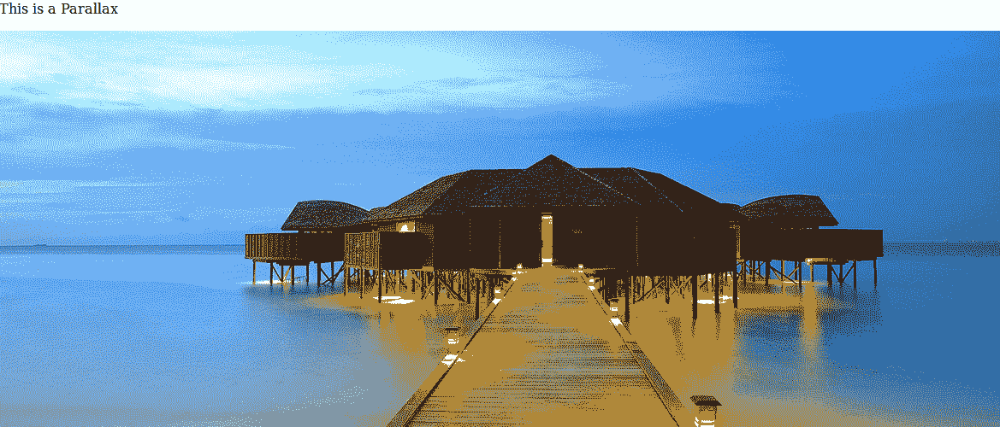
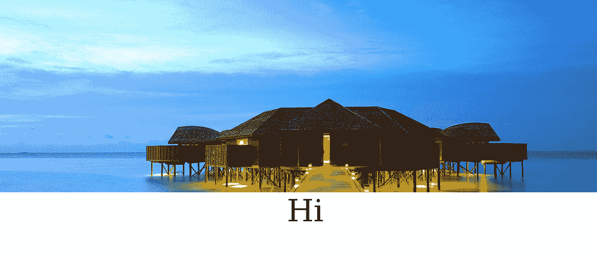
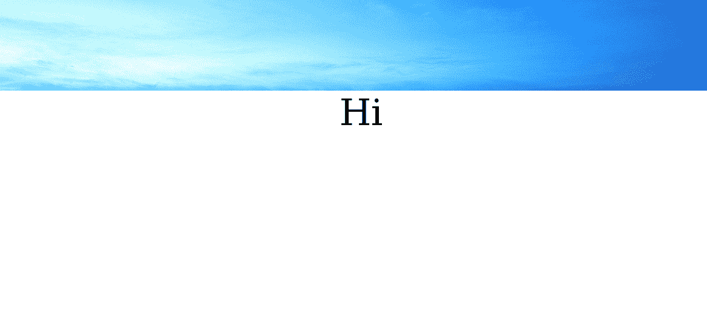

# 使用 CSS 的视差滚动效果。

> 原文:[https://www . geesforgeks . org/parallax-scrolling-effect-use-CSS/](https://www.geeksforgeeks.org/parallax-scrolling-effect-using-css/)

**视差**
视差是一种 3d 效果，用于各种网站，使网页具有吸引力。在这种效果下，当我们滚动时，网页的背景以不同于前景的速度移动，使其看起来明亮。

**例:**
这些网站把视差效果展现得淋漓尽致——

*   [防火墙修补游戏](http://www.firewatchgame.com/)
*   [花园工作室](https://gardenestudio.com.br/index.php)
*   炼金术士

这个效果是一个很好的视觉效果，但是在 CSS 的帮助下很容易实现。
首先，让我们了解给定示例中正在发生的事情。
创建效果是因为背景中的图像保持固定，没有移动，但其他图像在移动。这种简单的技术让这个效果看起来很棒。
现在让我们看看这个效果的实现使用 CSS-
**解释**
**1。背景-附件**
该属性用于确定背景图像是**固定**还是**随页面滚动**。

```
Syntax : background-attachment: scroll/fixed/local;
```

**2。背景-位置**
该属性决定背景图像的起始位置。

```
Syntax : background-position: value;
```

**3。背景-重复**
该属性决定背景图像是否重复，如果重复，将如何重复。

```
Syntax : background-repeat: repeat/repeat-x/repeat-y/no-repeat;
```

*重复–背景图像将垂直和水平重复。
重复-x–背景图像只会水平重复。
重复-y–背景图像将仅垂直重复。
不重复-背景图像不会重复。*
**4。背景大小**
该属性决定背景图像的大小。

```
Syntax : background-size: auto/length/cover/contain/;
```

*自动–默认值。
长度–设置背景图像的宽度和高度。
百分比–以容器元素的百分比设置背景图像的宽度和高度。
覆盖–将背景图像缩放到尽可能大，以便背景区域完全被背景图像覆盖。
contain–将图像缩放到最大尺寸，使其宽度和高度都适合内容区域。*

```
<html>
<head>
<style>
.parallax {
    background-image: url("http://s1.picswalls.com/wallpapers/2015/09/20/2015-wallpaper_111525594_269.jpg");
    min-height: 500px; 
    background-attachment: fixed;
    background-position: center;
    background-repeat: no-repeat;
    background-size: cover;
}
</style>
</head>
<body>
<p>This is a Parallax</p>
<div class="parallax"></div>
<div style="height:1000px;font-size:60px;">
<center>Hi</center>
</div>
</body>
</html>
```

输出:




**请注意**这种视差效果并不总是适用于手机和平板电脑，因此您需要使用媒体查询关闭该效果。

本文由 **Ayush Saxena** 供稿。如果你喜欢 GeeksforGeeks 并想投稿，你也可以使用[contribute.geeksforgeeks.org](http://www.contribute.geeksforgeeks.org)写一篇文章或者把你的文章邮寄到 contribute@geeksforgeeks.org。看到你的文章出现在极客博客主页上，帮助其他极客。

如果你发现任何不正确的地方，或者你想分享更多关于上面讨论的话题的信息，请写评论。