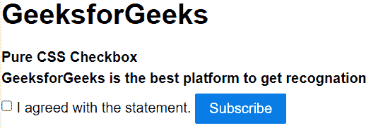
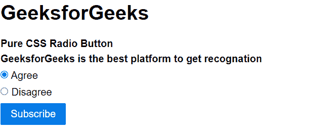

# 纯 CSS 复选框和单选按钮

> Original: [https://www.geeksforgeeks.org/pure-css-checkboxes-and-radio-buttons/](https://www.geeksforgeeks.org/pure-css-checkboxes-and-radio-buttons/)

在纯 CSS 中，我们没有针对复选框和单选按钮类型输入的任何特定布局。 但是我们可以通过使用 Pure CSS 类来使用这些类型的输入。 下面提到的类用于复选框和单选按钮。

*   **复选框：**要使用复选框，我们可以在标签标记内应用[input](https://www.geeksforgeeks.org/html-input-tag/)标记，在[标签](https://www.geeksforgeeks.org/html-label-tag/)标记内使用*纯复选框*类。
*   **单选按钮：**要使用复选框，我们可以在标签标记内应用[input](https://www.geeksforgeeks.org/html-input-tag/)标记，并在[标签](https://www.geeksforgeeks.org/html-label-tag/)标记内使用*纯无线电*类。

**示例 1：**在此示例中，我们将看到 Pure CSS 旁边的复选框。 下面的示例说明纯 CSS 中的复选框和单选按钮。

## 超文本标记语言

```html
<!DOCTYPE html>
<html>

<head>
    <title>Pure CSS Checkbox</title>
    <link rel="stylesheet"   
          href=
"https://unpkg.com/purecss@1.0.0/build/pure-min.css"   
          integrity=
"sha384-nn4HPE8lTHyVtfCBi5yW9d20FjT8BJwUXyWZT9InLYax14RDjBj46LmSztkmNP9w"   
          crossorigin="anonymous">  
</head>

<body>
    <h1>GeeksforGeeks</h1>
    <strong>
      Pure CSS Checkbox
    </strong>
    <form class="pure-form pure-form-stacked">
        <fieldset>
            <strong>
                GeeksforGeeks is the best 
                platform to get recognation
            </strong>
            <label class="pure-checkbox">
                <input type="checkbox" id="multi-terms" />
                  I agreed with the statement.
            <button type="submit" 
                    class="pure-button pure-button-primary">
                    Subscribe
            </button>
        </fieldset>
    </form>
</body>

</html>
```

发帖主题：Re：Колибри0.7.0



**示例 2：**在此示例中，我们将看到单选按钮。

## 超文本标记语言

```html
<!DOCTYPE html>
<html>

<head>
    <title>Pure CSS Radio Button</title>
    <link rel="stylesheet"   
          href=
"https://unpkg.com/purecss@1.0.0/build/pure-min.css"   
          integrity=
"sha384-nn4HPE8lTHyVtfCBi5yW9d20FjT8BJwUXyWZT9InLYax14RDjBj46LmSztkmNP9w"   
          crossorigin="anonymous">  
</head>

<body>
    <h1>GeeksforGeeks</h1>
    <strong>
      Pure CSS Radio Button
    </strong>

    <form class="pure-form pure-form-stacked">
          <fieldset>
            <strong>
                GeeksforGeeks is the best 
                platform to get recognation
            </strong>

            <label for="option-two" class="pure-radio">  
                  <input id="option-two" 
                      type="radio" name="gfg"  checked>  
                      Agree  
            </label>  

            <label for="option-three" class="pure-radio">  
                  <input id="option-three" 
                    type="radio" name="gfg" >  
                      Disagree
            </label>

            <button type="submit" 
                    class="pure-button pure-button-primary">
                    Subscribe
            </button>
        </fieldset>
    </form>
</body>

</html>
```

发帖主题：Re：Колибри0.7.0

