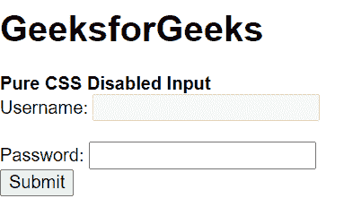
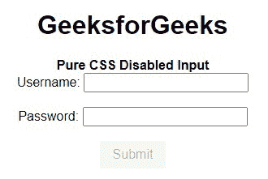
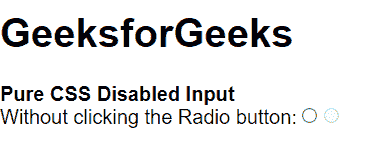

# 纯 CSS 禁用输入

> Original: [https://www.geeksforgeeks.org/pure-css-disabled-inputs/](https://www.geeksforgeeks.org/pure-css-disabled-inputs/)

在本文中，我们将了解如何在纯 CSS 中禁用输入字段。 在某些情况下，当我们要求某人填写表单时，一些项目会被激活，一些项目会被禁用，以供他们之前的选择使用。 在这种情况下，我们也可以在纯 CSS 中使用[HTML Disabled](https://www.geeksforgeeks.org/html-disabled-attribute/)。 此属性适用于其他类型的输入，如单选、复选框、数字、文本等。有关详细信息，请参阅[纯 CSS 按钮](https://www.geeksforgeeks.org/pure-css-buttons/)文章。

**语法：**

```
<tag disabled></tag>
```

**示例 1：**在此示例中，我们将使用 Disabled 属性禁用表单中的用户名字段。

## 超文本标记语言

```
<!DOCTYPE html>
<html>

<head>
    <title>Pure CSS Required Input</title>
    <link rel="stylesheet" href=
    "https://unpkg.com/purecss@1.0.0/build/pure-min.css"
        integrity=
"sha384-nn4HPE8lTHyVtfCBi5yW9d20FjT8BJwUXyWZT9InLYax14RDjBj46LmSztkmNP9w"
        crossorigin="anonymous">
</head>

<body>
    <h1>GeeksforGeeks</h1>
    <strong>
        Pure CSS Disabled Input
    </strong>
    <form action="">
        Username:
        <input type="text" name="usrname" disabled="">
        <br><br>
        Password:
        <input type="password" name="password">
        <br>
        <input type="submit">
    </form>
</body>

</html>
```

发帖主题：Re：Колибри0.7.0



**示例 2：**要将按钮标记为已禁用，请使用类 PURE-BUTTON 添加“PURE-BUTTON-DISABLED”。 您也可以直接使用 Disabled 属性。

**语法：**

```
<button class="pure-button pure-button-disabled">
  Disabled Button1
</button>  

<button class="pure-button" disabled> 
  Disabled Button2
</button>
```

**示例：**

## 超文本标记语言

```
<!DOCTYPE html>
<html>

<head>

    <!--Import Pure Css files-->
    <link rel="stylesheet" href=
"https://unpkg.com/purecss@1.0.0/build/pure-min.css"
        integrity=
"sha384-nn4HPE8lTHyVtfCBi5yW9d20FjT8BJwUXyWZT9InLYax14RDjBj46LmSztkmNP9w"
        crossorigin="anonymous" />
</head>

<body style="text-align: center">
    <h1>GeeksforGeeks</h1>
    <strong> Pure CSS Disabled Input </strong>
    <form action="">
        Username:
        <input type="text" name="usrname" />

        Password:
        <input type="password" name="password" />

        <input type="submit" 
            class="pure-button" disabled="" />
    </form>
</body>

</html>
```

发帖主题：Re：Колибри0.7.0



**示例 3：**在本例中，我们将把输入类型的 Disabled 属性设置为 Radio。

## 超文本标记语言

```
<!DOCTYPE html>
<html>

<head>
    <title>Pure CSS Required Input</title>
    <link rel="stylesheet" href=
"https://unpkg.com/purecss@1.0.0/build/pure-min.css"
        integrity=
"sha384-nn4HPE8lTHyVtfCBi5yW9d20FjT8BJwUXyWZT9InLYax14RDjBj46LmSztkmNP9w"
        crossorigin="anonymous" />
</head>

<body>
    <h1>GeeksforGeeks</h1>
    <strong> Pure CSS Disabled Input </strong>
    <form action="">
        Without clicking the Radio button:
        <input type="radio" 
            name="radiocheck" required="" />

        <input type="radio" 
            name="radiocheck" disabled="" />
    </form>
</body>

</html>
```

发帖主题：Re：Колибри0.7.0

