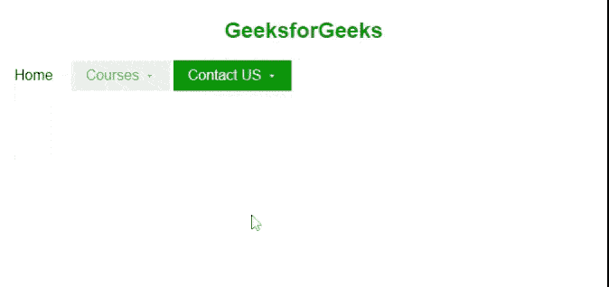
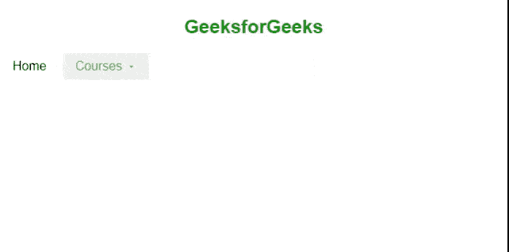

# 纯 CSS 下拉菜单

> Original: [https://www.geeksforgeeks.org/pure-css-dropdown/](https://www.geeksforgeeks.org/pure-css-dropdown/)

纯 CSS 是一个 CSS 框架。 它是一个免费的开源工具集，用于创建响应性网站和 Web 应用程序。

[Pure CSS](https://www.geeksforgeeks.org/pure-css-introduction/)由 Yahoo 开发，用于创建更快、更漂亮、响应更快的网站。 它可以用作 Bootstrap 的替代方案。 下拉菜单是互动网站最重要的部分之一。 下拉菜单是允许用户从列表中选择值的菜单项的集合。

要在 Pure.CSS 中创建下拉菜单，我们使用 class***PURE-MENU-HAS-CHILD***和***PURE-MENU-ALLOW-HOVER。*** 这个类允许我们将任何元素转换为下拉项。

**语法：**

```css
<div class="pure-menu-has-children pure-menu-allow-hover"></div>
```

**示例 1：**下面的示例显示一个简单的下拉菜单和一个使用 CSS 的[*Background-color*](https://www.geeksforgeeks.org/css-background-color-property/)属性创建的具有不同背景色的下拉列表。

## 超文本标记语言

```css
<!DOCTYPE html>
<html lang="en">

<head>
    <meta charset="utf-8">
    <meta name="viewport" content=
        "width=device-width, initial-scale=1">
    <link rel="stylesheet" href=
"https://unpkg.com/purecss@2.0.5/build/pure-min.css"
        integrity=
"sha384-LTIDeidl25h2dPxrB2Ekgc9c7sEC3CWGM6HeFmuDNUjX76Ert4Z4IY714dhZHPLd"
        crossorigin="anonymous">
</head>

<body>
    <center>
        <h2 style="color:green;">
            GeeksforGeeks
        </h2>
    </center>

    <div class="pure-menu pure-menu-horizontal">
        <ul class="pure-menu-list">
            <li class="pure-menu-item pure-menu-selected">
                <a href="#" class="pure-menu-link">Home</a>
            </li>
            <li class="pure-menu-item pure-menu-has-children 
                       pure-menu-allow-hover">
                <a href="#" class="pure-menu-link">Courses</a>
                <ul class="pure-menu-children">
                    <li class="pure-menu-item">
                        <a href="#" class="pure-menu-link">
                            Placement 100</a>
                    </li>
                    <li class="pure-menu-item">
                        <a href="#" class="pure-menu-link">
                            Complete Interview Preparation</a>
                    </li>
                    <li class="pure-menu-item">
                        <a href="#" class="pure-menu-link">
                            Android Bootcamp</a>
                    </li>
                </ul>
            </li>
            <li class="pure-menu-item pure-menu-has-children 
                   pure-menu-allow-hover" 
                    style="background-color: green;">

                <a href="#" class="pure-menu-link" 
                    style="color:white;">
                    Contact US
                </a>

                <ul class="pure-menu-children">
                    <li class="pure-menu-item">
                        <a href="#" class="pure-menu-link">
                            At Office
                        </a>
                    </li>
                    <li class="pure-menu-item">
                        <a href="#" class="pure-menu-link">
                            At Headquarter
                        </a>
                    </li>
                    <li class="pure-menu-item">
                        <a href="#" class="pure-menu-link">
                            Via mail
                        </a>
                    </li>
                </ul>
            </li>
        </ul>
    </div>
</body>

</html>
```

发帖主题：Re：Колибри0.7.0



纯 CSS

**示例 2：**我们可以通过将下拉菜单组件嵌套在彼此内部来创建嵌套下拉菜单。

## 超文本标记语言

```css
<!DOCTYPE html>
<html lang="en">

<head>
    <meta charset="utf-8">
    <meta name="viewport" content=
        "width=device-width, initial-scale=1">
    <link rel="stylesheet" href=
"https://unpkg.com/purecss@2.0.5/build/pure-min.css"
        integrity=
"sha384-LTIDeidl25h2dPxrB2Ekgc9c7sEC3CWGM6HeFmuDNUjX76Ert4Z4IY714dhZHPLd"
        crossorigin="anonymous">
</head>

<body>
    <center>
        <h2 style="color:green;">
            GeeksforGeeks
        </h2>
    </center>

    <div class="pure-menu pure-menu-horizontal">
        <ul class="pure-menu-list">
            <li class="pure-menu-item pure-menu-selected">
                <a href="#" class="pure-menu-link">Home</a>
            </li>
            <li class="pure-menu-item pure-menu-has-children 
                       pure-menu-allow-hover">
                <a href="#" class="pure-menu-link">Courses</a>
                <ul class="pure-menu-children">
                    <li class="pure-menu-item">
                        <a href="#" class="pure-menu-link">
                            Placement 100</a>
                    </li>
                    <li class="pure-menu-item" disabled>
                        <a href="#" class="pure-menu-link">
                            Complete Interview Preparation</a>
                    </li>
                    <li class="pure-menu-item" active>
                        <a href="#" class="pure-menu-link">
                            Android Bootcamp</a>
                    </li>
                    <li class="pure-menu-item 
                                pure-menu-has-children 
                                pure-menu-allow-hover">
                        <a href="#" class="pure-menu-link">
                            Contact US
                        </a>
                        <ul class="pure-menu-children">
                            <li class="pure-menu-item">
                                <a href="#" 
                                    class="pure-menu-link">
                                    At Office
                                </a>
                            </li>
                            <li class="pure-menu-item">
                                <a href="#" 
                                    class="pure-menu-link">
                                    At Headquarter
                                </a>
                            </li>
                            <li class="pure-menu-item">
                                <a href="#" 
                                    class="pure-menu-link">
                                    Via mail
                                </a>
                            </li>
                        </ul>
                    </li>
                </ul>
            </li>
        </ul>
    </div>
</body>

</html>
```

发帖主题：Re：Колибри0.7.0



**引用：**[https://purecss.io/menus/](https://purecss.io/menus/)