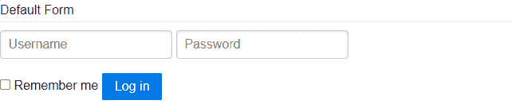
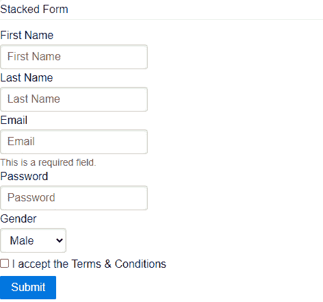
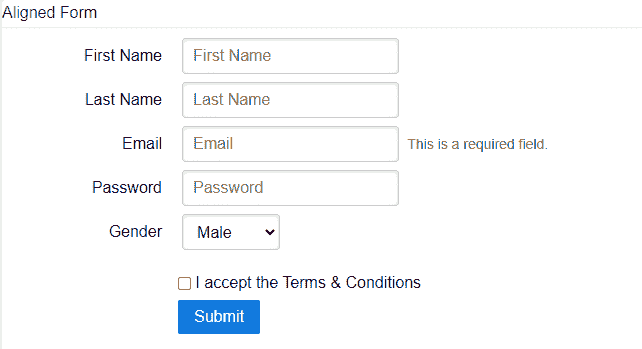
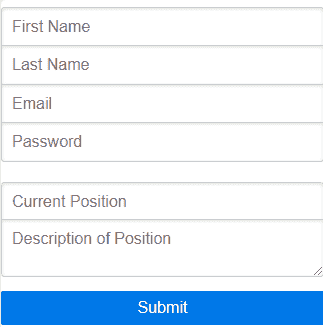

# 纯 CSS 表单

> Original: [https://www.geeksforgeeks.org/pure-css-forms/](https://www.geeksforgeeks.org/pure-css-forms/)

在网站中，为了各种目的收集数据或信息，表单是必不可少的。 使用纯 CSS，我们可以创建不同类型的表单。

**纯 CSS 窗体类：**

*   默认表单
*   堆叠形式
*   对齐的表单
*   分组输入

**DEFAULT FORM：**将类**“PURE-FORM”**添加到任何<FORM>元素以创建默认表单。 此表单在本质上将是内联的。

**语法：**

```
<form class="pure-form">...</form>
```

**示例：**

## 超文本标记语言

```
<!DOCTYPE html>
<html>
<head>
    <!--Import Pure Css files-->
    <link rel="stylesheet"
    href=
"https://unpkg.com/purecss@1.0.0/build/pure-min.css"
    integrity=
"sha384-nn4HPE8lTHyVtfCBi5yW9d20FjT8BJwUXyWZT9InLYax14RDjBj46LmSztkmNP9w"
    crossorigin="anonymous"/>

    <!-- Let browser know website is 
        optimized for mobile -->
    <meta name="viewport" content="width=device-width,
                                   initial-scale=1.0" />
</head>

<body>
    <!--To create Default form add
    "pure-form" classname-->
    <form class="pure-form">
    <fieldset>
        <legend>Default Form</legend>

        <input type="text" placeholder="Username" />
        <input type="password" placeholder="Password" />
        <br><br>
        <label for="remember">
        <input id="remember" type="checkbox" />
            Remember me
        </label>

        <button type="submit" 
                class="pure-button 
                       pure-button-primary">
        Log in
        </button>
    </fieldset>
    </form>
</body>
</html>
```

发帖主题：Re：Колибри0.7.0



**堆叠表单：**在<表单>元素内的纯表单旁边添加类**“Pure-Form-Stackked”**，以创建标签下面带有输入元素的堆叠表单。

**语法：**

```
<form class="pure-form-stacked">...</form>
```

**示例：**

## 超文本标记语言

```
<!DOCTYPE html>
<html>
  <head>
    <!--Import Pure Css files-->
    <link rel="stylesheet"
      href=
"https://unpkg.com/purecss@1.0.0/build/pure-min.css"
      integrity=
"sha384-nn4HPE8lTHyVtfCBi5yW9d20FjT8BJwUXyWZT9InLYax14RDjBj46LmSztkmNP9w"
      crossorigin="anonymous"/>

    <!-- Let browser know website is  
         optimized for mobile -->
    <meta name="viewport" content="width=device-width, 
                                   initial-scale=1.0" />
  </head>

  <body>
    <!--To create Stacked form add
    "pure-form-stacked" classname-->
    <form class="pure-form pure-form-stacked">
      <fieldset>
        <legend>Stacked Form</legend>

        <label for="first-name"> First Name</label>
        <input id="first-name" type="text"
               placeholder="First Name" />

        <label for="last-name"> Last Name</label>
        <input id="last-name" type="text" 
               placeholder="Last Name" />

        <label for="email">Email</label>
        <input id="email" type="email"
               placeholder="Email" />
        <span class="pure-form-message">
             This is a required field.
        </span>

        <label for="password">Password</label>
        <input id="password" type="password" 
               placeholder="Password" />

        <label for="state">Gender</label>
        <select id="state">
          <option>Male</option>
          <option>Female</option>
          <option>Other</option>
        </select>

        <label for="remember" class="pure-checkbox">
          <input id="remember" type="checkbox" />
           I accept the Terms & Conditions
        </label>

        <button type="submit" 
                class="pure-button pure-button-primary">
          Submit
        </button>
      </fieldset>
    </form>
  </body>
</html>
```

发帖主题：Re：Колибри0.7.0



**对齐的表单：**在<Form>元素内的纯表单旁边添加类**“Pure-Form-Align”**，以创建对齐的表单。 在这种类型的表单中，标签与表单输入控件右对齐，但在小屏幕上恢复为堆叠表单。

**语法：**

```
<form class="pure-form-aligned">...</form>
```

**示例：**

## 超文本标记语言

```
<!DOCTYPE html>
<html>
  <head>
    <!--Import Pure Css files-->
    <link rel="stylesheet"
      href=
"https://unpkg.com/purecss@1.0.0/build/pure-min.css"
      integrity=
"sha384-nn4HPE8lTHyVtfCBi5yW9d20FjT8BJwUXyWZT9InLYax14RDjBj46LmSztkmNP9w"
      crossorigin="anonymous"/>

    <!-- Let browser know website is 
        optimized for mobile -->
    <meta name="viewport" content="width=device-width, 
                                   initial-scale=1.0" />
  </head>

  <body>
    <!--To create Aligned form add
    "pure-form-aligned" classname-->
    <form class="pure-form pure-form-aligned">
      <fieldset>
        <legend>Aligned Form</legend>

        <div class="pure-control-group">
          <label for="first-name"> 
           First Name
          </label>
          <input id="first-name" type="text" 
                 placeholder="First Name" />
        </div>

        <div class="pure-control-group">
          <label for="last-name"> 
           Last Name
          </label>
          <input id="last-name" type="text" 
                 placeholder="Last Name" />
        </div>

        <div class="pure-control-group">
          <label for="email">Email</label>
          <input id="email" type="email" 
                 placeholder="Email" />
          <span class="pure-form-message-inline">
            This is a required field.</span
          >
        </div>

        <div class="pure-control-group">
          <label for="password"> Password</label>
          <input id="password" type="password"
                 placeholder="Password" />
        </div>

        <div class="pure-control-group">
          <label for="state">Gender</label>
          <select id="state">
            <option>Male</option>
            <option>Female</option>
            <option>Other</option>
          </select>
        </div>

        <div class="pure-controls">
          <label for="remember" class="pure-checkbox">
            <input id="remember" type="checkbox" />
              I accept the Terms & Conditions
          </label>

          <button type="submit" 
                  class="pure-button pure-button-primary">
            Submit
          </button>
        </div>
      </fieldset>
    </form>
  </body>
</html>
```

发帖主题：Re：Колибри0.7.0



**分组输入表单：**如果要为移动设备创建注册表单，此表单是最佳选择。 使用**“纯组”**类名将一组基于文本的输入元素包装在<fieldset>元素中，以创建这样的表单。 它要求页面上显示纯响应网格。

**语法：**

```
<fieldset class="pure-group">...</fieldset>
```

**示例：**

## 超文本标记语言

```
<!DOCTYPE html>
<html>
  <head>
    <!--Import Pure Css files-->
    <link rel="stylesheet"
      href=
"https://unpkg.com/purecss@1.0.0/build/pure-min.css"
      integrity=
"sha384-nn4HPE8lTHyVtfCBi5yW9d20FjT8BJwUXyWZT9InLYax14RDjBj46LmSztkmNP9w"
      crossorigin="anonymous"/>

    <!--Import Pure Css Grid files-->
    <link
      rel="stylesheet"
      href=
"https://unpkg.com/purecss@2.0.5/build/grids-responsive-min.css"/>

    <!-- Let browser know website is 
        optimized for mobile -->
    <meta name="viewport" content="width=device-width, 
                                   initial-scale=1.0" />
  </head>

  <body>
    <form class="pure-form">
      <!--To create groups use "pure-group"
        classname in <fieldset> element-->
      <fieldset class="pure-group">
        <input type="text" class="pure-input-1-2" 
               placeholder="First Name" />
        <input type="text" class="pure-input-1-2" 
               placeholder="Last Name" />
        <input type="text" class="pure-input-1-2" 
               placeholder="Email" />
        <input type="text" class="pure-input-1-2" 
               placeholder="Password" />
      </fieldset>

      <fieldset class="pure-group">
        <input
          type="text"
          class="pure-input-1-2"
          placeholder="Current Position"/>
        <textarea
          class="pure-input-1-2"
          placeholder="Description of Position">
        </textarea>
      </fieldset>

      <button
        type="submit"
        class="pure-button pure-input-1-2 
               pure-button-primary">
        Submit
      </button>
    </form>
  </body>
</html>
```

发帖主题：Re：Колибри0.7.0

