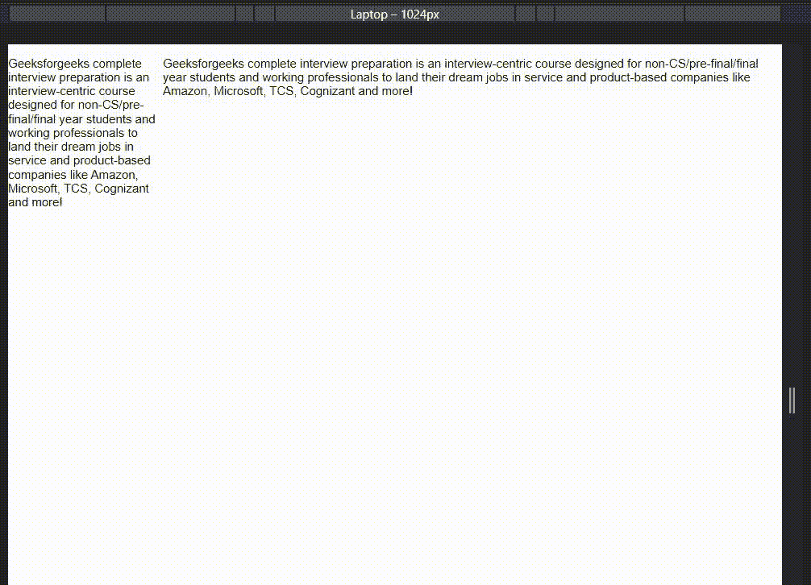
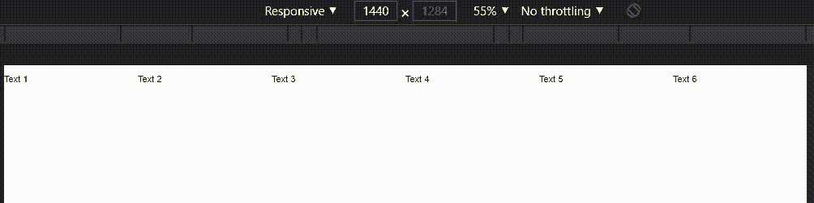

# 纯 CSS 网格

> Original: [https://www.geeksforgeeks.org/pure-css-grids/](https://www.geeksforgeeks.org/pure-css-grids/)

在创建真正的响应式网站布局的同时，网格系统是 Web 开发人员的重要工具。 网格是一组类，它帮助我们将屏幕或显示的宽度划分为更小的单位，并使网站在各种设备上看起来都很有响应性。 Pure.CSS 也提出了这样一个网格系统。

**纯 CSS 网格类：**

*   网格类(纯-g)
*   单位类(纯 u)
*   对单位类的响应性格网修改

**包含网格系统：**网格系统没有包含在 pure.css 中，因为媒体查询不能被覆盖，所以我们必须放入这三个 CSS 文件来实现网格系统。 指向这些文件的链接如下所示。 要获取最新版本，您可以访问 Pure.CSS Grid 的官方网站。

> <link rel="”stylesheet”" href="”https://unpkg.com/purecss@2.0.6/build/base-min.css”">
> <LINK REL=“StyleSheet”href=”https://unpkg.com/purecss@2.0.6/build/grids-min.css”>
> <LINK Rel=“StyleSheet”href=”https://unpkg.com/purecss@2.0.6/build/grids-responsive-min.css”>

**网格类(PURE-g)：**‘PURE-g’类称为 Pure.CSS 网格系统的网格类。 它作为单元类的包装器工作。 每个 Pure.CSS 单元类(纯-u)仍然是网格类(纯-g)的子类。

**语法：↔**

```
<div class="pure-g">
..... Some Unit Classes ....</div>
```

**单元类(PURE-U)：**‘PURE-U’或‘PURE-U-*’帮助我们将显示屏的宽度分成几个部分。 如果我们想要得到一个分区的显示屏部分的 m/n。 然后，我们必须向该特定的 div 添加类‘pure-u-m-n’。 假设我们想要占据显示屏的 2/5 部分，那么我们必须将类‘PURE-U-2-5’包含到该特定的 div 中。

**语法：**

```
<div class="pure-g">
    <div class="pure-u-2-5">...Inner Elements...</div>
    <div class="pure-u-3-5">...Inner Elements...</div>

</div>
```

**示例：**

## 超文本标记语言

```
<!DOCTYPE html>
<html lang="en">
<head>
    <title>Pure.CSS | Grids</title>
    <link rel="stylesheet" 
          href=
"https://unpkg.com/purecss@2.0.6/build/base-min.css">
    <link rel="stylesheet" 
          href=
"https://unpkg.com/purecss@2.0.6/build/grids-min.css">
    <link rel="stylesheet" 
          href=
"https://unpkg.com/purecss@2.0.6/build/grids-responsive-min.css">
</head>

<body>
    <div class="pure-g">
        <div class="pure-u-1-5">
            <p>
                An interview-centric course designed 
                for non-CS/pre-final/final year students
                and working professionals to land their 
                dream jobs in service and product-based 
                companies like Amazon, Microsoft, TCS, 
                Cognizant and more!
            </p>

        </div>
        <div class="pure-u-4-5">
            <p>
                An interview-centric course designed for 
                non-CS/pre-final/final year students and 
                working professionals to land their dream 
                jobs in service and product-based companies
                like Amazon, Microsoft, TCS, Cognizant and more!
            </p>

        </div>
    </div>
</body>
</html>
```

**输出：**在整个输出中，我们可以看到我们的网格对于划分屏幕宽度非常有用，但是它没有响应。 为了使布局具有响应性，我们必须使用“对单元类的响应性网格修改”(Responsive Grid Modify To Unit Class)。



**对单位类的响应性网格修改：**Pure.CSS 为我们提供了四个不同的关键字：sm、md、lg、xl。 这些关键字与 Pure Grid Unit 类(Pure-u)一起附加，用于根据屏幕宽度生成媒体查询。 所有这些类的条件和媒体查询如下：

<figure class="table">[T26。 [T50。 .Pure-u-lg-*

| 

关键字

 | 

Classname

 | 

应用

 | 

CSS 媒体查询

 |
| --- | --- | --- | --- |
| XL | .PURE-u-XL-* | ≥1280px | @媒体屏幕和(最小宽度：80em) |
| LG | ≥1024px | @媒体屏幕和(最小宽度：64em) |
| Md | .Pure-u-Md-* | 。 ≥768px | @媒体屏幕和(最小宽度：48em) |
| sm | .Pure-u-sm-* | ≥568px | [T95 . Width: 35.5em) |

</figure>

为了生成默认媒体查询，使用‘em’而不是‘px’，从而媒体查询相应地响应网页的缩放。

**语法：↔**

```
<div class="pure-g">
    <div class="pure-u-sm-1 pure-u-md-1-5"> Inner Elements </div>
    <div class="pure-u-sm-1 pure-u-md-1-5"> Inner Elements </div>
    <div class="pure-u-sm-1 pure-u-md-1-5"> Inner Elements </div>
    <div class="pure-u-sm-1 pure-u-md-1-5"> Inner Elements </div>
    <div class="pure-u-sm-1 pure-u-md-1-5"> Inner Elements </div>
</div>
```

#### 示例：

## 超文本标记语言

```
<!DOCTYPE html>
<html lang="en">
<head>
    <title>Pure.CSS | Grids</title>
    <link rel="stylesheet"
          href=
"https://unpkg.com/purecss@2.0.6/build/base-min.css">
    <link rel="stylesheet"
          href=
"https://unpkg.com/purecss@2.0.6/build/grids-min.css">
    <link rel="stylesheet"
          href=
"https://unpkg.com/purecss@2.0.6/build/grids-responsive-min.css">
</head>
<body>
    <div class="pure-g">
        <div class="pure-u-md-1-2 
                    pure-u-lg-1-3 pure-u-xl-1-6">
            <p>
                Text 1
            </p>

        </div>
        <div class="pure-u-md-1-2 
                    pure-u-lg-1-3 pure-u-xl-1-6">
            <p>
                Text 2
            </p>

        </div>
        <div class="pure-u-md-1-2 
                    pure-u-lg-1-3 pure-u-xl-1-6">
            <p>
                Text 3
            </p>

        </div>
        <div class="pure-u-md-1-2 
                    pure-u-lg-1-3 pure-u-xl-1-6">
            <p>
                Text 4
            </p>

        </div>
        <div class="pure-u-md-1-2 
                    pure-u-lg-1-3 pure-u-xl-1-6">
            <p>
                Text 5
            </p>

        </div>
        <div class="pure-u-md-1-2 
                    pure-u-lg-1-3 pure-u-xl-1-6">
            <p>
                Text 6
            </p>

        </div>
    </div>
</body>
</html>
```

发帖主题：Re：Колибри0.7.8.0

