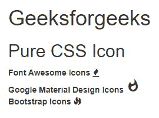
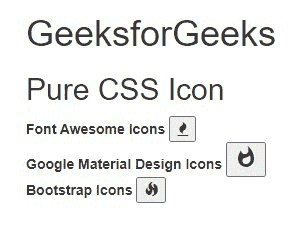

# 纯 CSS 图标

> Original: [https://www.geeksforgeeks.org/pure-css-icons/](https://www.geeksforgeeks.org/pure-css-icons/)

在本文中，我们将学习如何在纯 CSS 中使用图标，并通过示例了解其实现。 Pure CSS 没有任何图标组件，可以在 Pure CSS 中使用的图标包太多了。 在所有这些图标包中，有 3 个最常用、最容易使用的图标包，如下所述：

*   [**字体精美图标：**](https://www.geeksforgeeks.org/how-to-use-font-awesome-icons-from-node-modules/)**Font-awed 是一个 Web 图标库，它为您提供了可缩放的矢量图标，这些图标可以在颜色、大小和许多其他方面进行自定义。**

> **Https://cdnjs.cloudflare.com/ajax/libs/font-awesome/4.7.0/css/font-awesome.min.css**

*   **[**Google Material Icons：**](https://www.geeksforgeeks.org/how-to-use-google-material-icon-as-list-style-in-a-webpage-using-html-and-css/)**图标可以从图标库添加到我们的 HTML 页面。 库中的所有图标都可以使用 CSS 进行格式化。 它们可以根据大小、颜色、阴影等进行定制。****

> ****Https://fonts.googleapis.com/icon?family=Material+Icons****

*   ****[**引导图标：**](https://www.geeksforgeeks.org/bootstrap-5-alpha-icons-library/)**引导图标是用引导组件设计的，从表单控件到导航。 引导图标是 SVG，以便快速简单地进行扩展。******

> ******Https://cdn.jsdelivr.net/npm/bootstrap-icons@1.5.0/font/bootstrap-icons.css******

******下面的示例将说明如何将这些包与纯 CSS 一起使用。******

********示例 1：**在此示例中，我们将对 3 个不同的包使用点火图标。 对于这 3 个包，这些图标具有不同的外观和不同的类别。******

******示例**：****

## ****超文本标记语言****

```
**<!DOCTYPE html>
<html>

<head>
    <link rel="stylesheet" href=
    "https://unpkg.com/purecss@1.0.0/build/pure-min.css"
        integrity=
"sha384-nn4HPE8lTHyVtfCBi5yW9d20FjT8BJwUXyWZT9InLYax14RDjBj46LmSztkmNP9w" 
        crossorigin="anonymous" />

    <meta name="viewport" content=
        "width=device-width, initial-scale=1" />
    <link rel="stylesheet" href=
"https://yui.yahooapis.com/pure/0.6.0/pure-min.css" />
    <link rel="stylesheet" href=
"https://cdnjs.cloudflare.com/ajax/libs/font-awesome/4.4.0/css/font-awesome.min.css" />
    <link rel="stylesheet" href=
"https://fonts.googleapis.com/icon?family=Material+Icons" />
    <link rel="stylesheet" href=
"https://maxcdn.bootstrapcdn.com/bootstrap/3.3.7/css/bootstrap.min.css" />

    <script src=
"https://ajax.googleapis.com/ajax/libs/jquery/3.2.1/jquery.min.js">
    </script>
    <script src=
"https://maxcdn.bootstrapcdn.com/bootstrap/3.3.7/js/bootstrap.min.js">
    </script>
</head>

<body>
    <h1>GeeksforGeeks</h1>
    <h2>Pure CSS Icon</h2>

    <strong>Font Awesome Icons</strong>
    <i class="fa fa-fire"></i>
    <br />
    <strong>Google Material Design Icons</strong>
    <i class="material-icons">whatshot</i>
    <br />
    <strong>Bootstrap Icons</strong>
    <i class="glyphicon glyphicon-fire"></i>
</body>

</html>**
```

****发帖主题：Re：Колибри0.7.0****

********

******示例 2：**此示例说明了 Pure CSS 中按钮图标的用法。 我们将使用与上面&相同的示例在其上实现按钮图标。 有关详细信息，请参阅[文章](https://www.geeksforgeeks.org/how-to-use-buttons-with-icons-using-pure-css/)[如何在纯 CSS 中使用带有图标的按钮？](https://www.geeksforgeeks.org/how-to-use-buttons-with-icons-using-pure-css/)文章。****

******示例：******

## ****超文本标记语言****

```
**<!DOCTYPE html>
<html>

<head>
    <link rel="stylesheet" href=
    "https://unpkg.com/purecss@1.0.0/build/pure-min.css"
        integrity=
"sha384-nn4HPE8lTHyVtfCBi5yW9d20FjT8BJwUXyWZT9InLYax14RDjBj46LmSztkmNP9w"
        crossorigin="anonymous" />

    <meta name="viewport" content=
        "width=device-width, initial-scale=1" />
    <link rel="stylesheet" href=
"https://yui.yahooapis.com/pure/0.6.0/pure-min.css" />
    <link rel="stylesheet" href=
"https://cdnjs.cloudflare.com/ajax/libs/font-awesome/4.4.0/css/font-awesome.min.css" />
    <link rel="stylesheet" href=
"https://fonts.googleapis.com/icon?family=Material+Icons" />
    <link rel="stylesheet" href=
"https://maxcdn.bootstrapcdn.com/bootstrap/3.3.7/css/bootstrap.min.css" />

    <script src=
"https://ajax.googleapis.com/ajax/libs/jquery/3.2.1/jquery.min.js">
    </script>
    <script src=
"https://maxcdn.bootstrapcdn.com/bootstrap/3.3.7/js/bootstrap.min.js">
    </script>
</head>

<body>
    <h1>GeeksforGeeks</h1>
    <h2>Pure CSS Icon</h2>

    <strong>Font Awesome Icons</strong>
    <button>
        <i class="fa fa-fire"></i>
    </button>
    <br />
    <strong>Google Material Design Icons</strong>
    <button>
        <i class="material-icons">whatshot</i>
    </button>
    <br />
    <strong>Bootstrap Icons</strong>
    <button>
        <i class="glyphicon glyphicon-fire"></i>
    </button>
</body>

</html>**
```

****发帖主题：Re：Колибри0.7.0****

********