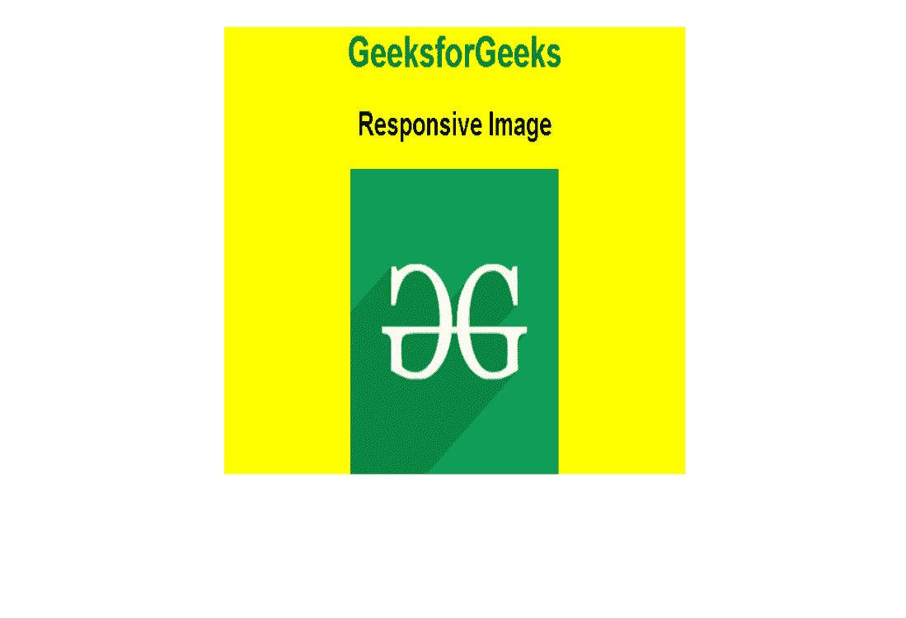
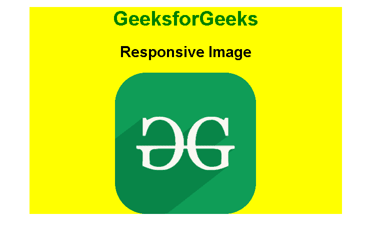
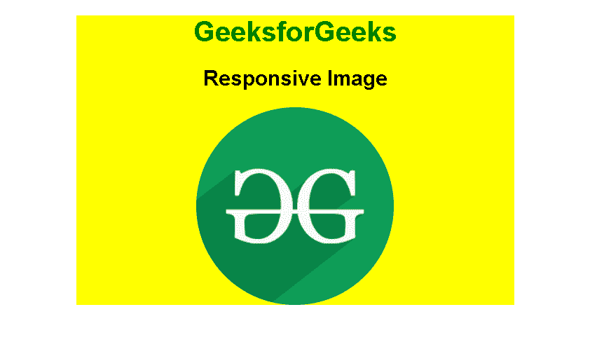

# 纯 CSS 图像

> Original: [https://www.geeksforgeeks.org/pure-css-images/](https://www.geeksforgeeks.org/pure-css-images/)

[**纯 CSS**](https://www.geeksforgeeks.org/pure-css-introduction/)是 CSS 的框架。 它是一个免费的开源工具集，用于创建响应性网站和 Web 应用程序。 Pure CSS 是由 Yahoo 开发的，用于创建更快、更漂亮、更具响应性的网站。 它可以用作 Bootstrap 的替代方案。

纯 CSS 提供了 PURE-IMG 类，使图像具有响应性。 此类可以应用于[](https://www.geeksforgeeks.org/html-img-tag/)元素，以使其随视口缩放。 这在构建响应性网站时非常方便。

**语法：**

```html

```

**示例：**在此示例中，我们使用。 **Pure-img**类，用于创建响应图像页面。

## 超文本标记语言

```html
<!DOCTYPE html>
<html lang="en">

<head>
    <title>PureCSS</title>
    <meta charset="utf-8">
    <meta name="viewport" content=
        "width=device-width, initial-scale=1">
    <link rel="stylesheet" href=
"https://unpkg.com/purecss@2.0.5/build/pure-min.css"
        integrity=
"sha384-LTIDeidl25h2dPxrB2Ekgc9c7sEC3CWGM6HeFmuDNUjX76Ert4Z4IY714dhZHPLd"
        crossorigin="anonymous">
</head>

<body>
    <center>
        <div style="width: 500px;background-color: yellow;">

            <h1 style="color:green;">
                GeeksforGeeks
            </h1>

            <h2>Responsive Image</h2>

            
        </div>
    </center>
</body>

</html>
```

发帖主题：Re：Колибри0.7.0



输出

**圆角图像：**CSS 的边框半径属性用于创建圆角图像。

**示例：**

## 超文本标记语言

```html
<!DOCTYPE html>
<html lang="en">

<head>
    <title>PureCSS</title>
    <meta charset="utf-8">
    <meta name="viewport" content=
        "width=device-width, initial-scale=1">
    <link rel="stylesheet" href=
"https://unpkg.com/purecss@2.0.5/build/pure-min.css"
        integrity=
"sha384-LTIDeidl25h2dPxrB2Ekgc9c7sEC3CWGM6HeFmuDNUjX76Ert4Z4IY714dhZHPLd"
        crossorigin="anonymous">
</head>

<body>
    <center>
        <div style="width: 500px;
            background-color: yellow;">

            <h1 style="color:green;">
                GeeksforGeeks
            </h1>

            <h2>Responsive Image</h2>

            
        </div>
    </center>
</body>

</html>
```

发帖主题：Re：Колибри0.7.0



输出

**圆形图像：**边界半径属性 50%用于创建圆形图像。

**示例：**

## 超文本标记语言

```html
<!DOCTYPE html>
<html lang="en">

<head>
    <title>PureCSS</title>
    <meta charset="utf-8">
    <meta name="viewport" content=
        "width=device-width, initial-scale=1">
    <link rel="stylesheet" href=
"https://unpkg.com/purecss@2.0.5/build/pure-min.css"
        integrity=
"sha384-LTIDeidl25h2dPxrB2Ekgc9c7sEC3CWGM6HeFmuDNUjX76Ert4Z4IY714dhZHPLd"
        crossorigin="anonymous">
</head>

<body>
    <center>
        <div style="width: 500px;
            background-color: yellow;">

            <h1 style="color:green;">
                GeeksforGeeks
            </h1>

            <h2>Responsive Image</h2>

            
        </div>
    </center>
</body>

</html>
```

发帖主题：Re：Колибри0.7.0



输出