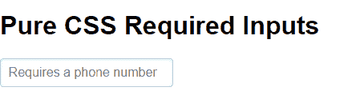
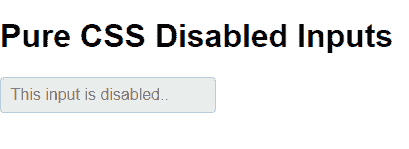
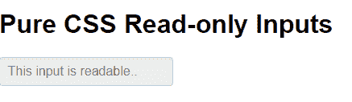
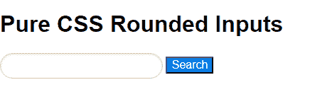
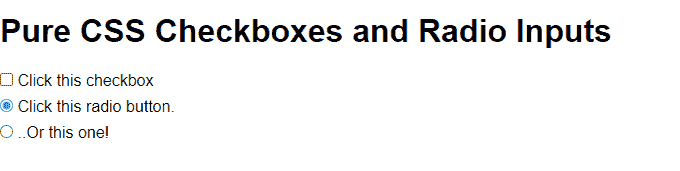

# 纯 CSS 输入

> Original: [https://www.geeksforgeeks.org/pure-css-inputs/](https://www.geeksforgeeks.org/pure-css-inputs/)

输入在任何网页形式中都很重要。 它用于接受用户的各种输入，这些输入在收集数据或信息时是必不可少的。

以下是纯 CSS 中的各种类型的输入：

*   所需输入
*   禁用的输入
*   只读输入
*   四舍五入的输入
*   复选框和单选按钮

**Required Input**：如果要将表单控件标记为 Required，请将**“Required”**属性添加到<Input>元素。 假设您的表单需要电话号码，那么您可以使用此属性来显示需要电话号码。

**语法：**

```html
<form class="pure-form">  
    <input type="…" placeholder="……" required>  
</form>
```

**示例：**

## 超文本标记语言

```html
<!DOCTYPE html>
<html>

<head>

    <!--Import Pure CSS files-->
    <link rel="stylesheet" 
    href=
"https://unpkg.com/purecss@1.0.0/build/pure-min.css" 
    integrity=
"sha384-nn4HPE8lTHyVtfCBi5yW9d20FjT8BJwUXyWZT9InLYax14RDjBj46LmSztkmNP9w" 
    crossorigin="anonymous">
</head>

<body>
    <h1>Pure CSS Required Inputs</h1>

    <!--Required input-->
    <form class="pure-form">
        <input type="tel" 
        placeholder="Requires a phone number" 
        required>
    </form>
</body>

</html>
```

发帖主题：Re：Колибри0.7.0



**禁用的输入：**如果您不想接受用户的任何输入，则可以使用禁用的输入。 将**“Disabled”**属性添加到<Input>元素以禁用表单控件。

**语法：**

```html
<form class="pure-form">
    <input type="…" placeholder="……" disabled="">
</form>
```

**示例：**

## 超文本标记语言

```html
<!DOCTYPE html>
<html>

<head>

    <!--Import Pure CSS files-->
    <link rel="stylesheet" href=
"https://unpkg.com/purecss@1.0.0/build/pure-min.css" 
      integrity=
"sha384-nn4HPE8lTHyVtfCBi5yW9d20FjT8BJwUXyWZT9InLYax14RDjBj46LmSztkmNP9w" 
      crossorigin="anonymous">
</head>

<body>
    <h1>Pure CSS Disabled Inputs</h1>

    <!--Disabled input-->
    <form class="pure-form">
        <input type="text" 
        placeholder="This input is disabled.." 
        disabled="" />
    </form>
</body>

</html>
```

发帖主题：Re：Колибри0.7.0



**只读输入：**如果要使表单输入为只读，则可以使用只读输入。 只读输入和禁用输入之间的主要区别在于禁用输入不是交互式的，而在只读输入中，您可以与输入交互并选择其文本。 因此，它们仍然是可聚焦的。 将**“readonly”**属性添加到<input>元素以创建只读输入。

**语法：**

```html
<form class="pure-form">  
    <input type="…" value="……" readonly>  
</form>
```

**示例：**

## 超文本标记语言

```html
<!DOCTYPE html>
<html>

<head>

    <!-- Import Pure CSS files -->
    <link rel="stylesheet" href=
"https://unpkg.com/purecss@1.0.0/build/pure-min.css" 
      integrity=
"sha384-nn4HPE8lTHyVtfCBi5yW9d20FjT8BJwUXyWZT9InLYax14RDjBj46LmSztkmNP9w" 
      crossorigin="anonymous">
</head>

<body>
    <h1>Pure CSS Read-only Inputs</h1>

    <!--Readable input-->
    <form class="pure-form">
        <input type="text"
         value="This input is readable.." readonly>
    </form>
</body>

</html>
```

发帖主题：Re：Колибри0.7.0



**四舍五入：**向<input>元素添加类名**“PURE-INPUT-ROUND”**，以显示具有圆角的表单控件。 它可以用来在你的网页上创建一个搜索框。

**语法：**

```html
<form class="pure-form">  
    <input type="…" class="pure-input-rounded">  
</form>
```

**示例：**

## 超文本标记语言

```html
<!DOCTYPE html>
<html>

<head>

    <!--Import Pure CSS files-->
    <link rel="stylesheet" href=
"https://unpkg.com/purecss@1.0.0/build/pure-min.css" 
    integrity=
"sha384-nn4HPE8lTHyVtfCBi5yW9d20FjT8BJwUXyWZT9InLYax14RDjBj46LmSztkmNP9w" 
    crossorigin="anonymous">
</head>

<body>
    <h1>Pure CSS Rounded Inputs</h1>

    <!--Rounded Inputs-->
    <form class="pure-form">
        <input type="text" 
          class="pure-input-rounded">
        <button type="submit" 
          class="pure-button-primary">
          Search
        </button>
    </form>
</body>

</html>
```

发帖主题：Re：Колибри0.7.0



**复选框和单选：**要标准化和对齐复选框和单选输入，请将类**“纯复选框”**或**“纯单选”**添加到<标签>元素。

**语法：**

```html
Checkbox:
<label for="..." class="pure-checkbox">  
    <input id="…" type="checkbox" value="">  
    . . .
</label>  

Radio-button:        
<label for="..." class="pure-radio">  
    <input id="…" type="radio" name="..." value="">  
    . . .
</label>
```

**示例：**

## 超文本标记语言

```html
<!DOCTYPE html>
<html>

<head>

    <!--Import Pure CSS files-->
    <link rel="stylesheet" href=
"https://unpkg.com/purecss@1.0.0/build/pure-min.css" 
      integrity=
"sha384-nn4HPE8lTHyVtfCBi5yW9d20FjT8BJwUXyWZT9InLYax14RDjBj46LmSztkmNP9w" 
      crossorigin="anonymous">
</head>

<body>
    <h1>Pure CSS Checkboxes and Radio Inputs</h1>
    <form class="pure-form">

        <!--Checkbox-->
        <label for="firstOption" class="pure-checkbox">  
            <input id="firstOption"
                   type="checkbox" value="">  
                Click this checkbox  
        </label>

        <!--Radio buttons-->
        <label for="secondOption" class="pure-radio">  
            <input id="secondOption" type="radio" 
                   name="optionsRadios" value="option1" checked>  
                Click this radio button.  
        </label>

        <label for="thirdOption" class="pure-radio">  
            <input id="thirdOption" type="radio"
                   name="optionsRadios" value="option2">  
                ..Or this one!  
        </label>
    </form>
</body>

</html>
```

发帖主题：Re：Колибри0.7.0

