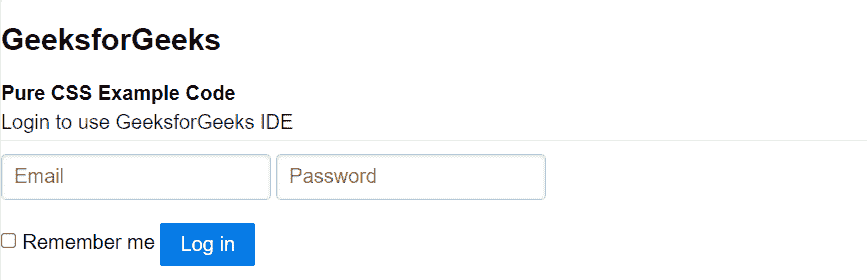
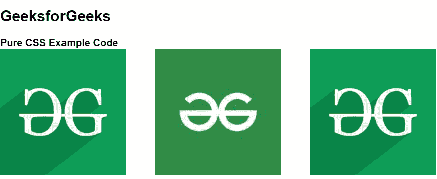

# 纯 CSS 安装并使用

> Original: [https://www.geeksforgeeks.org/pure-css-installation-and-uses/](https://www.geeksforgeeks.org/pure-css-installation-and-uses/)

**纯 CSS**是 CSS 的一个框架。 它是一个免费的开源工具集，用于创建响应性网站和 Web 应用程序。 Pure CSS 是由 Yahoo 开发的，用于创建更快、更漂亮、更具响应性的网站。 它可以用作 Bootstrap 的替代方案。

**Pure CSS 的安装：**我们可以通过两种方式将 Pure CSS 添加到我们的网页。

1.  使用 NPM 安装
2.  使用 CDN 链路

**使用 NPM 安装：**您可以通过 NPM 将纯 CSS 添加到您的项目中。 这是我们推荐的将 Pure CSS 集成到项目的构建过程和工具链中的方法。

```
npm install purecss --save
```

**使用 CDN Link：**您可以通过免费的 unpkg CDN 链接将纯 CSS 添加到您的页面。 只需在项目样式表之前将以下<link>元素添加到页面的<head>中。

> <link rel="”stylesheet”" href="”https://unpkg.com/purecss@2.0.5/build/pure-min.css”" integrity="”sha384-LTIDeidl25h2dPxrB2Ekgc9c7sEC3CWGM6HeFmuDNUjX76Ert4Z4IY714dhZHPLd”" crossorigin="”anonymous”">

下面的示例将显示纯 CSS 的用法：

**示例 1：**在此示例中，我们将使用**Pure CSS CDN 链接来设计基本表单。**

## **超文本标记语言**

```
<!DOCTYPE html>
<html>

<head>

    <!-- Import Pure CSS files -->
    <link rel="stylesheet" href=
        "https://unpkg.com/purecss@2.0.5/build/pure-min.css"
        integrity=
"sha384-LTIDeidl25h2dPxrB2Ekgc9c7sEC3CWGM6HeFmuDNUjX76Ert4Z4IY714dhZHPLd"
        crossorigin="anonymous">

    <!-- Let browser know website is
        optimized for mobile -->
    <meta name="viewport" content=
        "width=device-width, initial-scale=1.0" />
</head>

<body>
    <h2 color="">GeeksforGeeks</h2>
    <strong>Pure CSS Example Code</strong>

    <!-- Add class "pure-form" -->
    <form class="pure-form">
        <fieldset>
            <legend>Login to use GeeksforGeeks IDE</legend>
            <input type="email" placeholder="Email" />
            <input type="password" placeholder="Password" />
            <br><br>

            <label for="default-remember">
                <input type="checkbox" id="default-remember" />
                Remember me
            </label>

            <button type="submit" class="pure-button pure-button-primary">
                Log in
            </button>
        </fieldset>
    </form>
</body>

</html>
```

**发帖主题：Re：Колибри0.7.0**

****

****示例 2：**在此示例中，我们将使用纯 CSS 显示 CSS 网格。**

## **超文本标记语言**

```
<!DOCTYPE html>
<html>

<head>

    <!--Import Pure CSS files-->
    <link rel="stylesheet" href=
        "https://unpkg.com/purecss@2.0.5/build/pure-min.css"
        integrity=
"sha384-LTIDeidl25h2dPxrB2Ekgc9c7sEC3CWGM6HeFmuDNUjX76Ert4Z4IY714dhZHPLd"
        crossorigin="anonymous">

    <!-- Let browser know website is
         optimized for mobile -->
    <meta name="viewport" content=
        "width=device-width, initial-scale=1.0" />
</head>

<body>
    <h2 color="">GeeksforGeeks</h2>
    <strong>Pure CSS Example Code</strong>

    <!-- Add class "pure-grid" -->
    <div class="pure-g">
        <div class="pure-u-1-3">
            
        </div>
        <div class="pure-u-1-3">
            
        </div>
        <div class="pure-u-1-3">
            
        </div>
    </div>
</body>

</html>
```

**发帖主题：Re：Колибри0.7.0**

****