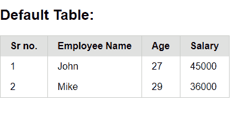

# 纯 CSS 简介

> Original: [https://www.geeksforgeeks.org/pure-css-introduction/](https://www.geeksforgeeks.org/pure-css-introduction/)

纯 CSS 是 CSS 的一个框架。 它是一个免费的开源工具集，用于创建响应性网站和 Web 应用程序。 Pure CSS 是由 Yahoo 开发的，用于创建更快、更漂亮、更具响应性的网站。 它可以用作[Bootstrap](https://www.geeksforgeeks.org/bootstrap-tutorials/)的替代。

**为什么我们使用纯 CSS？**

*   对于 Web 开发来说，这是一种更快、更容易的方式。
*   它创建独立于平台的网页。
*   它创建响应式的网页。
*   它还为移动设备设计响应迅速的网页。
*   它是 https://purecss.io/上提供的免费开源框架

**纯 CSS 组件：**纯 CSS 包含以下组件的集合：

*   基础 / 据点 / 基本成分 / 垒
*   栅栏 / 网格 / 输电网 / 橄榄球赛
*   形状 / 种类 / 方式 / 表格
*   小跟班
*   桌子 / 列表 / 表格 / 平面
*   菜单 / 饭菜 / 选单

**如何在网页中使用纯 CSS？**

我们可以通过两种方式将纯 CSS 添加到我们的网页：

*   使用 NPM 安装
*   使用 CDN 链路

**1.使用 NPM 安装：**您可以通过[npm](https://www.geeksforgeeks.org/node-js-npm-node-package-manager/)将纯 CSS 添加到您的项目中。 这是我们推荐的将 Pure CSS 集成到项目的构建过程和工具链中的方法。

```
$ npm install purecss --save
```

**2.使用 CDN 链接：**您可以通过免费的 unpkg CDN 链接将纯 CSS 添加到您的页面。 只需在项目样式表之前将以下<link>元素添加到页面的<head>中。

> <link rel="”stylesheet”" href="”https://unpkg.com/purecss@2.0.5/build/pure-min.css”" integrity="”sha384-LTIDeidl25h2dPxrB2Ekgc9c7sEC3CWGM6HeFmuDNUjX76Ert4Z4IY714dhZHPLd”" crossorigin="”anonymous”">

**示例：**在本例中，我们使用 Pure CSS 的纯表类创建一个表。 这些表格就像普通的 HTML 表格一样，但是在表格元素中添加了填充和边框，并且有一个强调的标题。 要创建默认表，请将 class**“纯表”**添加到<table>元素。

## 超文本标记语言

```
<!DOCTYPE html>
<html>

<head>

    <!--Import Pure CSS files-->
    <link rel="stylesheet" 
href="https://unpkg.com/purecss@2.0.5/build/pure-min.css" 
integrity="sha384-LTIDeidl25h2dPxrB2Ekgc9c7sEC3CWGM6HeFmuDNUjX76Ert4Z4IY714dhZHPLd" 
crossorigin="anonymous">

    <!-- Let browser know website is
        optimized for mobile -->
    <meta name="viewport" 
          content="width=device-width, initial-scale=1.0" />
</head>

<body>
    <h2>Default Table: </h2>

    <!-- Add class "pure-table" -->
    <table class="pure-table">
        <thead>
            <tr>
                <th>Sr no.</th>
                <th>Employee Name</th>
                <th>Age</th>
                <th>Salary</th>
            </tr>
        </thead>

        <tbody>
            <tr>
                <td>1</td>
                <td>John</td>
                <td>27</td>
                <td>45000</td>
            </tr>

            <tr>
                <td>2</td>
                <td>Mike</td>
                <td>29</td>
                <td>36000</td>
            </tr>

        </tbody>
    </table>
</body>

</html>
```

发帖主题：Re：Колибри0.7.0

