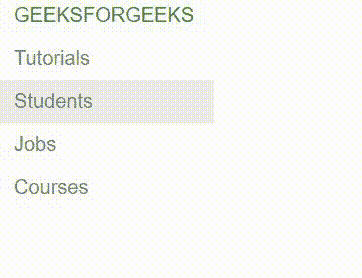
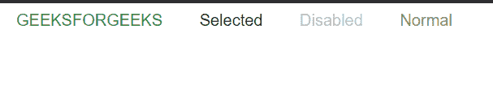
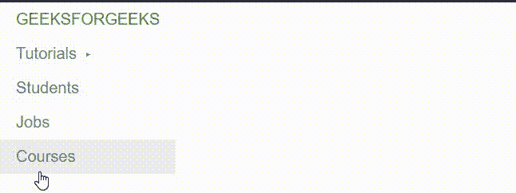

# 纯 CSS 菜单

> Original: [https://www.geeksforgeeks.org/pure-css-menus/](https://www.geeksforgeeks.org/pure-css-menus/)

菜单是访问者浏览整个网站的主要工具。 CSS 提供了非常简单的垂直和水平菜单，开发人员可以很容易地对其进行自定义。

**纯 CSS 菜单类：**

*   垂直菜单
*   水平菜单
*   菜单中选定和禁用的项目
*   下拉菜单
*   带有嵌套子菜单的垂直菜单

**垂直菜单：**Pure.CSS 提供的菜单默认为垂直菜单。 默认样式是最小的，因此开发人员可以轻松地对其进行自定义。 默认垂直菜单通常包含其容器的全宽，但开发人员可以指定它。 开发人员还可以相应地设置显示属性。

*   **Pure-Menu**是生成水平菜单的默认类。 它可以包含列表形式的菜单项和标题。
*   **Pure-Menu-List**是包含菜单项的无序列表的类。 此列表中的列表项必须具有类“”**Pure-Menu-Item“”。“”**
*   **PURE-MENU-LINK**是添加到菜单项内链接的类。
*   **纯菜单标题**是为菜单列表内部或外部的标题添加的类。 默认情况下，它将内部文本大写。

**语法：↔**

```css
<div class="pure-menu">
    <ul class="pure-menu-list">
        <li class="pure-menu-heading">
            Some Text Here
        </li>
        <li class="pure-menu-item">
            <a href="#" class="pure-menu-link">
                Some Text Here
            </a>
        </li>
    </ul>
</div>
```

**示例：**

## 超文本标记语言

```css
<!DOCTYPE html>
<html lang="en">
<head>
    <title>Pure CSS Menus</title>

    <link rel="stylesheet"
          href=
"https://unpkg.com/purecss@2.0.6/build/pure-min.css">

    <style>
        .custom-width {
        display: inline-block;
        }
        .pure-menu-heading{
            color: #308d46;
        }
    </style>
</head>

<body>
    <div class="pure-menu custom-width">
        <ul class="pure-menu-list">
            <li class="pure-menu-heading">
                GeeksforGeeks
            </li>
            <li class="pure-menu-item">
                <a href="#" class="pure-menu-link">
                    Tutorials
                </a>
            </li>
            <li class="pure-menu-item">
                <a href="#" class="pure-menu-link">
                    Students
                </a>
            </li>
            <li class="pure-menu-item">
                <a href="#" class="pure-menu-link">
                    Jobs
                </a>
            </li>
            <li class="pure-menu-item">
                <a href="#" class="pure-menu-link">
                    Courses
                </a>
            </li>
        </ul>
    </div>
</body>

</html>
```

发帖主题：Re：Колибри0.7.0



**水平菜单：**将类**‘Pure-Menu-Horizative’**添加到默认垂直的‘**PURE-MENU’**以使其成为水平菜单。 子元素，如**纯菜单列表**、**纯菜单项**、**纯菜单链接**、**和**纯菜单标题**保持与默认垂直菜单相同。**

****语法：****

```css
<div class="pure-menu pure-menu-horizontal">
    <ul class="pure-menu-list">
        <li class="pure-menu-heading">Some Text Here</li>
        <li class="pure-menu-item">
            <a href="#" class="pure-menu-link">
                Some Text Here
            </a>
        </li>
    </ul>
</div>
```

****示例：****

## **超文本标记语言**

```css
<!DOCTYPE html>
<html lang="en">
<head>
    <title>Pure CSS Menus</title>
    <link rel="stylesheet"
          href=
"https://unpkg.com/purecss@2.0.6/build/pure-min.css">

    <style>
        .pure-menu-heading{
            color: #308d46;
        }
    </style>
</head>

<body>
    <div class="pure-menu pure-menu-horizontal">
        <ul class="pure-menu-list">
            <li class="pure-menu-heading">
                GeeksforGeeks
            </li>
            <li class="pure-menu-item">
                <a href="#" class="pure-menu-link">
                    Tutorials
                </a>
            </li>
            <li class="pure-menu-item">
                <a href="#" class="pure-menu-link">
                    Students
                </a>
            </li>
            <li class="pure-menu-item">
                <a href="#" class="pure-menu-link">
                    Jobs
                </a>
            </li>
            <li class="pure-menu-item">
                <a href="#" class="pure-menu-link">
                    Courses
                </a>
            </li>
        </ul>
    </div>
</body>

</html>
```

**发帖主题：Re：Колибри0.7.0**

****

****菜单内选中和禁用的项目：**纯 CSS 提供了默认类，使我们能够将菜单项突出显示为禁用或选中。 在“**纯菜单项**”之后添加“**纯菜单禁用**”类名以禁用项目，并添加“**纯菜单选择**”类名以使项目看起来像被选中的。**

****语法：****

```css
<li class="pure-menu-item pure-menu-disabled">
    Inner Elements
</li>
<li class="pure-menu-item pure-menu-selected">
    Inner Elements
</li>
```

****示例：****

## **超文本标记语言**

```css
<!DOCTYPE html>
<html lang="en">

<head>
    <title>Pure.CSS | Menus</title>
    <link rel="stylesheet" href=
"https://unpkg.com/purecss@2.0.6/build/pure-min.css">

    <style>
        .pure-menu-heading {
            color: #308d46;
        }
    </style>
</head>

<body>
    <div class="pure-menu pure-menu-horizontal">
        <ul class="pure-menu-list">
            <li class="pure-menu-heading">
                GeeksforGeeks
            </li>
            <li class="pure-menu-item pure-menu-selected">
                <a href="#" class="pure-menu-link">
                    Selected
                </a>
            </li>
            <li class="pure-menu-item pure-menu-disabled">
                <a href="#" class="pure-menu-link">
                    Disabled
                </a>
            </li>
            <li class="pure-menu-item">
                <a href="#" class="pure-menu-link">
                    Normal
                </a>
            </li>
        </ul>
    </div>
</body>

</html>
```

**发帖主题：Re：Колибри0.7.0**

****

****下拉菜单：**下拉项目只能添加到水平菜单。 下面讨论创建下拉菜单的步骤。**

*   **选择要添加下拉项的列表项，并向其中添加类‘**PURE-MENU-HAS-CHILDS**’。**
*   **在该元素内创建一个无序列表，其类为‘**PURE-MENU-CHILDS**’。**
*   **使用“**纯菜单项**”类添加其中的列表项。**
*   **将类‘**PURE-MENU-ALLOW-HOVER**’添加到父列表项以使下拉菜单在悬停时出现。**

****语法：****

```css
<li class="pure-menu-item 
    pure-menu-has-children pure-menu-allow-hover">
    Some Inner Elements
    <ul class="pure-menu-children">
        <li class="pure-menu-item">
            Inner Elements
        </li>
    </ul>
</li>
```

****示例：****

## **超文本标记语言**

```css
<!DOCTYPE html>
<html lang="en">

<head>
    <title>Pure.CSS | Menus</title>
    <link rel="stylesheet" href=
"https://unpkg.com/purecss@2.0.6/build/pure-min.css">

    <style>
        .pure-menu-heading {
            color: #308d46;
        }
    </style>
</head>

<body>
    <div class="pure-menu pure-menu-horizontal">
        <ul class="pure-menu-list">
            <li class="pure-menu-heading">
                GeeksforGeeks
            </li>
            <li class="pure-menu-item 
                       pure-menu-has-children 
                       pure-menu-allow-hover">
                <a href="#" class="pure-menu-link">
                    Tutorials
                </a>
                <ul class="pure-menu-children">
                    <li class="pure-menu-item">
                        <a href="#" class="pure-menu-link">
                            Data Structures and Algorithms
                        </a>
                    </li>
                    <li class="pure-menu-item">
                        <a href="#" class="pure-menu-link">
                            GATE 2021
                        </a>
                    </li>
                    <li class="pure-menu-item">
                        <a href="#" class="pure-menu-link">
                            Practice
                        </a>
                    </li>
                </ul>
            </li>
            <li class="pure-menu-item">
                <a href="#" class="pure-menu-link">
                    Students
                </a>
            </li>
            <li class="pure-menu-item">
                <a href="#" class="pure-menu-link">
                    Jobs
                </a>
            </li>
            <li class="pure-menu-item">
                <a href="#" class="pure-menu-link">
                    Courses
                </a>
            </li>
        </ul>
    </div>
</body>

</html>
```

**发帖主题：Re：Колибри0.7.0**

****

****带有嵌套子菜单的垂直菜单：**创建带有嵌套子菜单的垂直菜单的方法与创建下拉菜单的方法非常相似。 只是菜单必须是默认的垂直菜单，而不是水平菜单。**

****语法：****

```css
<li class="pure-menu-item pure-menu-has-children pure-menu-allow-hover">
    Some Inner Elements
    <ul class="pure-menu-children">
        <li class="pure-menu-item">
            Inner Elements
        </li>
    </ul>
</li>
```

****示例：****

## **超文本标记语言**

```css
<!DOCTYPE html>
<html lang="en">

<head>
    <title>Pure CSS Menus</title>
    <link rel="stylesheet" href=
"https://unpkg.com/purecss@2.0.6/build/pure-min.css">

    <style>
        .pure-menu-heading {
            color: #308d46;
        }

        .custom-display {
            display: inline-block;
        }
    </style>
</head>

<body>
    <div class="pure-menu custom-display">
        <ul class="pure-menu-list">
            <li class="pure-menu-heading">
                GeeksforGeeks
            </li>
            <li class="pure-menu-item 
                       pure-menu-has-children 
                       pure-menu-allow-hover">
                <a href="#" class="pure-menu-link">
                    Tutorials
                </a>
                <ul class="pure-menu-children">
                    <li class="pure-menu-item">
                        <a href="#" class="pure-menu-link">
                            Data Structures and Algorithms
                        </a>
                    </li>
                    <li class="pure-menu-item">
                        <a href="#" class="pure-menu-link">
                            GATE 2021
                        </a>
                    </li>
                    <li class="pure-menu-item">
                        <a href="#" class="pure-menu-link">
                            Practice
                        </a>
                    </li>
                </ul>
            </li>
            <li class="pure-menu-item">
                <a href="#" class="pure-menu-link">
                    Students
                </a>
            </li>
            <li class="pure-menu-item">
                <a href="#" class="pure-menu-link">
                    Jobs
                </a>
            </li>
            <li class="pure-menu-item">
                <a href="#" class="pure-menu-link">
                    Courses
                </a>
            </li>
        </ul>
    </div>
</body>

</html>
```

**发帖主题：Re：Колибри0.7.0**

****