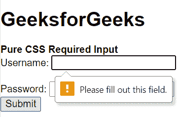
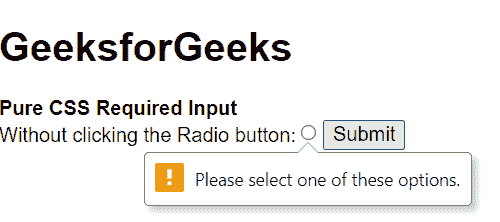

# Pure.CSS 必需输入

> Original: [https://www.geeksforgeeks.org/pure-css-required-inputs/](https://www.geeksforgeeks.org/pure-css-required-inputs/)

在某些情况下，当我们要求某人填写表格时，没有几项是可选的，也没有几项是必须填写的。

在这种情况下，我们也可以在纯 CSS 中使用所需的[HTML](https://www.geeksforgeeks.org/html-input-required-attribute/)。 *此属性适用于其他类型的输入，如单选、复选框、数字、文本等。

**语法：**

```html
<input required> 
```

**示例 1：**在此示例中，我们将对文本输入类型使用[Required](https://www.geeksforgeeks.org/html-input-required-attribute/)属性。

## 超文本标记语言

```html
<!DOCTYPE html>
<html>

<head>
    <link rel="stylesheet" href=
"https://unpkg.com/purecss@1.0.0/build/pure-min.css"
        integrity=
"sha384-nn4HPE8lTHyVtfCBi5yW9d20FjT8BJwUXyWZT9InLYax14RDjBj46LmSztkmNP9w"
        crossorigin="anonymous">
</head>

<body>
    <h1>GeeksforGeeks</h1>

    <strong>
        Pure CSS Required Input
    </strong>

    <form action="">
        Username:
        <input type="text" name="usrname" required="">
        <br><br>

        Password:
        <input type="password" name="password">
        <br>
        <input type="submit">
    </form>
</body>

</html>
```

发帖主题：Re：Колибри0.7.0



**示例 2：**在此示例中，我们将对无线电输入类型使用[Required](https://www.geeksforgeeks.org/html-required-attribute/)属性。

## 超文本标记语言

```html
<!DOCTYPE html>
<html>

<head>
    <link rel="stylesheet" href=
"https://unpkg.com/purecss@1.0.0/build/pure-min.css"
        integrity=
"sha384-nn4HPE8lTHyVtfCBi5yW9d20FjT8BJwUXyWZT9InLYax14RDjBj46LmSztkmNP9w"
        crossorigin="anonymous">
</head>

<body>
    <h1>GeeksforGeeks</h1>

    <strong>
        Pure CSS Required Input
    </strong>

    <form action="">
        Without clicking the Radio button:
        <input type="radio" 
            name="radiocheck" required="">

        <input type="submit">
    </form>
</body>

</html>
```

发帖主题：Re：Колибри0.7.0

