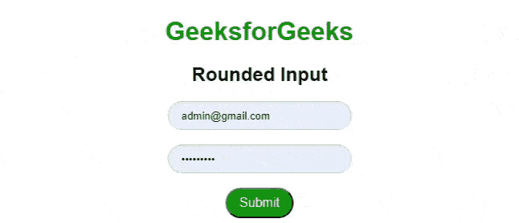

# 纯 CSS 四舍五入输入

> Original: [https://www.geeksforgeeks.org/pure-css-rounded-inputs/](https://www.geeksforgeeks.org/pure-css-rounded-inputs/)

[**纯 CSS**](https://www.geeksforgeeks.org/pure-css-introduction/)是 CSS 的框架。 它是一个免费的开源工具集，用于创建响应性网站和 Web 应用程序。 Pure CSS 是由 Yahoo 开发的，用于创建更快、更漂亮、更具响应性的网站。 它可以用作 Bootstrap 的替代方案。

纯 CSS 提供了“***纯输入四舍五入的***”类名，用于显示圆角的表单控件。 它通常用于搜索索引。

**语法：**

```html
<input type="input-type" class="pure-input-rounded">  
```

**示例：**在此示例中，我们使用类***纯表单***作为父标记的表单标记。 在父窗体标记内，我们有一个输入标记，其类为***纯输入四舍五入的***，用于四舍五入的输入框。 我们还可以使用相同的语法创建圆角提交按钮，方法是将输入类型设置为 Submit。

## 超文本标记语言

```html
<!DOCTYPE html>
<html lang="en">

<head>
    <meta charset="utf-8">
    <meta name="viewport" content=
        "width=device-width, initial-scale=1">
    <link rel="stylesheet" href=
"https://unpkg.com/purecss@2.0.5/build/pure-min.css"
        integrity=
"sha384-LTIDeidl25h2dPxrB2Ekgc9c7sEC3CWGM6HeFmuDNUjX76Ert4Z4IY714dhZHPLd"
        crossorigin="anonymous">
</head>

<body>
    <center>
        <div>
            <h1 style="color:green;">
                GeeksforGeeks
            </h1>

            <h2>Rounded Input</h2>

            <form class="pure-form">
                <input type="text" 
                    class="pure-input-rounded">

                <br /><br />
                <input type="password" 
                    class="pure-input-rounded">

                <br /><br />
                <input type="submit" 
                    class="pure-input-rounded" 
                    style="background-color:green;
                    color:white;" />
            </form>
        </div>
    </center>
</body>

</html>
```

发帖主题：Re：Колибри0.7.0

