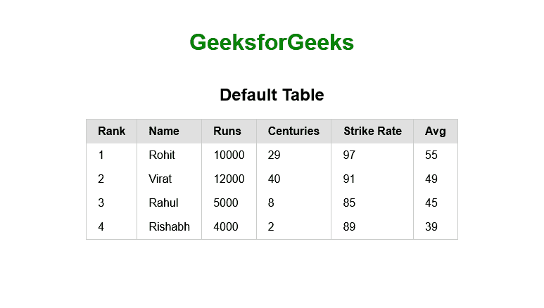
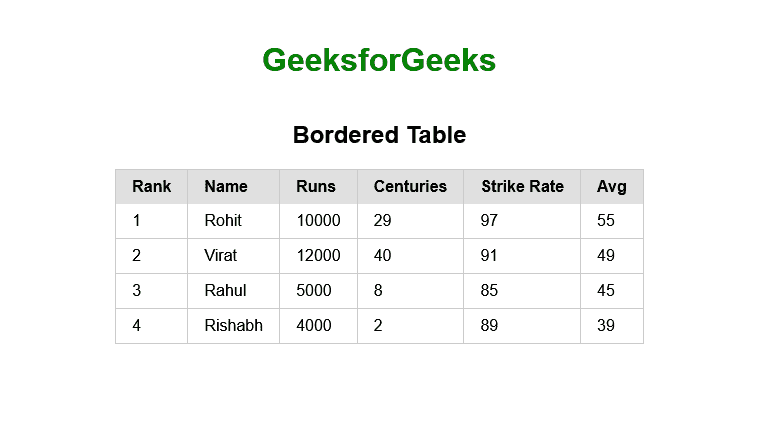
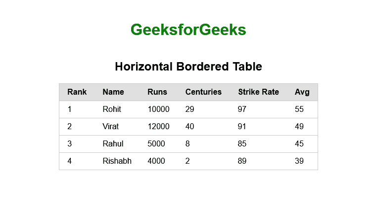
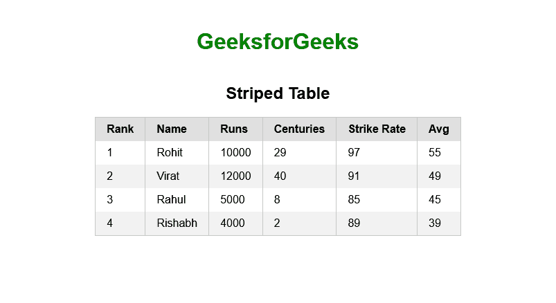

# 纯 CSS 表格

> 原文:[https://www.geeksforgeeks.org/pure-css-tables/](https://www.geeksforgeeks.org/pure-css-tables/)

**简介:**在入手 Pure 之前，我们必须了解素颜 [CSS](https://www.geeksforgeeks.org/css-introduction/) 的基础知识。基本上，纯 CSS 是由 YAHOO 开发的级联样式表框架。开发 [Pure CSS](https://www.geeksforgeeks.org/pure-css-introduction/) 的主要原因是用来开发类似 [Bootstrap](https://www.geeksforgeeks.org/bootstrap-tutorials/) 这样的响应性和反应性强的网站，也兼容移动设备，是开源的 CSS 框架，免费使用。可以是[物化 CSS](https://www.geeksforgeeks.org/materialize-introduction-and-installation/) 的最佳替代品。

在本文中，我们将了解什么是纯 CSS 表？并学习如何在我们的项目中使用它。

当我们想到创建网页时，我们知道表格是将网站中的大量数据以行和列的形式组织起来的一种既好又简单的方法。通过使用纯 CSS 框架，我们将能够设计不同类型的表。

纯 CSS 为样式表提供了许多实用程序类，基本上有 5 个主要类，如下所示:

*   **纯表格:**该类用于为表格设置默认填充样式，并为带有强调标题的表格元素分配边框。
*   **纯表格边框:**该类用于在表格上垂直和水平绘制所有表格单元格的边框。
*   **纯-表格-水平:**这个类用来绘制只有水平线的表格。
*   **纯表奇:**这个类用来创建一个斑马风格效果的条纹表，对于用户来说更加可见和吸引人。
*   **纯表分条:**基本上是用来显示分条表的。它在传递到*纯表*类旁边的<表>元素后自动分条一个表。

**示例:**现在我们在这里学习如何在 HTML 中使用表类。

**1。默认表格:*****纯表格*** 类在<表格>标签中使用，以一些基本的 CSS 样式创建一个基本表格，这些表格就像普通的 HTML 表格一样，带有一些填充和边框，添加到带有标题的表格元素中。

## 超文本标记语言

```html
<!DOCTYPE html>
<html>
  <head>
    <!-- Import Pure CSS -->
    <link rel="stylesheet"
          href="https://unpkg.com/purecss@2.0.6/build/pure-min.css"
          integrity="sha384-Uu6IeWbM+gzNVXJcM9XV3SohHtmWE+3VGi496jvgX1jyvDTXfdK+rfZc8C1Aehk5"
          crossorigin="anonymous"
          origin="anonymous"
    />

    <!-- Used to optimized Website for mobile -->
    <meta name="viewport" content="width=device-width, initial-scale=1.0" />

    <style>
      .container {
        margin-top: 20px;
        display: flex;
        align-items: center;
        justify-content: center;
        flex-direction: column;
      }
      h1 {
        color: green;
      }
    </style>
  </head>
  <body>
    <div class="container">
      <h1>GeeksforGeeks</h1>
      <h2>Default Table</h2>

      <!-- Here pure-table class is used -->
      <table class="pure-table">
        <thead>
          <tr>
            <th>Rank</th>
            <th>Name</th>
            <th>Runs</th>
            <th>Centuries</th>
            <th>Strike Rate</th>
            <th>Avg</th>
          </tr>
        </thead>

        <tbody>
          <tr>
            <td>1</td>
            <td>Rohit</td>
            <td>10000</td>
            <td>29</td>
            <td>97</td>
            <td>55</td>
          </tr>

          <tr>
            <td>2</td>
            <td>Virat</td>
            <td>12000</td>
            <td>40</td>
            <td>91</td>
            <td>49</td>
          </tr>

          <tr>
            <td>3</td>
            <td>Rahul</td>
            <td>5000</td>
            <td>8</td>
            <td>85</td>
            <td>45</td>
          </tr>

          <tr>
            <td>4</td>
            <td>Rishabh</td>
            <td>4000</td>
            <td>2</td>
            <td>89</td>
            <td>39</td>
          </tr>
        </tbody>
      </table>
    </div>
  </body>
</html>
```

**输出:**



**2。加边表格:**这里我们使用 ***纯表格加边*** 类来创建加边表格。这个类将为表格的所有单元格添加垂直和水平边框。

## 超文本标记语言

```html
<!DOCTYPE html>
<html>
  <head>
    <!-- Import Pure CSS -->
    <link rel="stylesheet"
          href="https://unpkg.com/purecss@2.0.6/build/pure-min.css"
          integrity="sha384-Uu6IeWbM+gzNVXJcM9XV3SohHtmWE+3VGi496jvgX1jyvDTXfdK+rfZc8C1Aehk5"
          crossorigin="anonymous"
          origin="anonymous"
    />

    <!-- Used to optimized Website for mobile -->
    <meta name="viewport" content="width=device-width, initial-scale=1.0" />

    <style>
      .container {
        margin-top: 20px;
        display: flex;
        align-items: center;

        justify-content: center;
        flex-direction: column;
      }
      h1 {
        color: green;
      }
    </style>
  </head>
  <body>
    <div class="container">
      <h1>GeeksforGeeks</h1>
      <h2>Bordered Table</h2>
      <!-- Here pure-table and pure-table-bordered class is used -->

      <table class="pure-table pure-table-bordered">
        <thead>
          <tr>
            <th>Rank</th>
            <th>Name</th>
            <th>Runs</th>
            <th>Centuries</th>
            <th>Strike Rate</th>
            <th>Avg</th>
          </tr>
        </thead>

        <tbody>
          <tr>
            <td>1</td>
            <td>Rohit</td>
            <td>10000</td>
            <td>29</td>
            <td>97</td>
            <td>55</td>
          </tr>

          <tr>
            <td>2</td>
            <td>Virat</td>
            <td>12000</td>
            <td>40</td>
            <td>91</td>
            <td>49</td>
          </tr>

          <tr>
            <td>3</td>
            <td>Rahul</td>
            <td>5000</td>
            <td>8</td>
            <td>85</td>
            <td>45</td>
          </tr>

          <tr>
            <td>4</td>
            <td>Rishabh</td>
            <td>4000</td>
            <td>2</td>
            <td>89</td>
            <td>39</td>
          </tr>
        </tbody>
      </table>
    </div>
  </body>
</html>
```

**输出:**



**3。带有水平边框的表格:**这里我们使用了 ***纯表格-水平*** 类来创建这种类型的表格。这将创建一个只有水平线的表格。

## 超文本标记语言

```html
<!DOCTYPE html>
<html>
  <head>
    <!-- Import Pure CSS -->
    <link rel="stylesheet"
          href="https://unpkg.com/purecss@2.0.6/build/pure-min.css"
          integrity="sha384-Uu6IeWbM+gzNVXJcM9XV3SohHtmWE+3VGi496jvgX1jyvDTXfdK+rfZc8C1Aehk5"
          crossorigin="anonymous"
          origin="anonymous"
    />

    <!-- Used to optimized Website for mobile -->
    <meta name="viewport" content="width=device-width, initial-scale=1.0" />

    <style>
      .container {
        margin-top: 20px;
        display: flex;
        align-items: center;

        justify-content: center;
        flex-direction: column;
      }
      h1 {
        color: green;
      }
    </style>
  </head>
  <body>
    <div class="container">
      <h1>GeeksforGeeks</h1>
      <h2>Horizontal Bordered Table</h2>

      <!-- Here pure-table and pure-table-horizontal class is used -->
      <table class="pure-table pure-table-horizontal">
        <thead>
          <tr>
            <th>Rank</th>
            <th>Name</th>
            <th>Runs</th>
            <th>Centuries</th>
            <th>Strike Rate</th>
            <th>Avg</th>
          </tr>
        </thead>

        <tbody>
          <tr>
            <td>1</td>
            <td>Rohit</td>
            <td>10000</td>
            <td>29</td>
            <td>97</td>
            <td>55</td>
          </tr>

          <tr>
            <td>2</td>
            <td>Virat</td>
            <td>12000</td>
            <td>40</td>
            <td>91</td>
            <td>49</td>
          </tr>

          <tr>
            <td>3</td>
            <td>Rahul</td>
            <td>5000</td>
            <td>8</td>
            <td>85</td>
            <td>45</td>
          </tr>

          <tr>
            <td>4</td>
            <td>Rishabh</td>
            <td>4000</td>
            <td>2</td>
            <td>89</td>
            <td>39</td>
          </tr>
        </tbody>
      </table>
    </div>
  </body>
</html>
```

**输出:**



**4。分条表格:**为了更好地可视化大尺寸表格，我们可以使用分条单元格。对于这里的分条表，我们在每一个 **< tr >** 元素标签中使用了 ***纯表-奇数*** 纯 CSS 类来改变奇数行的背景。这将创建一个具有斑马风格效果的分条表，对于用户的大量数据来说，这种效果更加明显和吸引人。

## 超文本标记语言

```html
<!DOCTYPE html>
<html>
  <head>
    <!-- Import Pure CSS -->
    <link rel="stylesheet"
          href="https://unpkg.com/purecss@2.0.6/build/pure-min.css"
          integrity="sha384-Uu6IeWbM+gzNVXJcM9XV3SohHtmWE+3VGi496jvgX1jyvDTXfdK+rfZc8C1Aehk5"
          crossorigin="anonymous"
          origin="anonymous"
    />

    <!-- Used to optimized Website for mobile -->
    <meta name="viewport" content="width=device-width, initial-scale=1.0" />

    <style>
      .container {
        margin-top: 20px;
        display: flex;
        align-items: center;
        justify-content: center;
        flex-direction: column;
      }
      h1 {
        color: green;
      }
    </style>
  </head>
  <body>
    <div class="container">
      <h1>GeeksforGeeks</h1>
      <h2>Horizontal Bordered Table</h2>

      <!-- Here pure-table class is used -->
      <table class="pure-table">
        <thead>
          <tr>
            <th>Rank</th>
            <th>Name</th>
            <th>Runs</th>
            <th>Centuries</th>
            <th>Strike Rate</th>
            <th>Avg</th>
          </tr>
        </thead>

        <tbody>
          <tr>
            <td>1</td>
            <td>Rohit</td>
            <td>10000</td>
            <td>29</td>
            <td>97</td>
            <td>55</td>
          </tr>

          <!--Here pure-table-odd class used
            to change background of row-->
          <tr class="pure-table-odd">
            <td>2</td>
            <td>Virat</td>
            <td>12000</td>
            <td>40</td>
            <td>91</td>
            <td>49</td>
          </tr>

          <tr>
            <td>3</td>
            <td>Rahul</td>
            <td>5000</td>
            <td>8</td>
            <td>85</td>
            <td>45</td>
          </tr>

          <tr class="pure-table-odd">
            <td>4</td>
            <td>Rishabh</td>
            <td>4000</td>
            <td>2</td>
            <td>89</td>
            <td>39</td>
          </tr>
        </tbody>
      </table>
    </div>
  </body>
</html>
```

**输出:**



在本文中，我们学习了什么是纯 CSS 表，它的类，以及如何在各种表中使用它。