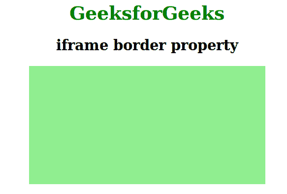

# 使用 CSS 从 IFrame 中移除边框

> 原文:[https://www . geeksforgeeks . org/remove-border-from-iframe-using-CSS/](https://www.geeksforgeeks.org/remove-border-from-iframe-using-css/)

Iframe 用于在网页上显示网页。移除网页中 *iframe* 标签的边框可以通过使用名为 *frameBorder* 的 iframe 标签的 CSS 属性之一并将其值设置为“0”来完成。

**语法:**

```html
frameBorder = "value";
```

**注意:**在 frameBorder 属性中，B 字母必须是大写的，否则浏览器无法识别。frameBorder 属性取的值是 0 和 1，其中 0 用于禁用边框，1 用于启用边框属性。默认情况下，该值设置为 1。

**例 1:**

```html
<!DOCTYPE html>
<html>
    <head>
        <title>Disable Iframe Border</title>
        <style>
            iframe {
                height:200px;
                width:400px;
                background-color:lightgreen;
            }
            h1 {
                color:green;
            }
            body {
                text-align:center;
            }
        </style>
    </head>
    <body>
        <h1>GeeksforGeeks</h1>
        <h2>iframe border property</h2>

        <!-- We do not use border by specifying value 0 -->
        <iframe src=# frameBorder="0"></iframe> 
    </body>
</html>                    
```

**输出:**


**例 2:**

```html
<!DOCTYPE html>
<html>
    <head>
        <title>Disable Iframe Border</title>
        <style>
            iframe {
                height:200px;
                width:400px;
                background-color:green;
            }
            h1 {
                color:green;
            }
            body {
                text-align:center;
            }
        </style>
    </head>
    <body>
        <h1>GeeksforGeeks</h1>
        <h2>iframe border property</h2>

        <!-- We use border by specifying a non-zero value -->
        <iframe src=# frameBorder="1"></iframe> 
    </body>
</html>                    
```

**输出:**
