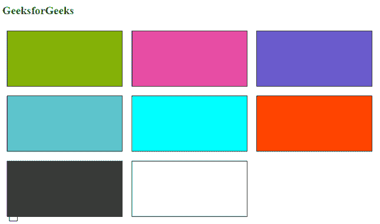

# CSS 中的 RGB 流

> 原文:[https://www.geeksforgeeks.org/rgb-stream-in-css/](https://www.geeksforgeeks.org/rgb-stream-in-css/)

RGB 代表 CSS 中的颜色。在这个命名法中，有三种流代表一种颜色，即红色、绿色和蓝色流。颜色的强度用数字 0 到 255 表示。这使得 CSS 具有可见的颜色光谱。

这三种颜色可以是数字(0 到 255)或百分比。

*   RGB(255，0，0)或 RGB(100%，0，0)为红色，因为红色被设置为其最高值。
*   RGB(0，255，0)或 RGB(0，100%，0)为绿色，因为绿色被设置为其最高值。
*   RGB(0，0，255)或 RGB(0，0，100%)为蓝色，因为蓝色被设置为其最高值。

**例 1:**

## 超文本标记语言

```css
<!DOCTYPE html>
<html>

<head>
    <style>
        div {
            width: 100px;
            height: 100px;
            border: 2px solid;
            display: flex;
            float: left;
            margin: 10px;
            border-radius: 10px;
        }

        .box1 {

            /* rgb(100%, 0, 0) */
            background-color: rgb(255, 0, 0);
        }

        .box2 {

            /* rgb(0, 100%, 0) */
            background-color: rgb(0, 255, 0);
        }

        .box3 {

            /* rgb(0, 0, 100%) */
            background-color: rgb(0, 0, 255);
        }
    </style>
</head>

<body>
    <h2 style="color:green">GeeksforGeeks</h2>
    <div class="box1"></div>
    <div class="box2"></div>
    <div class="box3"></div>
</body>

</html>
```

**输出:**


**例 2:** 我们可以对不同的颜色使用 [rgb()](https://www.geeksforgeeks.org/css-rgb-function/) 。

## 超文本标记语言

```css
<!DOCTYPE html>
<html>

<head>
    <style>
        div {
            width: 250px;
            height: 120px;
            display: flex;
            float: left;
            margin: 10px;
            border: 1px solid;
        }

        .box1 {
            background-color: rgb(131, 176, 7);
        }

        .box2 {
            background-color: rgb(230, 77, 163);
        }

        .box3 {
            background-color: rgb(106, 90, 205);
        }

        .box4 {
            background-color: rgb(90, 197, 205);
        }

        .box5 {
            background-color: rgb(0, 255, 255);
        }

        .box6 {
            background-color: rgb(255, 69, 0);
        }

        .box7 {
            background-color: rgb(60, 60, 60);
        }

        .box8 {
            background-color: rgb(255, 255, 255);
        }
    </style>
</head>

<body>
    <h2 style="color:green">
          GeeksforGeeks
      </h2>

    <div class="box1"></div>
    <div class="box2"></div>
    <div class="box3"></div>
    <div class="box4"></div>
    <div class="box5"></div>
    <div class="box6"></div>
    <div class="box7"></div>
    <div class="box8"></div>
</body>

</html>
```

**输出:**

