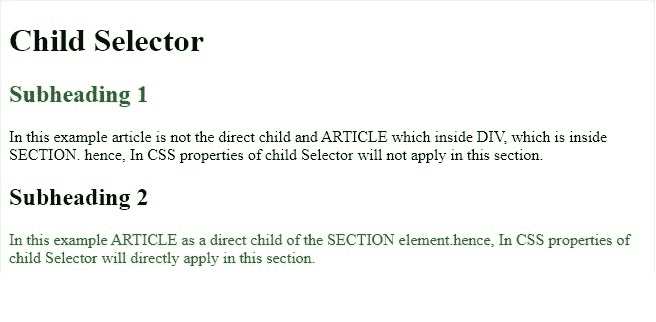
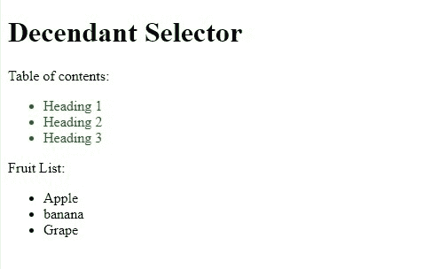

# CSS 选择器的作用

> 原文:[https://www.geeksforgeeks.org/role-of-css-selector/](https://www.geeksforgeeks.org/role-of-css-selector/)

在本文中，我们将讨论在设计网页时 CSS 选择器是如何重要的。CSS 选择器在响应网页中的作用非常重要。让我们一个一个讨论。
**子选择器的作用:**在子选择器中，任何元素的属性都是另一个元素的直接父元素。

**语法:**

```html
if article > p  
```

它定义段落元素是文章的直接子元素，那么 CSS 选择器属性将适用。

## 超文本标记语言

```html
<!DOCTYPE html>
<html>

<head>
    <style>

        /* In child selector any article
        element whose immediate parent is
        a section element. */
        section > article {
            color: green;
            font-size: 16px;
        }

        /* In child selector any h2
        element whose immediate parent
        is a section element. */
        section > h2 {
            color: green;
        }
    </style>
</head>

<body>
    <h1>Child Selector</h1>

    <section>
        <h2>Subheading 1</h2>

        <!-- Applicable to Subheading 1
            because h2 is direct child
            of section here. -->
        <div>
            <article>
                In this example, article is
                not the direct child and
                ARTICLE which is inside DIV,
                which is inside SECTION. In
                CSS properties of child,
                selector will not apply in
                this section.
            </article>
        </div>
    </section>

    <h2>Subheading 2</h2>
    <section>
        <article>
            In this example ARTICLE as a
            direct child of the SECTION
            element. In CSS properties
            of child, selector will directly
            apply in this section.
        </article>

        <!-- Not applicable for Subheading 2,
            because h2 is not direct child
            of section here. -->
    </section>
</body>

</html>      
```

上述代码的输出验证了子 CSS 选择器属性是否适用于节元素。

**输出:**



**后代选择器的角色:**后代选择器的 CSS 选择器属性适用于每一个级别或父元素。
**语法:**

```html
section li
```

它定义“li”是子元素，但在任何级别上，它也只考虑截面元素和属性中的“li”元素适用。

## 超文本标记语言

```html
<!DOCTYPE html>
<html>

<head>
    <style>

        /* In this Descendant selector,
        properties will be applicable to
        all "li" elements that are inside
        section element. */
        section li {
            color: green;
        }
    </style>
</head>

<body>
    <h1>Descendant Selector</h1>
    <section>
        Table of contents:
        <ul>
            <li>Article 1</li>
            <li>Article 2</li>
            <li>Article 3</li>
        </ul>
    </section>
    <article>
        Shopping List:
        <ul>
            <li>Cookies</li>
            <li>Cake</li>
            <li>Pie</li>
        </ul>
    </article>
</body>

</html>
```

**输出:**

