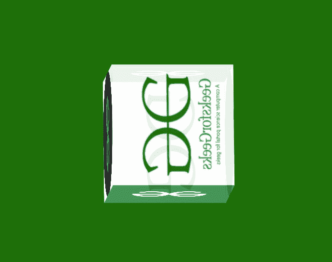

# 使用 CSS 旋转 3D 图像预览器立方体

> 原文:[https://www . geesforgeks . org/rotating-3d-image-previewer-cube-using-CSS/](https://www.geeksforgeeks.org/rotating-3d-image-previewer-cube-using-css/)

3D 旋转图像预览器立方体是一种效果，其中一组图像出现在旋转的 3D 立方体的表面上。这种效果可以使用 HTML 和 CSS 来创建。

**逼近**:制作 HTML 对象动画的最好方法是使用 CSS[@关键帧](https://www.geeksforgeeks.org/css-keyframes-rule/)，在不同的动画状态下设置过渡状态。



**HTML 代码:**

*   创建一个超文本标记语言文件。
*   将提供所有动画效果的 CSS 文件链接到我们的 HTML。放在标签里面。
*   为立方体的每个面创建 6 个标签，并将图像放在每个面上。

## 超文本标记语言

```html
<!DOCTYPE html>
<html lang="en">

<head>
    <meta charset="UTF-8">
    <meta http-equiv="X-UA-Compatible" content="IE=edge">

    <meta name="viewport" content=
        "width=device-width, initial-scale=1.0">

    <link rel="stylesheet" href="style.css">
</head>

<body>
    <div class="cube">

        <!-- Creating 6 divs for each face of the cube -->

        <div class="box box1">
            
        </div>

        <div class="box box2">
            
        </div>

        <div class="box box3">
            
        </div>

        <div class="box box4">
            
        </div>

        <div class="box box5">
            
        </div>

        <div class="box box6">
            
        </div>
    </div>
</body>

</html>
```

**CSS 代码**:以下是上述 HTML 代码中使用的‘style . CSS’文件的内容。CSS 被用来给我们的 HTML 页面提供不同类型的动画和效果，这样它看起来对所有用户都是交互式的。

*   创建一个 body 类，为整个页面提供通用样式。
*   为立方体的每个面创建 id 和类以提供样式。
*   使用[@关键帧](https://www.geeksforgeeks.org/css-keyframes-rule/)来制作 HTML 元素的动画。

## 半铸钢ˌ钢性铸铁(Cast Semi-Steel)

```html
/* CSS for general styling */
body {
    display: flex;
    height: 100vh;
    justify-content: center;
    align-items: center;
    background: #1e6f0a;
}

.cube {
    width: 200px;
    height: 200px;
    position: relative;
    transform-style: preserve-3d;
    animation: rotate 10s linear infinite;
}

img {
    width: 100%;
    height: 100%;
    object-fit: cover;
}

.box {
    width: 100%;
    height: 100%;
    position: absolute;
    top: 0;
    left: 0;
    opacity: 0.9;
}

/* Applying styles to each face */
.box1 {
    transform: translateZ(100px);
}

.box2 {
    transform: rotateY(90deg) translateX(100px);
    transform-origin: right;
}

.box3 {
    transform: rotateY(180deg) translateZ(100px);
}

.box4 {
    transform: rotateY(-90deg) translateX(-100px);
    transform-origin: left;
}

.box5 {
    transform: rotateX(-90deg) translateY(-100px);
    transform-origin: top;
}

.box6 {
    transform: rotateX(90deg) translateY(100px);
    transform-origin: bottom;
}

/* Animating the elements */
@keyframes rotate {
    0%,
    100% {
        transform: rotate(0deg);
    }
    20% {
        transform: rotateY(90deg) rotateZ(90deg);
    }
    40% {
        transform: rotateY(180deg) rotateZ(-90deg);
    }
    60% {
        transform: rotateY(270deg) rotateZ(90deg);
    }
    80% {
        transform: rotateY(360deg) rotateZ(-90deg);
    }
}
```

**输出:**

