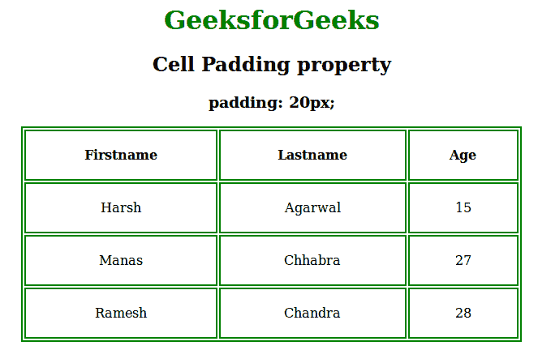
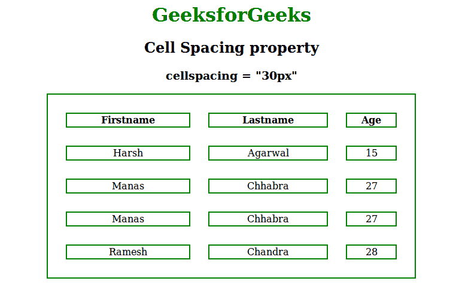

# 在 CSS 中设置单元格填充和单元格间距

> 原文:[https://www . geeksforgeeks . org/set-cell padding-and-cell spacing-in-CSS/](https://www.geeksforgeeks.org/set-cellpadding-and-cellspacing-in-css/)

**单元格填充**

单元格填充用于定义单元格与其边框之间的间距。如果没有应用单元格填充属性，那么它将被设置为默认值。

**示例:**

```css
<!DOCTYPE html>
<html>
    <head>
        <title>cell padding</title>
        <style>
            table, th, td {
                border: 2px solid green;
                text-align:center;
            }
            th, td {
                padding: 20px;
                background-color:none;
            }

            h1 {
            color:green;
            }
        </style>
    </head>
    <body>
        <center>
        <h1>GeeksforGeeks</h1>
        <h2>Cell Padding property</h2>
        <h3>padding: 20px;</h3>
        <table style="width:70%">
        <tr>
            <th>Firstname</th>
            <th>Lastname</th> 
            <th>Age</th>
        </tr>
        <tr>
            <td>Harsh</td>
            <td>Agarwal</td>
            <td>15</td>
        </tr>
        <tr>
            <td>Manas</td>
            <td>Chhabra</td>
            <td>27</td>
        </tr>
        <tr>
            <td>Ramesh</td>
            <td>Chandra</td>
            <td>28</td>
        </tr>
        </table>
        </center>
    </body>
</html>                    
```

**输出:**


**单元格间距**

单元格间距用于定义单元格之间的间距。

**示例:**

```css
<!DOCTYPE html>
<html>
    <head>
        <title>cell spacing property</title>
        <style>
            table, th, td {
                border: 2px solid green;
                text-align:center;

            }
            h1 {
            color:green;
            }
        </style>
    </head>
    <body>
        <center>
        <h1>GeeksforGeeks</h1>
        <h2>Cell Spacing property</h2>
        <h3>cellspacing = "30px"</h3>
        <table style="width:70%;"cellspacing="30px">
        <tr>
            <th>Firstname</th>
            <th>Lastname</th> 
            <th>Age</th>
        </tr>
        <tr>
            <td>Harsh</td>
            <td>Agarwal</td>
            <td>15</td>
        </tr>
        <tr>
            <td>Manas</td>
            <td>Chhabra</td>
            <td>27</td>
        </tr>
        <tr>
            <td>Manas</td>
            <td>Chhabra</td>
            <td>27</td>
        </tr>
        <tr>
            <td>Ramesh</td>
            <td>Chandra</td>
            <td>28</td>
        </tr>
        </table>
        </center>
    </body>
</html>                    
```

**输出:**


**支持的浏览器:**单元格填充和单元格间距支持的浏览器如下:

*   苹果 Safari
*   谷歌 Chrome
*   火狐浏览器
*   歌剧
*   微软公司出品的 web 浏览器