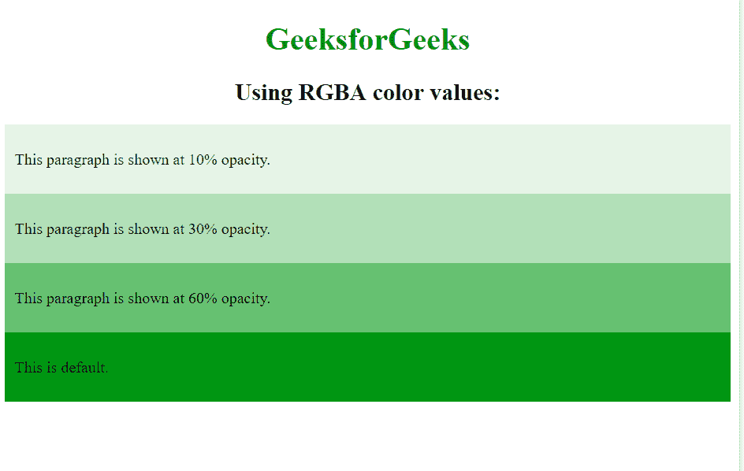

# 在 CSS

中将不透明度仅设置为背景色，不设置在文本上

> 原文:[https://www . geesforgeks . org/set-不透明度-仅设置为背景色-不在 css 文本上/](https://www.geeksforgeeks.org/set-the-opacity-only-to-background-color-not-on-the-text-in-css/)

图像中使用不透明度属性来描述图像的透明度。不透明度的值介于 0.0 到 1.0 之间，其中低值表示高透明度，高值表示低透明度。不透明度的百分比计算为不透明度% =不透明度* 100
以仅设置背景的不透明度，而不设置其内部的文本。它可以通过使用 RGBA 颜色值而不是不透明度属性来设置，因为使用不透明度属性可以使其中的文本成为完全透明的元素。

**语法:**

```html
element {
    background: rgba(red, green, blue, alpha);
    // CSS property
}

```

每个参数(红色、绿色和蓝色)定义 0 到 255 之间的颜色强度。RGBA 颜色值是 RGB 颜色值的扩展，带有指定颜色不透明度的 alpha 通道。alpha 参数是一个介于 0.0(完全透明)和 1.0(完全不透明)之间的数字。

**示例:**

```html
<!DOCTYPE html>
<html>
    <head>
        <title>rgba property</title>
        <style>
            h1 {
                color: green;
            }
            h1, h2 {
                text-align: center;
            }
            div {
                background: rgb(0, 151, 19);
                padding: 10px;
                text-align:justify; 
            }

            div.first {
                /*setting alpha = 0.1*/
                background: rgba(0, 151, 19, 0.1);
            }

            div.second {
                /*setting alpha = 0.3*/
                background: rgba(0, 151, 19, 0.3);
            }

            div.third {
                /*setting alpha = 0.6*/
                background: rgba(0, 151, 19, 0.6);
            }
        </style>
    </head>
    <body>
        <h1>GeeksforGeeks</h1>
        <h2>Using RGBA color values:</h2>
        <div class="first">
            <p>This paragraph is shown at 10% opacity.</p></div>
        <div class="second">
            <p>This paragraph is shown at 30% opacity.</p></div>
        <div class="third">
            <p>This paragraph is shown at 60% opacity.</p></div>
        <div><p>This is default.</p></div>
    </body>
</html>                    
```

**输出:**


HTML 是网页的基础，通过构建网站和网络应用程序用于网页开发。您可以通过以下 [HTML 教程](https://www.geeksforgeeks.org/html-tutorials/)和 [HTML 示例](https://www.geeksforgeeks.org/html-examples/)从头开始学习 HTML。

CSS 是网页的基础，通过设计网站和网络应用程序用于网页开发。你可以通过以下 [CSS 教程](https://www.geeksforgeeks.org/css-tutorials/)和 [CSS 示例](https://www.geeksforgeeks.org/css-examples/)从头开始学习 CSS。