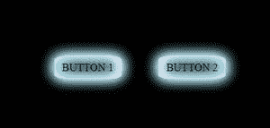

# 使用 CSS 的闪亮霓虹按钮效果

> 原文:[https://www . geesforgeks . org/闪亮-闪烁-霓虹-按钮-效果-使用-css/](https://www.geeksforgeeks.org/shiny-glimmering-neon-button-effect-using-css/)

一个闪亮的霓虹按钮可以使用纯 CSS 创建，并带有**阴影效果**。这些按钮可用于在深色背景或主题上形成良好的对比。它给人一种简约的外观，吸引用户的注意力。必须遵循以下步骤来创建这种效果。

**HTML 部分:**该部分包含显示按钮所需的 HTML 代码。这些按钮是用 div 元素创建的，并被分配了一个我们稍后将创建的类。

## 超文本标记语言

```css
<!DOCTYPE html>
<html>

<body>
    <div class="button button_1">
        BUTTON 1
    </div>
    <div class="button button_2">
        BUTTON 2
    </div>
</body>

</html>
```

**CSS 部分:**该部分包含为按钮添加效果的代码。

**框阴影**属性用于为具有插入值的阴影添加一组变化的颜色。使用**边界半径**属性使按钮变圆，并使用**左侧**属性适当对齐。

## 半铸钢ˌ钢性铸铁(Cast Semi-Steel)

```css
/* Set the background color of 
   all the elements */
* {
    background-color: black;
}

.button {

    /* Change the shape of the button */
    height: 35px;
    width: 100px;
    border-radius: 20%;

    /* Position the buttons */
    position: fixed;
    top: 48vh;

    /* Center the name of the button */
    display: flex;
    align-items: center;
    justify-content: center;
}

.button_1 {
    /* Position the button */
    left: 35vw;
    /* Add the shadow effect for the button */
    box-shadow: inset 0 0 18px #fff, 
       inset -6px 0 18px #f3bad6, 
       inset 6px 0 18px #0ff, 
       inset -6px 0 30px #f3bad6, 
       inset 6px 0 30px #0ff, 
       0 0 18px #fff, 4px 0 18px 
       #f3bad6, -4px 0 18px #0ff;
}

.button_2 {

    /* Position the button */
    left: 55vw;

    /* Add the shadow effect for the button */
    box-shadow: inset 0 0 18px #fff, 
       inset 6px 0 18px #f3bad6, 
       inset -6px 0 18px #0ff, 
       inset 6px 0 30px #f3bad6, 
       inset -6px 0 30px #0ff, 
       0 0 18px #fff, -4px 0 18px 
       #f3bad6, 4px 0 18px #0ff;
}
```

**完整代码:**是上面两段代码的组合。

## 超文本标记语言

```css
<!DOCTYPE html>
<html>

<head>
  <style>

    /* Set the background color of all the elements */
    *{
        background-color: black;
     }

    .button {

        /* Change the shape of the button */
        height: 35px;
        width: 100px;
        border-radius: 20%;

        /* Position the buttons */
        position: fixed;
        top: 48vh;

        /* Center the name of the button */
        display: flex;
        align-items: center;
        justify-content: center;
    }
    .button_1 {

        /* Position the button */
        left: 35vw;

        /* Add the shadow effect for the button */
        box-shadow: inset 0 0 18px #fff,
        inset -6px 0 18px #f3bad6,
        inset 6px 0 18px #0ff,
        inset -6px 0 30px #f3bad6,
        inset 6px 0 30px #0ff,
        0 0 18px #fff, 4px 0 18px #f3bad6,
        -4px 0 18px #0ff;
    }
    .button_2 {

        /* Position the button */
        left:55vw;

        /* Add the shadow effect for the button */
        box-shadow: inset 0 0 18px #fff,
        inset 6px 0 18px #f3bad6,
        inset -6px 0 18px #0ff,
        inset 6px 0 30px #f3bad6, 
        inset -6px 0 30px #0ff,
        0 0 18px #fff, -4px 0 18px #f3bad6,
        4px 0 18px #0ff;
    }
  </style>
</head>

<body>
    <div class="button button_1">
        BUTTON 1
    </div>

    <div class="button button_2">
        BUTTON 2
    </div>
</body>

</html>
```

**输出:**

