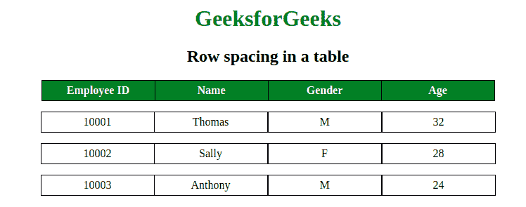

# 使用 CSS 的表格中两行之间的空间？

> 原文:[https://www . geesforgeks . org/表中两行之间的空间-使用-css/](https://www.geeksforgeeks.org/space-between-two-rows-in-a-table-using-css/)

表格中两行之间的间距可以使用 CSS 边框间距和边框折叠属性来实现。边框间距属性用于设置表格单元格之间的间距，边框折叠属性用于指定表格边框是否折叠。仅当边框折叠属性设置为分隔时，才能使用边框间距属性。

**示例:**

```html
<!DOCTYPE html>
<html>
    <head>
        <style>
            table {
                border-collapse: collapse;
            }
            th {
                background-color:green;
                Color:white;
            }
            th, td {
                width:150px;
                text-align:center;
                border:1px solid black;
                padding:5px

            }
            .geeks {
                border-right:hidden;
            }
            .gfg {
                border-collapse:separate;
                border-spacing:0 15px;
            }
            h1 {
                color:green;
            }
        </style>
    </head>
    <body>
        <center>
        <h1>GeeksforGeeks</h1>
        <h2>Row spacing in a table</h2>
        <table>
            <tr>
                <th>Employee ID</th>
                <th>Name</th>
                <th>Gender</th>
                <th>Age</th>
            </tr>
        </table>
        <table class = "gfg">
            <tr>
                <td class = "geeks">10001</td>
                <td>Thomas</td>
                <td>M</td>
                <td>32</td>
            </tr>
            <tr>
                <td class = "geeks">10002</td>
                <td>Sally</td>
                <td>F</td>
                <td>28</td>
            </tr>
            <tr>
                <td class = "geeks">10003</td>
                <td>Anthony</td>
                <td>M</td>
                <td>24</td>
            </tr>
        </table>
        </center>
    </body>
</html>
```

**输出:**


HTML 是网页的基础，通过构建网站和网络应用程序用于网页开发。您可以通过以下 [HTML 教程](https://www.geeksforgeeks.org/html-tutorials/)和 [HTML 示例](https://www.geeksforgeeks.org/html-examples/)从头开始学习 HTML。

CSS 是网页的基础，通过设计网站和网络应用程序用于网页开发。你可以通过以下 [CSS 教程](https://www.geeksforgeeks.org/css-tutorials/)和 [CSS 示例](https://www.geeksforgeeks.org/css-examples/)从头开始学习 CSS。