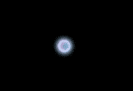

# 使用 CSS 旋转光晕效果的球动画

> 原文:[https://www . geesforgeks . org/spinning-ball-animation-with-glow-effect-use-CSS/](https://www.geeksforgeeks.org/spinning-ball-animation-with-glow-effect-using-css/)

旋转球动画可以很容易地使用变换属性来旋转球。动画迭代次数被应用为无穷大，以获得永无止境的旋转动画。为了获得发光的效果，使用了框阴影。

**步骤:**

*   创建一个名为 index.html 的 HTML 文件。
*   在 index.html 文件中创建一个 div 元素，并给出一个类名 **ball** 。
*   给这个类名添加样式。
*   使用@关键帧规则创建名为**旋转球**的动画。使用变换属性旋转球。
*   在方块阴影属性中应用 2 色嵌入组合来获得发光旋转效果。
*   可以通过更改动画持续时间来调整旋转速度。

## 超文本标记语言

```css
<!DOCTYPE html>
<html lang="en">

<head>
    <meta charset="UTF-8">
    <meta http-equiv="X-UA-Compatible" 
            content="IE=edge">

    <meta name="viewport" content=
        "width=device-width, initial-scale=1.0">

    <title>Spinning Ball Animation</title>

    <style>
        * {
            background-color: black;
        }

        .ball {
            height: 40px;
            width: 40px;
            border-radius: 100px;
            position: fixed;
            top: 50vh;
            left: 50vw;
            animation: spinBall 0.13s linear infinite;
            box-shadow: inset 0 0 18px #fff, 
                inset 6px 0 18px violet, 
                inset -6px 0 18px #0ff, 
                inset 6px 0 30px violet, 
                inset -6px 0 30px #0ff, 
                0 0 18px #fff, -4px 
                0 18px violet, 4px 0 18px #0ff;
        }

        @keyframes spinBall {
            100% {
                transform: rotate(360deg);
            }
        }
    </style>
</head>

<body>
    <div class="ball"></div>
</body>

</html>
```

**输出:**



旋转球动画