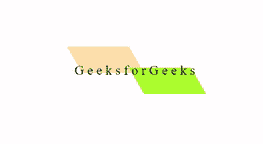

# 使用 CSS 分割倾斜按钮悬停动画

> 原文:[https://www . geesforgeks . org/split-skew-button-hover-animation-using-CSS/](https://www.geeksforgeeks.org/split-skewed-button-hover-animation-using-css/)

分割倾斜按钮悬停动画效果可以使用 CSS 中的前后伪类来创建。关于悬停改变偏斜度和伪类前后位置互换。

**步骤:**

*   创建一个名为 index.html 的 HTML 文件。
*   为按钮创建一个 div 元素。
*   向按钮添加样式。
*   在按钮的伪类之前和之后，设置按钮的背景颜色，并将宽度设置为 50%，并将两者都转换为倾斜某个角度。
*   在按钮的 before 伪类上，将顶部位置设置在按钮顶部位置的上方。
*   在按钮的 after 伪类上，将顶部位置设置在按钮顶部位置的下方，并将左侧位置设置为按钮宽度的 50%。
*   悬停时，将两个伪类的顶部位置设置为 0，并将偏斜度更改为 0 度。

**代码:**

## 超文本标记语言

```css
<!DOCTYPE html>
<html lang="en">

<head>
    <style>
        * {
            padding: 0;
            margin: 0;
        }

        .container {
            position: fixed;
            top: 50vh;
            left: 50vw;
            transform: translate(-50%, -50%);
        }

        .btn {
            position: relative;
            letter-spacing: 0.25em;
            font-size: 30px;
            height: 60px;
            /* To center the text vertically */
            display: flex;
            align-items: center;
            cursor: pointer;
        }

        .btn::after,
        .btn::before {
            content: "";
            position: absolute;
            height: 100%;
            width: 50%;
            transform: skewX(30deg);
            background: transparent;
            transition: all 0.7s cubic-bezier(0.7, -0.5, 0.25, 1.5);
            z-index: -1;
        }

        .btn::before {
            top: -40%;
            left: 0;
            background-color: navajowhite;
        }

        .btn::after {
            top: 40%;
            left: 50%;
            background-color: greenyellow;
        }

        .btn:hover::before {
            top: 0;
            left: 50%;
            transform: skewX(0deg);
        }

        .btn:hover::after {
            top: 0;
            left: 0;
            transform: skewX(0deg);
        }
    </style>
</head>

<body>
    <div class="container">
        <div class="btn">GeeksforGeeks</div>
    </div>
</body>

</html>
```

**输出:**

