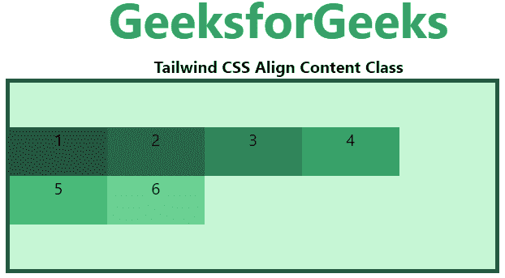
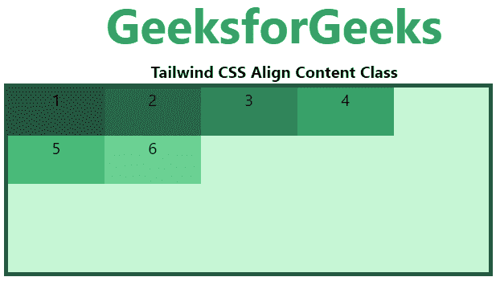
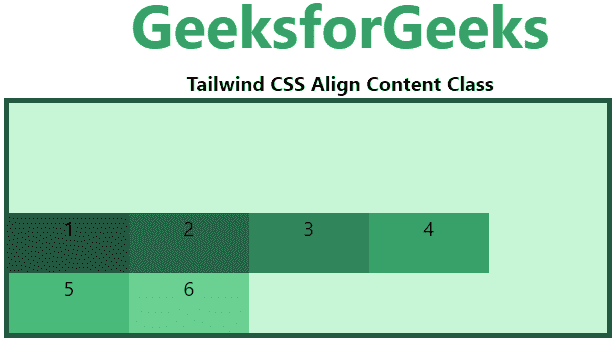
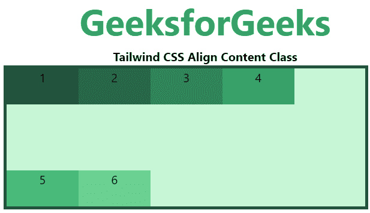
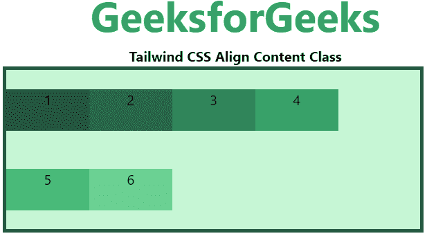
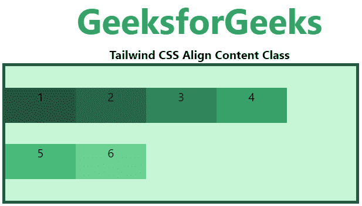

# 顺风 CSS 对齐内容

> 原文:[https://www.geeksforgeeks.org/tailwind-css-align-content/](https://www.geeksforgeeks.org/tailwind-css-align-content/)

这个类在[顺风 CSS](https://www.geeksforgeeks.org/css-tailwind-introduction/) 中接受很多值。它是 [CSS 对齐内容](https://www.geeksforgeeks.org/css-align-content-property/#:~:text=It%20is%20used%20to%20specify,center) [属性](https://www.geeksforgeeks.org/css-align-content-property/#:~:text=It%20is%20used%20to%20specify,center)的替代。此类用于更改*伸缩包装*属性的行为。它对齐伸缩线。它用于指定柔性容器内各行之间的对齐方式。此属性定义了每个弹性线在弹性框内的对齐方式，仅在应用*弹性包裹:包裹*时适用，即如果存在多行弹性框项目。

**对齐内容类别:**

*   资源中心
*   内容-开始
*   内容结束
*   内容之间
*   围绕内容
*   内容均匀

**资源中心:**该类用于在柔性容器的中心放置线。

**语法:**

```
<element class="content-center">...</element>
```

**示例:**

## 超文本标记语言

```
<!DOCTYPE html> 
<head> 
    <link href=
"https://unpkg.com/tailwindcss@^1.0/dist/tailwind.min.css" 
          rel="stylesheet"> 
</head> 

<body class="text-center"> 
    <h1 class="text-green-600 text-5xl font-bold">
        GeeksforGeeks
    </h1> 
    <b>Tailwind CSS Align Content Class</b> 
    <div id="main" class="ml-24 h-48 w-2/3 flex flex-wrap
                          content-center
                          bg-green-200 border-solid border-4 
                          border-green-900"> 
        <div class="bg-green-900 w-24 h-12">1</div> 
        <div class="bg-green-800 w-24 h-12">2</div> 
        <div class="bg-green-700 w-24 h-12">3</div> 
        <div class="bg-green-600 w-24 h-12">4</div> 
        <div class="bg-green-500 w-24 h-12">5</div> 
        <div class="bg-green-400 w-24 h-12">6</div> 
    </div> 
</body> 

</html>
```

**输出:**



**内容-开始:**这个类用于在 flex 容器的开始处放置行。

**语法:**

```
<element class="content-start">...</element>
```

**示例:**

## 超文本标记语言

```
<!DOCTYPE html> 
<head> 
    <link href=
"https://unpkg.com/tailwindcss@^1.0/dist/tailwind.min.css" 
          rel="stylesheet"> 
</head> 

<body class="text-center"> 
    <h1 class="text-green-600 text-5xl font-bold">
        GeeksforGeeks
    </h1> 
    <b>Tailwind CSS Align Content Class</b> 
    <div id="main" class="ml-24 h-48 w-2/3 flex flex-wrap
                          content-start
                          bg-green-200 border-solid border-4 
                          border-green-900"> 
        <div class="bg-green-900 w-24 h-12">1</div> 
        <div class="bg-green-800 w-24 h-12">2</div> 
        <div class="bg-green-700 w-24 h-12">3</div> 
        <div class="bg-green-600 w-24 h-12">4</div> 
        <div class="bg-green-500 w-24 h-12">5</div> 
        <div class="bg-green-400 w-24 h-12">6</div> 
    </div> 
</body> 

</html>
```

**输出:**



**content-end:** 这个类用于在 flex 容器的末端放置线条。

**语法:**

```
<element class="content-end">...</element>
```

**示例:**

## 超文本标记语言

```
<!DOCTYPE html> 
<head> 
    <link href=
"https://unpkg.com/tailwindcss@^1.0/dist/tailwind.min.css" 
          rel="stylesheet"> 
</head> 

<body class="text-center"> 
    <h1 class="text-green-600 text-5xl font-bold">
        GeeksforGeeks
    </h1> 
    <b>Tailwind CSS Align Content Class</b> 
    <div id="main" class="ml-24 h-48 w-2/3 flex flex-wrap
                          content-end
                          bg-green-200 border-solid border-4 
                          border-green-900"> 
        <div class="bg-green-900 w-24 h-12">1</div> 
        <div class="bg-green-800 w-24 h-12">2</div> 
        <div class="bg-green-700 w-24 h-12">3</div> 
        <div class="bg-green-600 w-24 h-12">4</div> 
        <div class="bg-green-500 w-24 h-12">5</div> 
        <div class="bg-green-400 w-24 h-12">6</div> 
    </div> 
</body> 

</html>
```

**输出:**



**content-between:** 这个类用于在容器中分配行，这样每行之间就有相等的空间。

**语法:**

```
<element class="content-between">...</element>
```

**示例:**

## 超文本标记语言

```
<!DOCTYPE html> 
<head> 
    <link href=
"https://unpkg.com/tailwindcss@^1.0/dist/tailwind.min.css" 
          rel="stylesheet"> 
</head> 

<body class="text-center"> 
    <h1 class="text-green-600 text-5xl font-bold">
        GeeksforGeeks
    </h1> 
    <b>Tailwind CSS Align Content Class</b> 
    <div id="main" class="ml-24 h-48 w-2/3 flex flex-wrap
                          content-between
                          bg-green-200 border-solid border-4 
                          border-green-900"> 
        <div class="bg-green-900 w-24 h-12">1</div> 
        <div class="bg-green-800 w-24 h-12">2</div> 
        <div class="bg-green-700 w-24 h-12">3</div> 
        <div class="bg-green-600 w-24 h-12">4</div> 
        <div class="bg-green-500 w-24 h-12">5</div> 
        <div class="bg-green-400 w-24 h-12">6</div> 
    </div> 
</body> 

</html>
```

**输出:**



**content-round:**这个类用于在一个容器中分配行，使得每行周围都有相等的空间。

**语法:**

```
<element class="content-around">...</element>
```

**示例:**

## 超文本标记语言

```
<!DOCTYPE html> 
<head> 
    <link href=
"https://unpkg.com/tailwindcss@^1.0/dist/tailwind.min.css" 
          rel="stylesheet"> 
</head> 

<body class="text-center"> 
    <h1 class="text-green-600 text-5xl font-bold">
        GeeksforGeeks
    </h1> 
    <b>Tailwind CSS Align Content Class</b> 
    <div id="main" class="ml-24 h-48 w-2/3 flex flex-wrap
                          content-around
                          bg-green-200 border-solid border-4 
                          border-green-900"> 
        <div class="bg-green-900 w-24 h-12">1</div> 
        <div class="bg-green-800 w-24 h-12">2</div> 
        <div class="bg-green-700 w-24 h-12">3</div> 
        <div class="bg-green-600 w-24 h-12">4</div> 
        <div class="bg-green-500 w-24 h-12">5</div> 
        <div class="bg-green-400 w-24 h-12">6</div> 
    </div> 
</body> 

</html>
```

**输出:**



**内容-均匀:**这个类用于在一个容器中分配行，使得每个项目周围有相等的空间，但是也考虑了当使用*内容-周围*类*时，您通常会在每个项目之间看到的双倍空间。*

**语法:**

```
<element class="content-evenly">...</element>
```

**示例:**

## 超文本标记语言

```
<!DOCTYPE html> 
<head> 
    <link href=
"https://unpkg.com/tailwindcss@^1.0/dist/tailwind.min.css" 
          rel="stylesheet"> 
</head> 

<body class="text-center"> 
    <h1 class="text-green-600 text-5xl font-bold">
        GeeksforGeeks
    </h1> 
    <b>Tailwind CSS Align Content Class</b> 
    <div id="main" class="ml-24 h-48 w-2/3 flex flex-wrap
                          content-evenly
                          bg-green-200 border-solid border-4 
                          border-green-900"> 
        <div class="bg-green-900 w-24 h-12">1</div> 
        <div class="bg-green-800 w-24 h-12">2</div> 
        <div class="bg-green-700 w-24 h-12">3</div> 
        <div class="bg-green-600 w-24 h-12">4</div> 
        <div class="bg-green-500 w-24 h-12">5</div> 
        <div class="bg-green-400 w-24 h-12">6</div> 
    </div> 
</body> 

</html>
```

**输出:**

