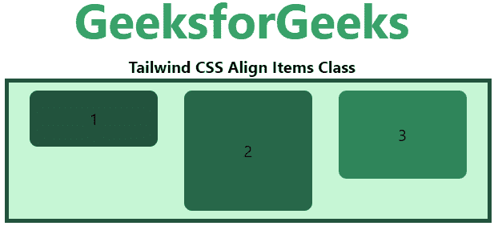
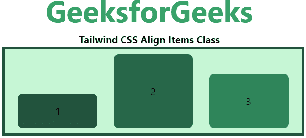
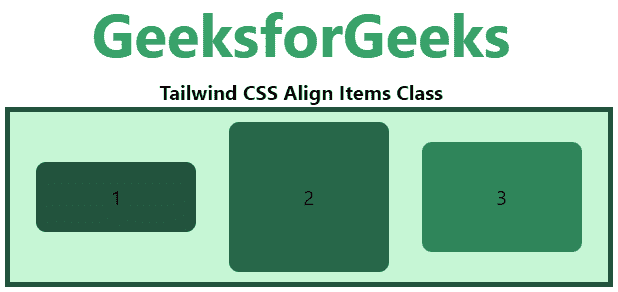
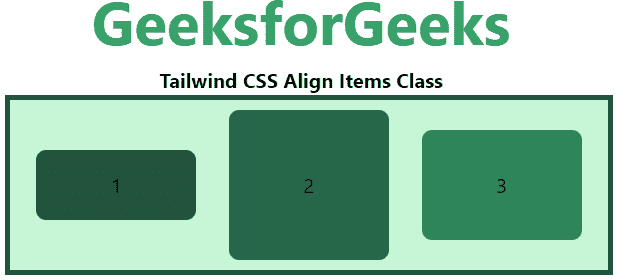
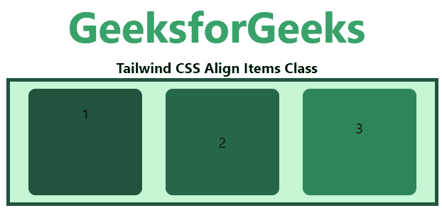

# 顺风 CSS 对齐项目

> 原文:[https://www.geeksforgeeks.org/tailwind-css-align-items/](https://www.geeksforgeeks.org/tailwind-css-align-items/)

这个类在[顺风 CSS](https://www.geeksforgeeks.org/css-tailwind-introduction/) 中接受很多值。它是 [CSS 对齐项目属性](https://www.geeksforgeeks.org/css-align-items-property/#:~:text=It%20is%20used%20to%20specify,center)的替代。此类用于设置柔性容器内部或给定窗口中项目的对齐方式。它将伸缩项目与轴对齐。*自对齐*类用于覆盖对齐项目类。

**对齐项目类别:**

*   项目-开始
*   项目-结束
*   项目-中心
*   项目-基线
*   项目-拉伸

**物品-开始:**物品将被定位到容器的开始处。

**语法:**

```html
<element class="items-start">...</element>
```

**示例:**

## 超文本标记语言

```html
<!DOCTYPE html> 
<head> 
    <link href=
"https://unpkg.com/tailwindcss@^1.0/dist/tailwind.min.css" 
          rel="stylesheet"> 
</head> 

<body class="text-center"> 
    <h1 class="text-green-600 text-5xl font-bold">
        GeeksforGeeks
    </h1> 
    <b>Tailwind CSS Align Items Class</b> 
    <div id="main" class="p-2 justify-around ml-32 h-26 w-2/3 flex
                          items-start
                          bg-green-200 border-solid border-4 
                          border-green-900"> 
        <div class="bg-green-900 rounded-lg py-4 w-32">1</div> 
        <div class="bg-green-800 rounded-lg py-12 w-32">2</div> 
        <div class="bg-green-700 rounded-lg py-8 w-32">3</div> 
    </div> 
</body> 

</html>
```

**输出:**



**物品-结束:**物品将被放置到容器的末端。

**语法:**

```html
<element class="items-end">...</element>
```

**示例:**

## 超文本标记语言

```html
<!DOCTYPE html> 
<head> 
    <link href=
"https://unpkg.com/tailwindcss@^1.0/dist/tailwind.min.css" 
          rel="stylesheet"> 
</head> 

<body class="text-center"> 
    <h1 class="text-green-600 text-5xl font-bold">
        GeeksforGeeks
    </h1> 
    <b>Tailwind CSS Align Items Class</b> 
    <div id="main" class="p-2 justify-around ml-32 h-26 w-2/3 flex
                          items-end
                          bg-green-200 border-solid border-4 
                          border-green-900"> 
        <div class="bg-green-900 rounded-lg py-4 w-32">1</div> 
        <div class="bg-green-800 rounded-lg py-12 w-32">2</div> 
        <div class="bg-green-700 rounded-lg py-8 w-32">3</div> 
    </div> 
</body> 

</html>
```

**输出:**



**物品-中心:**物品的位置应垂直于容器的中心。

**语法:**

```html
<element class="items-center">...</element>
```

**示例:**

## 超文本标记语言

```html
<!DOCTYPE html> 
<head> 
    <link href=
"https://unpkg.com/tailwindcss@^1.0/dist/tailwind.min.css" 
          rel="stylesheet"> 
</head> 

<body class="text-center"> 
    <h1 class="text-green-600 text-5xl font-bold">
        GeeksforGeeks
    </h1> 
    <b>Tailwind CSS Align Items Class</b> 
    <div id="main" class="p-2 justify-around ml-32 h-26 w-2/3 flex
                          items-center
                          bg-green-200 border-solid border-4 
                          border-green-900"> 
        <div class="bg-green-900 rounded-lg py-4 w-32">1</div> 
        <div class="bg-green-800 rounded-lg py-12 w-32">2</div> 
        <div class="bg-green-700 rounded-lg py-8 w-32">3</div> 
    </div> 
</body> 

</html>
```

**输出:**



**物品-基线:**物品将被定位到容器的基线。

**语法:**

```html
<element class="items-baseline">...</element>
```

**示例:**

## 超文本标记语言

```html
<!DOCTYPE html> 
<head> 
    <link href=
"https://unpkg.com/tailwindcss@^1.0/dist/tailwind.min.css" 
          rel="stylesheet"> 
</head> 

<body class="text-center"> 
    <h1 class="text-green-600 text-5xl font-bold">
        GeeksforGeeks
    </h1> 
    <b>Tailwind CSS Align Items Class</b> 
    <div id="main" class="p-2 justify-around ml-32 h-26 w-2/3 flex
                          items-baseline
                          bg-green-200 border-solid border-4 
                          border-green-900"> 
        <div class="bg-green-900 rounded-lg py-4 w-32">1</div> 
        <div class="bg-green-800 rounded-lg py-12 w-32">2</div> 
        <div class="bg-green-700 rounded-lg py-8 w-32">3</div> 
    </div> 
</body> 

</html>
```

**输出:**



**项目-拉伸:**项目被拉伸以适合容器，这是默认值。

**语法:**

```html
<element class="items-stretch">...</element>
```

**示例:**

## 超文本标记语言

```html
<!DOCTYPE html> 
<head> 
    <link href=
"https://unpkg.com/tailwindcss@^1.0/dist/tailwind.min.css" 
          rel="stylesheet"> 
</head> 

<body class="text-center"> 
    <h1 class="text-green-600 text-5xl font-bold">
        GeeksforGeeks
    </h1> 
    <b>Tailwind CSS Align Items Class</b> 
    <div id="main" class="p-2 justify-around ml-32 h-26 w-2/3 flex
                          items-stretch
                          bg-green-200 border-solid border-4 
                          border-green-900"> 
        <div class="bg-green-900 rounded-lg py-4 w-32">1</div> 
        <div class="bg-green-800 rounded-lg py-12 w-32">2</div> 
        <div class="bg-green-700 rounded-lg py-8 w-32">3</div> 
    </div> 
</body> 

</html>
```

**输出:**

