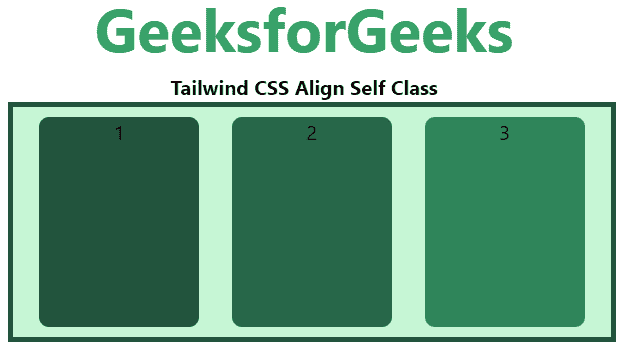
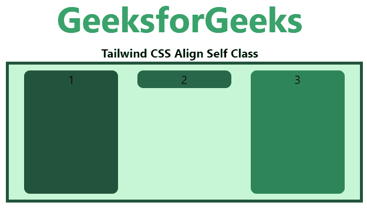
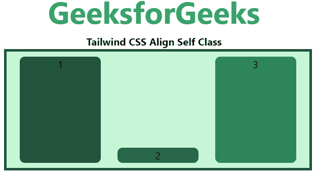
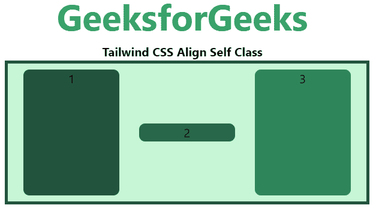

# 顺风 CSS 自动对齐

> 原文:[https://www.geeksforgeeks.org/tailwind-css-align-self/](https://www.geeksforgeeks.org/tailwind-css-align-self/)

这个类接受[顺风 CSS](https://www.geeksforgeeks.org/css-tailwind-introduction/) 中的很多值。它是 [CSS 对齐自身属性](https://www.geeksforgeeks.org/css-align-self-property/)的替代物。此类用于控制单个 flex 或 grid 项如何沿其容器的横轴定位。

**对齐自身类别:**

*   自动的
*   自启动
*   自我终结
*   自我中心
*   自拉伸

**自动:**该类用于继承其父容器 align-items 属性，如果没有父容器，则用于拉伸。这是一个默认值。

**语法:**

```html
<element class="self-auto">...</element>
```

**示例:**

## 超文本标记语言

```html
<!DOCTYPE html> 
<head> 
    <link href=
"https://unpkg.com/tailwindcss@^1.0/dist/tailwind.min.css" 
          rel="stylesheet"> 
</head> 

<body class="text-center"> 
    <h1 class="text-green-600 text-5xl font-bold">
        GeeksforGeeks
    </h1> 
    <b>Tailwind CSS Align Self Class</b> 
    <div id="main" class="p-2 justify-around ml-32 h-48 w-2/3 flex
                          iitems-stretch
                          bg-green-200 border-solid border-4 
                          border-green-900"> 
        <div class="bg-green-900 rounded-lg w-32">1</div> 
        <div class="self-auto bg-green-800 rounded-lg  w-32">2</div> 
        <div class="bg-green-700 rounded-lg w-32">3</div> 
    </div> 
</body> 

</html>
```

**输出:**



**自启动:**此类用于在柔性容器的开头对齐选中的项目。

**语法:**

```html
<element class="self-start">...</element>
```

**示例:**

## 超文本标记语言

```html
<!DOCTYPE html> 
<head> 
    <link href=
"https://unpkg.com/tailwindcss@^1.0/dist/tailwind.min.css" 
          rel="stylesheet"> 
</head> 

<body class="text-center"> 
    <h1 class="text-green-600 text-5xl font-bold">
        GeeksforGeeks
    </h1> 
    <b>Tailwind CSS Align Self Class</b> 
    <div id="main" class="p-2 justify-around ml-32 h-48 w-2/3 flex
                          iitems-stretch
                          bg-green-200 border-solid border-4 
                          border-green-900"> 
        <div class="bg-green-900 rounded-lg w-32">1</div> 
        <div class="self-start bg-green-800 rounded-lg  w-32">2</div> 
        <div class="bg-green-700 rounded-lg w-32">3</div> 
    </div> 
</body> 

</html>
```

**输出:**



**自行结束:**此类用于在柔性容器末端对齐所选项目。

**语法:**

```html
<element class="self-end">...</element>
```

**示例:**

## 超文本标记语言

```html
<!DOCTYPE html> 
<head> 
    <link href=
"https://unpkg.com/tailwindcss@^1.0/dist/tailwind.min.css" 
          rel="stylesheet"> 
</head> 

<body class="text-center"> 
    <h1 class="text-green-600 text-5xl font-bold">
        GeeksforGeeks
    </h1> 
    <b>Tailwind CSS Align Self Class</b> 
    <div id="main" class="p-2 justify-around ml-32 h-48 w-2/3 flex
                          iitems-stretch
                          bg-green-200 border-solid border-4 
                          border-green-900"> 
        <div class="bg-green-900 rounded-lg w-32">1</div> 
        <div class="self-end bg-green-800 rounded-lg  w-32">2</div> 
        <div class="bg-green-700 rounded-lg w-32">3</div> 
    </div> 
</body> 

</html>
```

**输出:**



**自居中:**该类用于将物品放置在柔性容器的中心。

**语法:**

```html
<element class="self-center">...</element>
```

**示例:**

## 超文本标记语言

```html
<!DOCTYPE html> 
<head> 
    <link href=
"https://unpkg.com/tailwindcss@^1.0/dist/tailwind.min.css" 
          rel="stylesheet"> 
</head> 

<body class="text-center"> 
    <h1 class="text-green-600 text-5xl font-bold">
        GeeksforGeeks
    </h1> 
    <b>Tailwind CSS Align Self Class</b> 
    <div id="main" class="p-2 justify-around ml-32 h-48 w-2/3 flex
                          iitems-stretch
                          bg-green-200 border-solid border-4 
                          border-green-900"> 
        <div class="bg-green-900 rounded-lg w-32">1</div> 
        <div class="self-center bg-green-800 rounded-lg  w-32">2</div> 
        <div class="bg-green-700 rounded-lg w-32">3</div> 
    </div> 
</body> 

</html>
```

**输出:**



**自拉伸:**该类用于定位元素以适应容器。

**语法:**

```html
<element class="self-stretch">...</element>
```

**示例:**

## 超文本标记语言

```html
<!DOCTYPE html> 
<head> 
    <link href=
"https://unpkg.com/tailwindcss@^1.0/dist/tailwind.min.css" 
          rel="stylesheet"> 
</head> 

<body class="text-center"> 
    <h1 class="text-green-600 text-5xl font-bold">
        GeeksforGeeks
    </h1> 
    <b>Tailwind CSS Align Self Class</b> 
    <div id="main" class="p-2 justify-around ml-32 h-48 w-2/3 flex
                          iitems-stretch
                          bg-green-200 border-solid border-4 
                          border-green-900"> 
        <div class="bg-green-900 rounded-lg w-32">1</div> 
        <div class="self-stretch bg-green-800 rounded-lg  w-32">2</div> 
        <div class="bg-green-700 rounded-lg w-32">3</div> 
    </div> 
</body> 

</html>
```

**输出:**

