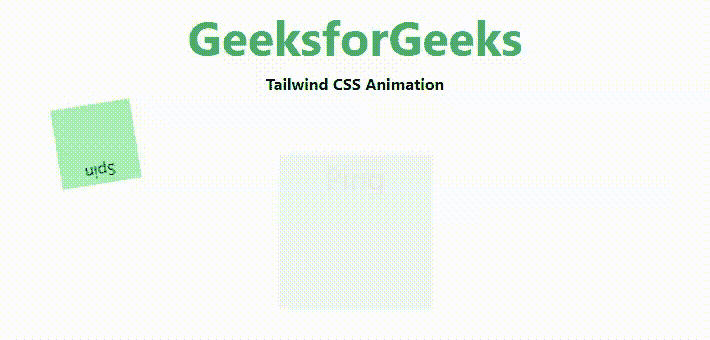
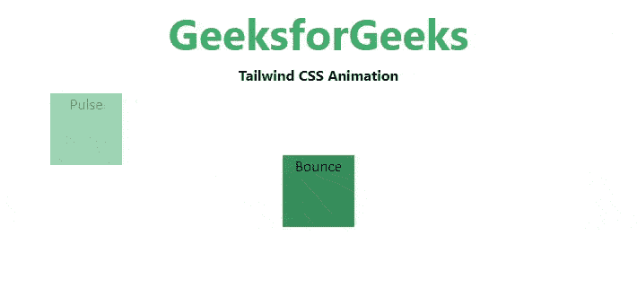

# 泰风 CSS 动画

> 原文:[https://www.geeksforgeeks.org/tailwind-css-animation/](https://www.geeksforgeeks.org/tailwind-css-animation/)

这个类在[顺风 CSS](https://www.geeksforgeeks.org/css-tailwind-introduction/) 中接受很多值，其中所有的属性都以类的形式被覆盖。这个类用于用 CSS 动画制作元素的动画。在 CSS 中，我们可以通过使用 [CSS 动画属性来实现。](https://www.geeksforgeeks.org/css-animations/)

**动画类:**

*   **动画-旋转:**这个类用于给元素添加线性旋转动画。
*   **animate-ping:** 这个类用来让一个元素缩放和淡化，就像雷达 ping 或者水波纹一样。
*   **动画-弹跳:**这个类用来让一个元素上下弹跳。
*   **动画-脉冲:**这个职业是用来让一个元素轻轻地淡入淡出的。

**语法:**

```
<element class="animate-{animation_name}">...</element>
```

**示例 1:** 以下代码实现类*动画-旋转*和*动画-ping* 。

## 超文本标记语言

```
<!DOCTYPE html>
<html>
<head> 
    <link href= 
"https://unpkg.com/tailwindcss@^1.0/dist/tailwind.min.css"
        rel="stylesheet"> 
</head> 
<body class="text-center mx-4 space-y-2">
    <h1 class="text-green-600 text-5xl font-bold"> 
        GeeksforGeeks 
    </h1> 
    <b>Tailwind CSS Animation</b> 

    <div class="m-auto ml-10 h-20 w-20 
                bg-green-300 animate-spin">
        Spin
    </div>
    <div class="m-auto mt-0 h-20 w-20 
                bg-green-500 animate-ping">
         Ping
    </div>
</body>
</html>
```

**输出:**



**示例 2:** 以下代码实现类*动画-弹跳*和*动画-脉冲*。

## 超文本标记语言

```
<!DOCTYPE html>
<html>
<head> 
    <link href= 
"https://unpkg.com/tailwindcss@^1.0/dist/tailwind.min.css"
        rel="stylesheet"> 
</head> 
<body class="text-center mx-4 space-y-2">
<h1 class="text-green-600 text-5xl font-bold"> 
        GeeksforGeeks 
    </h1> 
    <b>Tailwind CSS Animation</b> 

    <div class=" m-auto ml-10 h-20 w-20
                bg-green-600 animate-pulse">
       Pulse
    </div>
    <div class="m-auto mt-0 h-20 w-20 
                bg-green-700 animate-bounce">
       Bounce
    </div>

</body>
</html>
```

**输出:**

