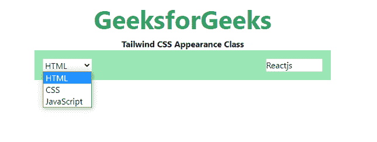

# 顺风 CSS 外观

> 原文:[https://www.geeksforgeeks.org/tailwind-css-appearance/](https://www.geeksforgeeks.org/tailwind-css-appearance/)

此类用于抑制本机窗体控件样式，以重置元素上任何特定于浏览器的样式。创建自定义表单组件时，经常使用该实用程序。

**外观:**

*   **外观-无:**此类用于重置任何浏览器的自然行为。

**语法:**

```html
<element class="class="appearance-none"">...</element>
```

**示例:**

## 超文本标记语言

```html
<!DOCTYPE html> 
<html> 
<head> 
    <link href= 
"https://unpkg.com/tailwindcss@^1.0/dist/tailwind.min.css"
    rel="stylesheet"> 
</head> 

<body class="text-center"> 
    <h1 class="text-green-600 text-5xl font-bold"> 
       GeeksforGeeks 
    </h1> 
    <b>Tailwind CSS Appearance Class</b> 
    <div class="bg-green-300 
                mx-24
                p-4
                justify-between 
                grid grid-flow-col"> 
        <select>
            <option>HTML</option>
            <option>CSS</option>
            <option>JavaScript</option>
        </select>

        <select class="appearance-none">
            <option>Reactjs</option>
            <option>Tailwind</option>
            <option>Framer Motion</option>
        </select>
    </div> 
</body> 
</html> 
```

**输出:**



顺风外观等级