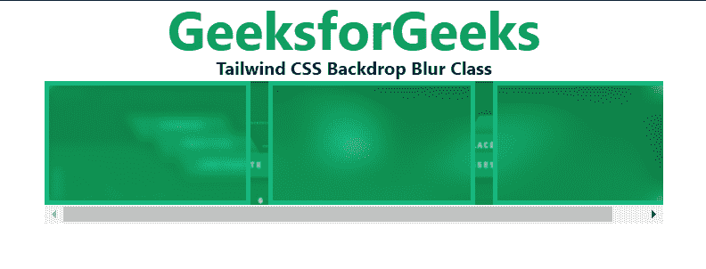

# 顺风 CSS 背景模糊

> 原文:[https://www.geeksforgeeks.org/tailwind-css-backdrop-blur/](https://www.geeksforgeeks.org/tailwind-css-backdrop-blur/)

背景模糊类用于对元素应用模糊效果滤镜。顺风 CSS 在 2.1 版本中新增了模糊功能。

**背景模糊类:**

*   **背景-模糊-0:** 这个类相当于 CSS 中作为模糊(0)的元素没有模糊效果。
*   **背景-模糊-sm:** 这个类相当于 CSS 中作为模糊(4px)对元素的小模糊效果。
*   **背景-模糊:**这个类相当于 CSS 中作为模糊(8px)对元素的正常模糊效果。
*   **背景-模糊-md:** 这个类相当于元素上的中等模糊效果为 CSS 中的模糊(12px)。
*   **背景-模糊-lg:** 这个类相当于元素上的大模糊效果在 CSS 中表现为模糊(16px)。
*   **背景-模糊-xl:** 这个类相当于元素上的超大模糊效果，在 CSS 中表现为模糊(24px)。
*   **背景-模糊-2xl:** 这个类相当于在 CSS 中把元素上的超大模糊效果加倍为模糊(40px)。
*   **背景-模糊-3xl:** 这个类相当于 CSS 中元素作为模糊(64px)的三重超大模糊效果。

**语法:**

```html
<element class="filter backdrop-blur-{amount}">..</element>
```

**示例:**

## 超文本标记语言

```html
<!DOCTYPE html>
<html>
<head>
    <link href=
"https://unpkg.com/tailwindcss@^2.1/dist/tailwind.min.css"
          rel="stylesheet">
</head>

<body class="text-center mx-4 ">
    <h1 class="text-green-600 text-5xl font-bold">
        GeeksforGeeks
    </h1>
    <b>Tailwind CSS Backdrop Blur Class</b>
    <div class=" mx-16 mt-18 h-36 relative">
        <div class="absolute w-full py-18">
            
        </div>
        <div class="relative h-32 flex overflow-x-auto space-x-4">
            <div class="flex-shrink-0 border-4 border-green-500 
                        backdrop-filter backdrop-blur-sm w-1/3">
            </div>
            <div class="flex-shrink-0 border-4 border-green-500 
                        backdrop-filter backdrop-blur-md w-1/3">
            </div>
            <div class="flex-shrink-0 border-4 border-green-500 
                        backdrop-filter backdrop-blur-lg w-1/3">
            </div>
        </div> 
    </div>
</body>

</html>
```

**输出:**

