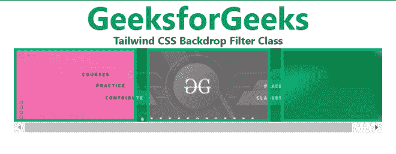

# 顺风 CSS 背景滤镜

> 原文:[https://www.geeksforgeeks.org/tailwind-css-backdrop-filter/](https://www.geeksforgeeks.org/tailwind-css-backdrop-filter/)

顺风 CSS 背景滤镜用于启用滤镜使用的任何滤镜的背景。它像过滤器类一样工作，但方向相反。在滤镜类中，我们已经看到，如果我们想要对任何元素使用任何效果，比如模糊、对比度、亮度等，那么我们必须在该效果之前使用滤镜。类似地，要禁用该效果，我们必须使用背景-模糊或背景-对比度与背景-滤镜。

**背景过滤等级:**

*   **背景滤镜:**该类用于启用背景滤镜
*   **背景-滤镜-无:**此类用于移除滤镜。

**语法:**

```css
<element class="backdrop-filter | backdrop-filter-none">..</element>
```

**示例:**

## 超文本标记语言

```css
<!DOCTYPE html>
<html>
<head>
    <link href=
"https://unpkg.com/tailwindcss@^2.1/dist/tailwind.min.css"
          rel="stylesheet">
</head>

<body class="text-center mx-4 ">
    <h1 class="text-green-600 text-5xl font-bold">
        GeeksforGeeks
    </h1>
    <b>Tailwind CSS Backdrop Filter Class</b>
    <div class=" mx-16 mt-18 h-36 relative">
        <div class="absolute w-full py-18">
            
        </div>
        <div class="relative h-32 flex overflow-x-auto space-x-4">
            <div class="flex-shrink-0 border-4 border-green-500 
                        backdrop-filter backdrop-invert w-1/3">
            </div>
            <div class="flex-shrink-0 border-4 border-green-500 
                        backdrop-filter backdrop-grayscale w-1/3">
            </div>
            <div class="flex-shrink-0 border-4 border-green-500 
                        backdrop-filter backdrop-blur w-1/3">
            </div>
        </div>
    </div>
</body>

</html>
```

**输出:**

