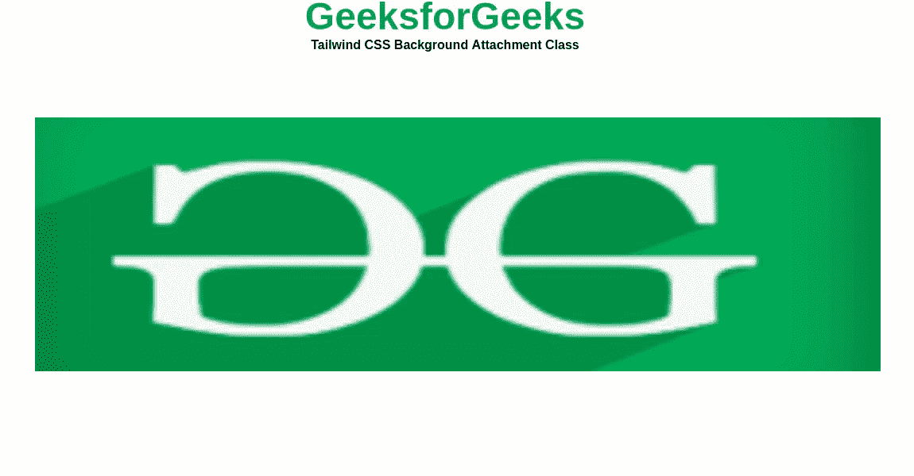

# 顺风 CSS 背景附件

> 原文:[https://www . geesforgeks . org/tail wind-CSS-background-attachment/](https://www.geeksforgeeks.org/tailwind-css-background-attachment/)

在本文中，我们将学习如何使用[顺风 CSS 来附加背景图像。](https://www.geeksforgeeks.org/introduction-to-tailwind-css/)

**进场:**

您可以使用顺风 CSS 中的**背景附加属性**轻松附加背景图像。所有的属性都包含在类的形式中。它是 [CSS 背景附件属性](https://www.geeksforgeeks.org/css-background-attachment-property/)的替代物。它可以设置为滚动或保持固定。

**后台附件类:**

*   **bg-fixed:** 此类用于相对于视口固定背景图像。
*   **bg-local:** 这个类用于滚动带有容器和视口的背景图像。
*   **bg-scroll:** 这个类是用视口滚动背景图像，而不是用容器。

**语法:**

```html
<div class="bg-fixed ...">
    ...
</div>
```

**示例 1:** 以下示例演示了使用 *bg-fixed* 类相对于视口固定背景图像。

## 超文本标记语言

```html
<!DOCTYPE html>
<html>

<head>
    <link href=
"https://unpkg.com/tailwindcss@^1.0/dist/tailwind.min.css"
        rel="stylesheet">
</head>

<body class="text-center">
    <h1 class="text-green-600 text-5xl font-bold">
        GeeksforGeeks
    </h1>

    <b>Tailwind CSS Background Attachment Class</b>

    <div class="mx-4  h-screen w-full">
        <div class="bg-fixed bg-contain overflow-auto 
            m-20 h-80 w-38" style="background-image:url(
https://media.geeksforgeeks.org/wp-content/uploads/20210603152813/tree276014340-300x191.jpg
            )">
        </div>
    </div>
</body>

</html>
```

**输出:**



BG-固定

**示例 2:** 以下示例演示了使用 *bg-local* 属性来固定容器和视口的背景图像。

## 超文本标记语言

```html
<!DOCTYPE html>
<html>

<head>
    <link href=
"https://unpkg.com/tailwindcss@^1.0/dist/tailwind.min.css"
        rel="stylesheet">
</head>

<body>

    <div class="mx-4  flex items-center 
        justify-center h-screen w-full">

        <div class="bg-local bg-contain 
            overflow-auto m-20 h-80 w-38" 
            style="background-image:url(
https://media.geeksforgeeks.org/wp-content/uploads/20210603154238/download-200x125.jpeg)">

            <div class="h-64 w-64"></div>
        </div>
    </div>
</body>

</html>
```

**输出:**


BG-本地

**示例 3:** 以下示例演示了使用 *bg-scroll* 属性使用视口固定背景图像，但不使用容器。

## 超文本标记语言

```html
<!DOCTYPE html>
<html>

<head>
    <link href=
"https://unpkg.com/tailwindcss@^1.0/dist/tailwind.min.css"
        rel="stylesheet">
</head>

<body>

    <div class="mx-4  flex items-center 
        justify-center h-screen w-full">

        <div class="bg-scroll bg-contain 
            overflow-auto m-20 h-60 w-38" 
            style="background-image:url(
 https://media.geeksforgeeks.org/wp-content/uploads/20210628092647/bgimage.jpg
            )">

            <div class="h-64 w-64"></div>
        </div>
    </div>
</body>

</html>
```

**输出:**


bg 滚动