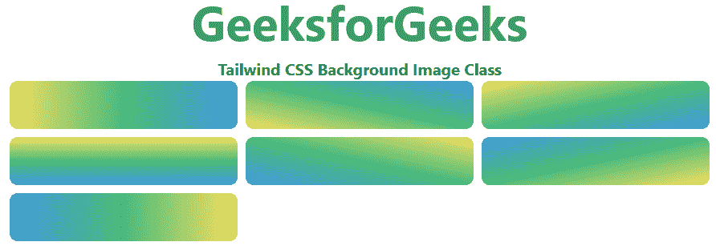

# 顺风 CSS 背景图

> 原文:[https://www . geesforgeks . org/tail wind-CSS-background-image/](https://www.geeksforgeeks.org/tailwind-css-background-image/)

该类在[顺风 CSS](https://www.geeksforgeeks.org/css-tailwind-introduction/) 中接受多个值。所有的属性都包含在类的形式中。它是 [CSS 背景图像属性](https://www.geeksforgeeks.org/css-background-image-property/)的替代品。此类用于为元素设置一个或多个背景图像。默认情况下，它将图像放在左上角。要指定两个或多个图像，请用逗号分隔 URL。

**背景图像类:**

*   **bg-none:** 此类用于不设置任何*线性渐变*。
*   **bg-gradient-to-t:** 此类用于将*线性渐变*设置到顶部。
*   **bg-gradient-to-tr:** 此类用于将*线性渐变*设置到右上角。
*   **bg-gradient-to-r:** 此类用于将*线性渐变*设置为右侧。
*   **bg-gradient-to-br:** 此类用于将*线性渐变*设置到右下角。
*   **bg-gradient-to-b:** 此类用于将*线性渐变*设置到底部。
*   **bg-gradient-to-bl:** 此类用于将*线性渐变*设置到左下角。
*   **bg-gradient-to-l:** 该类用于将*线性渐变*设置为左侧。
*   **bg-gradient-to-tl:** 此类用于将*线性渐变*设置到左上角。

**语法:**

```
<element class="bg-gradient-to-{direction}">...</element>
```

**示例:**

## 超文本标记语言

```
<!DOCTYPE html> 
<html> 
<head> 
    <link href=
"https://unpkg.com/tailwindcss@^1.0/dist/tailwind.min.css"
    rel="stylesheet"> 
</head> 

<body class="text-center"> 
    <h1 class="text-green-600 text-5xl font-bold"> 
    GeeksforGeeks 
    </h1> 
    <b>Tailwind CSS Background Image Class</b> 
    <div class="mx-4 grid grid-cols-3 gap-2">
    <div class="h-12 w-full bg-gradient-to-r rounded-lg
                from-yellow-400 via-green-500 to-blue-500">
    </div>
    <div class="h-12 w-full bg-gradient-to-tr rounded-lg
                from-yellow-400 via-green-500 to-blue-500">
    </div>
    <div class="h-12 w-full bg-gradient-to-br rounded-lg
                from-yellow-400 via-green-500 to-blue-500">
    </div>
    <div class="h-12 w-full bg-gradient-to-b rounded-lg
                from-yellow-400 via-green-500 to-blue-500">
    </div>
    <div class="h-12 w-full bg-gradient-to-bl rounded-lg
                from-yellow-400 via-green-500 to-blue-500">
    </div>
    <div class="h-12 w-full bg-gradient-to-tl rounded-lg
                from-yellow-400 via-green-500 to-blue-500">
    </div>
    <div class="h-12 w-full bg-gradient-to-l rounded-lg
                from-yellow-400 via-green-500 to-blue-500">
    </div>
</body> 
</html>
```

**输出:**



顺风 CSS 背景图像