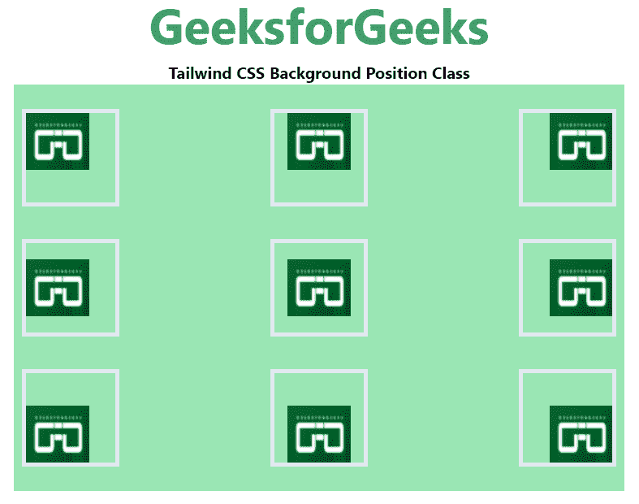

# 顺风 CSS 背景位置

> 原文:[https://www . geesforgeks . org/tail wind-CSS-background-position/](https://www.geeksforgeeks.org/tailwind-css-background-position/)

该类在[顺风 CSS](https://www.geeksforgeeks.org/css-tailwind-introduction/) 中接受多个值。所有的属性都包含在类的形式中。它是 [CSS 背景位置属性](https://www.geeksforgeeks.org/css-background-image-property/)的替代物。此类用于为元素设置一个或多个背景图像。默认情况下，它将图像放在左上角。要指定两个或多个图像，请用逗号分隔 URL。

**背景位置类别:**

*   **BG-左上方:**位于背景的*左上方*。
*   **bg-top:** 位于背景的*顶部*。
*   **BG-右上方:**位于背景的*右上方*。
*   **bg-left:** 位于背景的*左侧*。
*   **bg-center:** 位于背景的*中心*。
*   **bg-right:** 位于背景的*右侧*。
*   **BG-左下:**位于背景的*左下*。
*   **bg-bottom:** 位于背景的*底部*。
*   **BG-右下方:**位于背景的*右下方*。

**注:**以下示例中使用了所有类。

**语法:**

```html
<element class="bg-{side}">...</element>
```

**示例:**

## 超文本标记语言

```html
<!DOCTYPE html> 
<html> 
<head> 
    <link href=
"https://unpkg.com/tailwindcss@^1.0/dist/tailwind.min.css"
    rel="stylesheet"> 
</head> 

<body class="text-center"> 
    <h1 class="text-green-600 text-5xl font-bold"> 
    GeeksforGeeks 
    </h1> 
    <b>Tailwind CSS Background Position Class</b> 
    <div class="bg-green-300 
                mx-16 
                space-y-4 
                p-2 
                justify-between 
                grid grid-rows-3 
                grid-flow-col"> 
    <div title="bg-left-top"
         class="bg-no-repeat bg-left-top 
                bg-gree-200 w-24 h-24
                border-4 my-4"
         style=
         "background-image:url(
 https://media.geeksforgeeks.org/wp-content/uploads/20210222211217/Screenshot20210222211207.png)">
    </div>
    <div title="bg-left"
         class="bg-no-repeat bg-left 
                bg-gree-200 w-24 h-24 
                border-4 my-4"
         style=
         "background-image:url(
 https://media.geeksforgeeks.org/wp-content/uploads/20210222211217/Screenshot20210222211207.png)">
    </div>
    <div title="bg-left-bottom"
         class="bg-no-repeat bg-left-bottom 
                bg-gree-200 w-24 h-24 
                border-4 my-4"
         style="background-image:url(
 https://media.geeksforgeeks.org/wp-content/uploads/20210222211217/Screenshot20210222211207.png)">
    </div>
    <div title="bg-top"
         class="bg-no-repeat bg-top 
                bg-gree-200 w-24 h-24 
                border-4 my-4"
         style="background-image:url(
 https://media.geeksforgeeks.org/wp-content/uploads/20210222211217/Screenshot20210222211207.png)">
    </div>
    <div title="bg-center"
         class="bg-no-repeat bg-center 
                bg-gree-200 w-24 h-24 
                border-4 my-4"
         style="background-image:url(
 https://media.geeksforgeeks.org/wp-content/uploads/20210222211217/Screenshot20210222211207.png)">
    </div>
    <div title="bg-bottom"
         class="bg-no-repeat bg-bottom 
                bg-gree-200 w-24 h-24 
                border-4 my-4"
         style="background-image:url(
 https://media.geeksforgeeks.org/wp-content/uploads/20210222211217/Screenshot20210222211207.png)">
    </div>
    <div title="bg-right-top"
         class="bg-no-repeat bg-right-top 
                bg-gree-200 w-24 h-24 
                border-4 my-4"
         style="background-image:url(
https://media.geeksforgeeks.org/wp-content/uploads/20210222211217/Screenshot20210222211207.png)">
    </div>
    <div title="bg-right"
         class="bg-no-repeat bg-right 
                bg-gree-200 w-24 h-24
                border-4 my-4"
         style="background-image: url(
 https://media.geeksforgeeks.org/wp-content/uploads/20210222211217/Screenshot20210222211207.png)">
    </div>
     <div title="bg-right-bottom"
         class="bg-no-repeat bg-right-bottom 
                bg-gree-200 w-24 h-24
                border-4 my-4"
         style="background-image:url(
 https://media.geeksforgeeks.org/wp-content/uploads/20210222211217/Screenshot20210222211207.png)">
     </div>    
    </div> 
</body> 
</html>
```

**输出:**你可以悬停在输出图像上，每个图像都会在工具提示中显示其背景位置。



背景位置