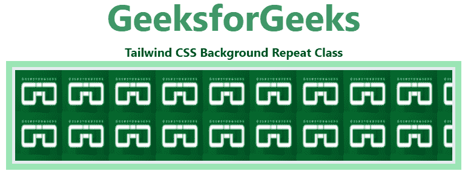

# 顺风 CSS 背景重复

> 原文:[https://www . geesforgeks . org/tail wind-CSS-background-repeat/](https://www.geeksforgeeks.org/tailwind-css-background-repeat/)

该类在[顺风 CSS](https://www.geeksforgeeks.org/css-tailwind-introduction/) 中接受多个值。所有的属性都包含在类的形式中。它是 [CSS 背景位置属性](https://www.geeksforgeeks.org/css-background-repeat-property/)的替代物。这个类用于水平和垂直重复背景图像。它还决定背景图像是否重复。

**背景重复类:**

*   **BG-重复**
*   **血糖-无-重复**
*   **BG-重复-x**
*   **BG-重复-y**
*   **BG-重复-回合**
*   **BG-重复-空格**

**bg-repeat:** 此类用于水平和垂直重复背景图像。如果最后一个图像不适合浏览器窗口，它将被剪切。

**语法:**

```css
<element class="bg-repeat">...</element>
```

**示例:**

## 超文本标记语言

```css
<!DOCTYPE html> 
<html> 
<head> 
    <link href=
"https://unpkg.com/tailwindcss@^1.0/dist/tailwind.min.css"
    rel="stylesheet"> 
</head> 

<body class="text-center"> 
    <h1 class="text-green-600 text-5xl font-bold"> 
    GeeksforGeeks 
    </h1> 
    <b>Tailwind CSS Background Repeat Class</b> 
    <div class="bg-green-300 
                mx-16 
                space-y-4 
                p-2 
                justify-between"> 
    <div class="bg-repeat bg-left-top bg-gree-200 
                w-full h-32 border-4"
         style="background-image:url(
https://media.geeksforgeeks.org/wp-content/uploads/20210222211217/Screenshot20210222211207.png)">
    </div>

    </div> 
</body> 
</html>
```

**输出:**



**bg-no-repeat:** 此类用于水平和垂直方向都不重复背景图像。

**语法:**

```css
<element class="bg-no-repeat">...</element>
```

**示例:**

## 超文本标记语言

```css
<!DOCTYPE html> 
<html> 
<head> 
    <link href=
"https://unpkg.com/tailwindcss@^1.0/dist/tailwind.min.css"
    rel="stylesheet"> 
</head> 

<body class="text-center"> 
    <h1 class="text-green-600 text-5xl font-bold"> 
    GeeksforGeeks 
    </h1> 
    <b>Tailwind CSS Background no Repeat Class</b> 
    <div class="bg-green-300 
                mx-16 
                space-y-4 
                p-2 
                justify-between"> 
       <div class="bg-no-repeat bg-left-top 
                   bg-gree-200 w-full h-32 
                   border-4"
            style="background-image:url(
https://media.geeksforgeeks.org/wp-content/uploads/20210222211217/Screenshot20210222211207.png)">
    </div>

    </div> 
</body> 
</html>
```

**输出:**


**bg-repeat-x:** 这个类用于水平重复背景图像。

**语法:**

```css
<element class="bg-repeat-x">...</element>
```

**示例:**

## 超文本标记语言

```css
<!DOCTYPE html> 
<html> 
<head> 
    <link href=
"https://unpkg.com/tailwindcss@^1.0/dist/tailwind.min.css"
    rel="stylesheet"> 
</head> 

<body class="text-center"> 
    <h1 class="text-green-600 text-5xl font-bold"> 
    GeeksforGeeks 
    </h1> 
    <b>Tailwind CSS Background Repeat X Class</b> 
    <div class="bg-green-300 
                mx-16 
                space-y-4 
                p-2 
                justify-between"> 
      <div class="bg-repeat-x bg-left-top 
                  bg-gree-200 w-full 
                  h-32 border-4"
           style="background-image:url(
https://media.geeksforgeeks.org/wp-content/uploads/20210222211217/Screenshot20210222211207.png)">
      </div>
    </div> 
</body> 
</html>
```

**输出:**


**bg-repeat-y:** 此类用于垂直重复背景图像。

**语法:**

```css
<element class="bg-repeat-y">...</element>
```

**示例:**

## 超文本标记语言

```css
<!DOCTYPE html> 
<html> 
<head> 
    <link href=
"https://unpkg.com/tailwindcss@^1.0/dist/tailwind.min.css"
    rel="stylesheet"> 
</head> 

<body class="text-center"> 
    <h1 class="text-green-600 text-5xl font-bold"> 
    GeeksforGeeks 
    </h1> 
    <b>Tailwind CSS Background Repeat Y Class</b> 
    <div class="bg-green-300 
                mx-16 
                space-y-4 
                p-2 
                justify-between"> 
       <div class="bg-repeat-y bg-left-top
                   bg-gree-200 w-full
                   h-32 border-4"
            style="background-image:url(
https://media.geeksforgeeks.org/wp-content/uploads/20210222211217/Screenshot20210222211207.png)">
       </div>
    </div> 
</body> 
</html>
```

**输出:**


**bg-repeat-round:** 该类用于以适合容器的方式重复图像，图像之间没有任何额外的空间。

**语法:**

```css
<element class="bg-repeat-round">...</element>
```

**示例:**

## 超文本标记语言

```css
<!DOCTYPE html> 
<html> 
<head> 
    <link href=
"https://unpkg.com/tailwindcss@^1.0/dist/tailwind.min.css"
    rel="stylesheet"> 
</head> 

<body class="text-center"> 
    <h1 class="text-green-600 text-5xl font-bold"> 
    GeeksforGeeks 
    </h1> 
    <b>Tailwind CSS Background Repeat Round Class</b> 
    <div class="bg-green-300 
                mx-16 
                space-y-4 
                p-2 
                justify-between"> 
     <div class="bg-repeat-round bg-left-top 
                bg-gree-200 w-full 
                h-32 border-4"
          style="background-image:url(
https://media.geeksforgeeks.org/wp-content/uploads/20210222211217/Screenshot20210222211207.png)">
     </div>
    </div> 
</body> 
</html>
```

**输出:**


**bg-repeat-space:** 这个类用于以一种方式重复图像，这种方式将使容器与图像之间所需的额外空间相适应。

**语法:**

```css
<element class="bg-repeat-space">...</element>
```

**示例:**

## 超文本标记语言

```css
<!DOCTYPE html> 
<html> 
<head> 
    <link
    href="https://unpkg.com/tailwindcss@^1.0/dist/tailwind.min.css"
    rel="stylesheet"> 
</head> 

<body class="text-center"> 
    <h1 class="text-green-600 text-5xl font-bold"> 
      GeeksforGeeks 
    </h1> 
    <b>Tailwind CSS Background Repeat Space Class</b> 
    <div class="bg-green-300 
                mx-16 
                space-y-4 
                p-2 
                justify-between"> 
     <div class="bg-repeat-space bg-left-top 
                 bg-gree-200 w-full 
                 h-32 border-4"
          style="background-image:url(
                 https://media.geeksforgeeks.org/wp-content/uploads/20210222211217/Screenshot20210222211207.png)">
     </div>
    </div> 
</body> 
</html>
```

**输出:**

