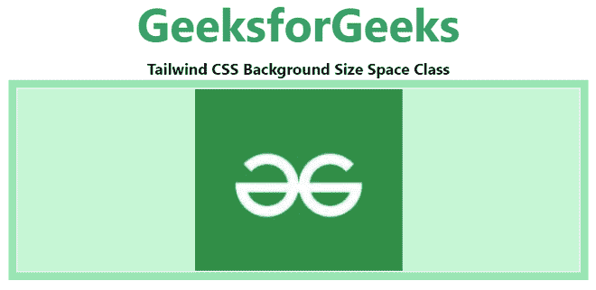

# 顺风 CSS 背景尺寸

> 原文:[https://www.geeksforgeeks.org/tailwind-css-background-size/](https://www.geeksforgeeks.org/tailwind-css-background-size/)

该类在[顺风 CSS](https://www.geeksforgeeks.org/css-tailwind-introduction/) 中接受多个值。所有的属性都包含在类的形式中。它是 [CSS 背景大小属性](https://www.geeksforgeeks.org/css-background-size-property/)的替代品。此类用于设置背景图像的大小。

**背景尺寸等级:**

*   **BG-自动**
*   **BG-盖**
*   **BG-包含**

**bg-auto:** 用于将背景大小类设置为默认值。它用于将背景图像显示为其原始大小。

**语法:**

```html
<element class="bg-auto">...</element>
```

**示例:**

## 超文本标记语言

```html
<!DOCTYPE html> 
<html> 
<head> 
    <link href=
"https://unpkg.com/tailwindcss@^1.0/dist/tailwind.min.css"
          rel="stylesheet"> 
</head> 

<body class="text-center"> 
    <h1 class="text-green-600 text-5xl font-bold"> 
    GeeksforGeeks 
    </h1> 
    <b>Tailwind CSS Background Size Space Class</b> 
    <div class="bg-green-300 
                mx-16 
                space-y-4 
                p-2 
                justify-between"> 
    <div class="bg-no-repeat bg-auto bg-center 
                bg-green-200 w-full h-48 border-2"
         style="background-image:url(
https://media.geeksforgeeks.org/wp-content/uploads/20210222231443/Screenshot20210222231435.png)">
    </div>

    </div> 
</body> 
</html>
```

**输出:**



**bg-cover:** 用于调整背景图像大小，覆盖整个容器元素。

**语法:**

```html
<element class="bg-cover">...</element>
```

**示例:**

## 超文本标记语言

```html
<!DOCTYPE html> 
<html> 
<head> 
    <link href=
"https://unpkg.com/tailwindcss@^1.0/dist/tailwind.min.css"
    rel="stylesheet"> 
</head> 

<body class="text-center"> 
    <h1 class="text-green-600 text-5xl font-bold"> 
    GeeksforGeeks 
    </h1> 
    <b>Tailwind CSS Background Size Space Class</b> 
    <div class="bg-green-300 
                mx-16 
                space-y-4 
                p-2 
                justify-between"> 
    <div class="bg-no-repeat bg-cover bg-center 
                bg-green-200 w-full h-48 border-2"
         style="background-image:url(
https://media.geeksforgeeks.org/wp-content/uploads/20210222231443/Screenshot20210222231435.png)">
    </div>

    </div> 
</body> 
</html>
```

**输出:**


**bg-contain:** 用于通过收缩将背景图像包含在容器内。

**语法:**

```html
<element class="bg-contain">...</element>
```

**示例:**

## 超文本标记语言

```html
<!DOCTYPE html> 
<html> 
<head> 
    <link href=
"https://unpkg.com/tailwindcss@^1.0/dist/tailwind.min.css"
    rel="stylesheet"> 
</head> 

<body class="text-center"> 
    <h1 class="text-green-600 text-5xl font-bold"> 
    GeeksforGeeks 
    </h1> 
    <b>Tailwind CSS Background Size Space Class</b> 
    <div class="bg-green-300 
                mx-16 
                space-y-4 
                p-2 
                justify-between"> 
    <div class="bg-no-repeat bg-contain bg-center 
                bg-green-200 w-full h-48 border-2"
         style="background-image: url(
https://media.geeksforgeeks.org/wp-content/uploads/20210222231443/Screenshot20210222231435.png)">
    </div>

    </div> 
</body> 
</html>
```

**输出:**

