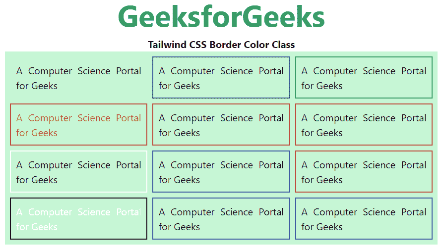

# 顺风 CSS 边框颜色

> 原文:[https://www.geeksforgeeks.org/tailwind-css-border-color/](https://www.geeksforgeeks.org/tailwind-css-border-color/)

这个类在 tailwind CSS 中接受多个值，其中所有的属性都以类的形式被覆盖。它是 [CSS 边框颜色属性](https://www.geeksforgeeks.org/css-border-color-property/)的替代。此类用于指定元素的边框颜色。

**边框颜色等级:**

*   **边框透明:**边框颜色将为透明。
*   **边框-当前:**边框颜色将取决于父元素颜色。
*   **边框-黑色:**边框颜色将为黑色。
*   **边框-白色:**边框颜色将为白色。
*   **边框-灰色-50:** 边框颜色将为灰色。
*   **边框-红色-50:** 边框颜色为红色。
*   **边框-蓝色-50:** 边框颜色将为蓝色。
*   **边框-靛蓝-50:** 边框颜色将为靛蓝。
*   **边框-紫色-50:** 边框颜色将为紫色。
*   **边框-绿色-50:** 边框颜色将为绿色。
*   **边框-黄色-50:** 边框颜色将为黄色。
*   **边框-粉色-50:** 边框颜色将为粉色。

**注意:**颜色的值可以根据你的需要在 50-900 之间变化，跨度应该是 100，在 100 之后。

**语法:**

```html
<element class="border-{color}">...</element>
```

**示例:**

## 超文本标记语言

```html
<!DOCTYPE html> 
<head> 
    <link href= 
"https://unpkg.com/tailwindcss@^1.0/dist/tailwind.min.css"
        rel="stylesheet"> 
</head> 

<body class="text-center mx-4"> 
    <h1 class="text-green-600 text-5xl font-bold"> 
        GeeksforGeeks 
    </h1> 
    <b>Tailwind CSS Border Color Class</b> 
    <div class="mx-14 bg-green-200 grid grid-rows-4 
                grid-flow-col gap-2 text-justify p-2"> 

    <p class="border-2 border-transparent p-2"> 
        A Computer Science Portal for Geeks 
    </p>

    <p class="border-2 border-current text-red-600 p-2"> 
        A Computer Science Portal for Geeks 
    </p>

    <p class="border-2 border-white p-2"> 
        A Computer Science Portal for Geeks 
    </p>

    <p class="border-2 border-black text-white p-2"> 
        A Computer Science Portal for Geeks 
    </p>

    <p class="border-2 border-gray-700 p-2"> 
        A Computer Science Portal for Geeks 
    </p>

    <p class="border-2 border-red-700 p-2"> 
        A Computer Science Portal for Geeks 
    </p>

    <p class="border-2 border-indigo-700 p-2"> 
        A Computer Science Portal for Geeks 
    </p>

    <p class="border-2 border-blue-700 p-2"> 
        A Computer Science Portal for Geeks 
    </p>

    <p class="border-2 border-green-700 p-2"> 
        A Computer Science Portal for Geeks 
    </p>

    <p class="border-2 border-yellow-700 p-2"> 
        A Computer Science Portal for Geeks 
    </p>

    <p class="border-2 border-pink-700 p-2"> 
        A Computer Science Portal for Geeks 
    </p>

    <p class="border-2 border-purple-700 p-2"> 
        A Computer Science Portal for Geeks 
    </p>

    </div> 
</body> 

</html> 
```

**输出:**

