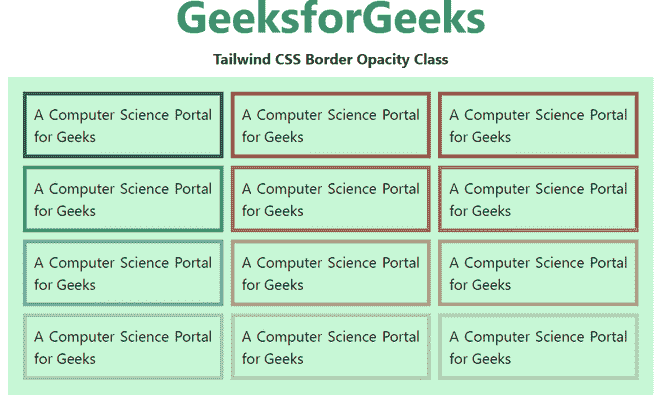

# 顺风 CSS 边框不透明度

> 原文:[https://www.geeksforgeeks.org/tailwind-css-border-opacity/](https://www.geeksforgeeks.org/tailwind-css-border-opacity/)

这个类在[顺风 CSS](https://www.geeksforgeeks.org/css-tailwind-introduction/) 中接受很多值，其中所有的属性都以类的形式被覆盖。边框不透明度是描述元素透明度的元素类别。它是 [CSS 不透明度/透明度](https://www.geeksforgeeks.org/css-opacity-transparency/)的替代品。

**边框不透明度等级:**

*   边框-不透明度-0
*   边框-不透明度-5
*   边框-不透明度-10
*   边框-不透明度-20
*   边框-不透明度-25
*   边框-不透明度-30
*   边框-不透明度-40
*   边框-不透明度-50
*   边框-不透明度-60
*   边框-不透明度-70
*   边框-不透明度-75
*   边框-不透明度-80
*   边框-不透明度-90
*   边框-不透明度-95
*   边框-不透明度-100

**语法:**

```html
<element class="border-opacity-{amount}">...</element>
```

**示例:**

## 超文本标记语言

```html
<!DOCTYPE html>

<head>
    <link href=
"https://unpkg.com/tailwindcss@^1.0/dist/tailwind.min.css"
        rel="stylesheet">
</head>

<body class="text-center mx-4 space-y-2">
    <h1 class="text-green-600 text-5xl font-bold">
        GeeksforGeeks
    </h1>

    <b>Tailwind CSS Border Opacity Class</b>

    <div class="mx-14 bg-green-200 grid grid-rows-4 
                grid-flow-col gap-2 text-justify p-4">

        <p class="border-green-800 border-4
                border-opacity-100 p-2">
            A Computer Science Portal for Geeks
        </p>

        <p class="border-green-800 border-4
                border-opacity-75 p-2">
            A Computer Science Portal for Geeks
        </p>

        <p class="border-green-800 border-4
                border-opacity-50 p-2">
            A Computer Science Portal for Geeks
        </p>

        <p class="border-green-800 border-4
                border-opacity-25 p-2">
            A Computer Science Portal for Geeks
        </p>

        <p class="border-yellow-800 border-4
                border-opacity-100 p-2">
            A Computer Science Portal for Geeks
        </p>

        <p class="border-yellow-800 border-4
                border-opacity-75 p-2">
            A Computer Science Portal for Geeks
        </p>

        <p class="border-yellow-800 border-4
                border-opacity-50 p-2">
            A Computer Science Portal for Geeks
        </p>

        <p class="border-yellow-800 border-4
                border-opacity-25 p-2">
            A Computer Science Portal for Geeks
        </p>

        <p class="border-pink-800 border-4
                border-opacity-100 p-2">
            A Computer Science Portal for Geeks
        </p>

        <p class="border-pink-800 border-4
                border-opacity-75 p-2">
            A Computer Science Portal for Geeks
        </p>

        <p class="border-pink-800 border-4
                border-opacity-50 p-2">
            A Computer Science Portal for Geeks
        </p>

        <p class="border-pink-800 border-4
                border-opacity-25 p-2">
            A Computer Science Portal for Geeks
        </p>
    </div>
</body>

</html>
```

**输出:**

