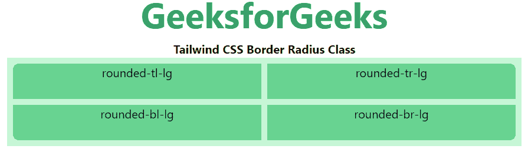

# 顺风 CSS 边框半径

> 原文:[https://www.geeksforgeeks.org/tailwind-css-border-radius/](https://www.geeksforgeeks.org/tailwind-css-border-radius/)

这个类在顺风 CSS 中接受多个值。所有的属性都包含在类的形式中。它是 [CSS 边框半径属性的替代。](https://www.geeksforgeeks.org/css-border-radius-property/)该类用于设置边框半径。

**边界半径等级:**

*   四舍五入-无
*   圆形 sm
*   全面的
*   圆形 md
*   圆形 lg
*   圆形-xl
*   圆形-2xl
*   圆角-3xl
*   全圆的
*   四舍五入-t-无
*   四舍五入-r-无
*   四舍五入-B-无
*   四舍五入-l-无
*   圆形 t-sm
*   圆形 r-sm
*   圆形 b-sm
*   圆形 l-sm
*   圆形 t
*   圆形 r
*   圆角 b
*   圆角 l
*   圆形 t-md
*   圆形 r-md
*   圆形 b-md
*   圆形-l-md
*   圆形 t-lg
*   圆形 r-lg
*   圆形 b-lg
*   圆形-l-lg
*   圆形 t-xl
*   圆形-r-xl
*   圆形 b-xl
*   圆角-l-xl
*   圆形 t-2xl
*   圆形-r-2xl
*   圆形-b-2xl
*   圆形-l-2xl
*   圆形 t-3xl
*   圆角 r-3xl
*   圆角 b-3xl
*   圆角-l-3xl
*   圆角 t 形
*   四舍五入
*   四舍五入
*   圆形-l 形-全
*   四舍五入-t1-无
*   四舍五入-tr-无
*   四舍五入-br-无
*   四舍五入
*   圆形-tl-sm
*   圆形 tr-sm
*   圆形 br-sm
*   圆形 bl-sm
*   圆形-tl
*   圆形 tr
*   圆形-br
*   圆形 bl
*   圆形-tl-md
*   圆形 tr-md
*   圆形-br-md
*   圆形-bl-md
*   圆形-tl-lg
*   圆形 tr-lg
*   圆形-br-lg
*   圆形 bl-lg
*   圆形-tl-xl
*   圆形 tr-xl
*   圆形-br-xl
*   圆形 bl-xl
*   圆形-t1-2xl
*   圆形 tr-2xl
*   圆形-br-2xl
*   圆形-bl-2xl
*   圆形-tl-3xl
*   圆角 tr-3xl
*   圆形-br-3xl
*   圆形-bl-3xl
*   圆形-TL-全
*   圆形 tr-full
*   圆形 br-full
*   圆形-bl-full

**圆角:**在本节中，涵盖了用于创建圆角的类，如 round-sm、round-MD、round-LG 等，但不包括完全圆形或药丸形状。

**语法:**

```html
<element class="rounded-{Border-Radius}">...</element>
```

**示例:**

## 超文本标记语言

```html
<!DOCTYPE html>
<html>

<head>
    <link href=
"https://unpkg.com/tailwindcss@^1.0/dist/tailwind.min.css"
        rel="stylesheet">
</head>

<body class="text-center">
    <h1 class="text-green-600 text-5xl font-bold">
        GeeksforGeeks
    </h1>

    <b>Tailwind CSS Border Radius Class</b>

    <div class="mx-4 grid grid-cols-3 gap-2 bg-green-200 p-2">

        <!-- First sub div is not for roundig-->
        <div class="rounded-none bg-green-400 w-48 h-12">
            rounded-none</div>
        <div class="rounded bg-green-400 w-48 h-12">
            rounded</div>
        <div class="rounded-sm bg-green-400 w-48 h-12">
            rounded-sm</div>
        <div class="rounded-md bg-green-400 w-48 h-12">
            rounded-md</div>
        <div class="rounded-lg bg-green-400 w-48 h-12">
            rounded-lg</div>
        <div class="rounded-xl bg-green-400 w-48 h-12">
            rounded-xl</div>
    </div>
</body>

</html>
```

**输出:**


**药丸和圆圈:**在本节中，涵盖了已用于创建完整圆圈和药丸(如圆形完整类)的类。

**语法:**

```html
<element class="rounded-full">...</element>
```

**示例:**

## 超文本标记语言

```html
<!DOCTYPE html>
<html>

<head>
    <link href=
"https://unpkg.com/tailwindcss@^1.0/dist/tailwind.min.css"
        rel="stylesheet">
</head>

<body class="text-center">
    <h1 class="text-green-600 text-5xl font-bold">
        GeeksforGeeks
    </h1>

    <b>Tailwind CSS Border Radius Class</b>

    <div class="mx-24 grid grid-cols-3 gap-2 bg-green-200 p-2">
        <div class="rounded-full bg-green-400 py-3 px-6">
            rounded-full for Design Pill
        </div>
        <div class="rounded-full mx-32 bg-green-400 h-24 w-24
                flex items-center justify-center">
            rounded-full for Circle
        </div>
    </div>
</body>

</html>
```

**输出:**


**分别倒圆角边:**在本节中，涵盖了所有用于创建倒圆角边的类，如倒圆角-t-lg、倒圆角-r-lg、倒圆角-b-lg 等。

**语法:**

```html
<element class="rounded-{t|r|b|l}{-size?}">...</element>
```

**示例:**

## 超文本标记语言

```html
<!DOCTYPE html>
<html>

<head>
    <link href=
"https://unpkg.com/tailwindcss@^1.0/dist/tailwind.min.css"
        rel="stylesheet">
</head>

<body class="text-center">
    <h1 class="text-green-600 text-5xl font-bold">
        GeeksforGeeks
    </h1>

    <b>Tailwind CSS Border Radius Class</b>

    <div class="mx-4 grid grid-cols-2 gap-2 bg-green-200 p-2">

        <!-- First sub div is not for roundig-->
        <div class="rounded-t-lg bg-green-400 w-full h-12">
            rounded-t-lg</div>
        <div class="rounded-r-lg bg-green-400 w-full h-12">
            rounded-r-lg</div>
        <div class="rounded-l-lg bg-green-400 w-full h-12">
            rounded-l-lg</div>
        <div class="rounded-b-lg bg-green-400 w-full h-12">
            rounded-b-lg</div>
    </div>
</body>

</html>
```

**输出:**


**分别圆角:**在本节中，涵盖了所有用于创建圆角的类，如 rounded-tl-lg、rounded-tr-lg、rounded-br-lg 等。

**语法:**

```html
<element class="rounded-{tl|tr|br|bl}{-size?}">...</element>
```

**示例:**

## 超文本标记语言

```html
<!DOCTYPE html>
<html>

<head>
    <link href=
"https://unpkg.com/tailwindcss@^1.0/dist/tailwind.min.css"
        rel="stylesheet">
</head>

<body class="text-center">
    <h1 class="text-green-600 text-5xl font-bold">
        GeeksforGeeks
    </h1>

    <b>Tailwind CSS Border Radius Class</b>

    <div class="mx-4 grid grid-cols-2 gap-2 bg-green-200 p-2">

        <!-- First sub div is not for roundig-->
        <div class="rounded-tl-lg bg-green-400 w-full h-12">
            rounded-tl-lg</div>
        <div class="rounded-tr-lg bg-green-400 w-full h-12">
            rounded-tr-lg</div>
        <div class="rounded-bl-lg bg-green-400 w-full h-12">
            rounded-bl-lg</div>
        <div class="rounded-br-lg bg-green-400 w-full h-12">
            rounded-br-lg</div>
    </div>
</body>

</html>
```

**输出:**

