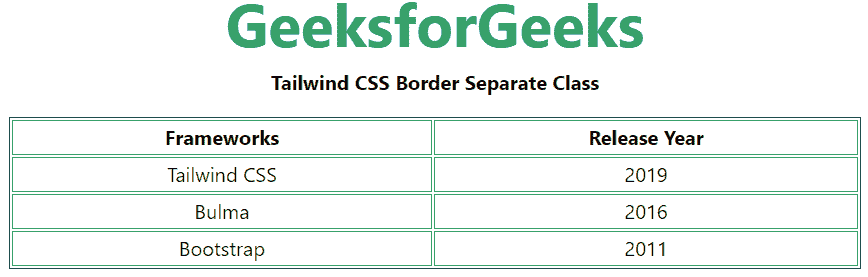

# 顺风 CSS 边框分离

> 原文:[https://www.geeksforgeeks.org/tailwind-css-border-separate/](https://www.geeksforgeeks.org/tailwind-css-border-separate/)

这个类在 [<u>顺风 CSS</u>](https://www.geeksforgeeks.org/css-tailwind-introduction/) 中接受大量的值，其中所有的属性都包含在类形式中。此类用于设置表格中单元格的边框，并告知这些单元格是否共享一个公共边框。

**语法:**

```css
<element class="border-separate">...</element>
```

**示例:**

## 超文本标记语言

```css
<!DOCTYPE html> 
<html>
<head> 
    <link href= 
"https://unpkg.com/tailwindcss@^1.0/dist/tailwind.min.css"
        rel="stylesheet"> 
</head> 

<body class="text-center mx-4 space-y-2"> 
    <h1 class="text-green-600 text-5xl font-bold"> 
        GeeksforGeeks 
    </h1> 
    <b>Tailwind CSS Border Separate Class</b> 
    <div class="grid grid-flow-col text-center p-2"> 
        <table class="border-separate border border-green-900">
        <thead>
          <tr>
            <th class="border border-green-600">Frameworks</th>
            <th class="border border-green-600">Release Year</th>
          </tr>
        </thead>
        <tbody>
          <tr>
            <td class="border border-green-600">Tailwind CSS</td>
            <td class="border border-green-600">2019</td>
          </tr>
          <tr>
            <td class="border border-green-600">Bulma</td>
            <td class="border border-green-600">2016</td>
          </tr>
          <tr>
            <td class="border border-green-600">Bootstrap</td>
            <td class="border border-green-600">2011</td>
          </tr>
        </tbody>
        </table>
    </div> 
</body> 

</html> 
```

**输出:**



顺风 CSS 边框独立类