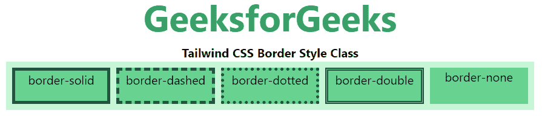

# 顺风 CSS 边框样式

> 原文:[https://www.geeksforgeeks.org/tailwind-css-border-style/](https://www.geeksforgeeks.org/tailwind-css-border-style/)

该类在[顺风 CSS](https://www.geeksforgeeks.org/css-tailwind-introduction/) 中接受多个值，其中所有属性都以类的形式覆盖。它是 [CSS 边框样式属性](https://www.geeksforgeeks.org/css-border-style-property/)的替代品。此类用于控制元素边框的样式。

**边框样式类:**

*   **边框-实心**
*   **虚线边框**
*   **虚线边框**
*   **边框-双**
*   **边框-无**

**语法:**

```css
<element class="border-{style}">...</element>
```

**示例:**

## 超文本标记语言

```css
<!DOCTYPE html>
<html>

<head>
    <link href=
"https://unpkg.com/tailwindcss@^1.0/dist/tailwind.min.css"
        rel="stylesheet">
</head>

<body class="text-center">
    <h1 class="text-green-600 text-5xl font-bold">
        GeeksforGeeks
    </h1>

    <b>Tailwind CSS Border Style Class</b>

    <div class="mx-4 grid grid-cols-5 gap-2 bg-green-200 p-2">

        <!-- First sub div is not for roundig-->
        <div class="border-4 border-green-900 border-solid
                    bg-green-400 w-full h-12">
            border-solid
        </div>

        <div class="border-4 border-green-900 border-dashed
                    bg-green-400 w-full h-12">
            border-dashed
        </div>

        <div class="border-4 border-green-900 border-dotted
                    bg-green-400 w-full h-12">
            border-dotted
        </div>

        <div class="border-4 border-green-900 border-double
                    bg-green-400 w-full h-12">
            border-double
        </div>

        <div class="border-4 border-green-900 border-none
                    bg-green-400 w-full h-12">
            border-none
        </div>
    </div>
</body>

</html>
```

**输出:**

