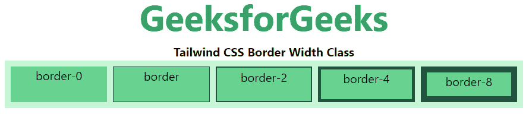
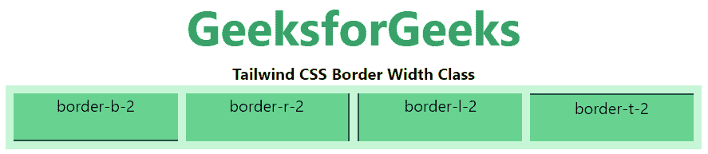

# 顺风 CSS 边框宽度

> 原文:[https://www.geeksforgeeks.org/tailwind-css-border-width/](https://www.geeksforgeeks.org/tailwind-css-border-width/)

这个类在顺风 CSS 中接受多个值。所有的属性都包含在类的形式中。它是 [CSS 边框宽度属性](https://www.geeksforgeeks.org/css-border-width-property/)的替代。此类用于设置元素所有四条边的边框宽度。边框宽度属性是四个属性的组合

**边框宽度等级:**

*   边界
*   边框-0
*   边界-2
*   边界-4
*   边界-8
*   边界 t
*   边框-t-0
*   边界 t-2
*   边界 t-4
*   边界-t-8
*   边框-r
*   边框-r-0
*   边界-r-2
*   边界-r-4
*   边界-r-8
*   边界-b
*   边框-b-0
*   边界-b-2
*   边界-b-4
*   边界-b-8
*   边框-l
*   边框-l-0
*   边界-l-2
*   边界-l-4
*   边界-l-8

**所有边:**在本节中，类已经用于设置元素所有边的边框宽度。这些类是 border、border-0、border-2、border-4 和 border-8。

**语法:**

```css
<element class="border-{number}">...</element>
```

**示例:**

## 超文本标记语言

```css
<!DOCTYPE html>
<html>

<head>
    <link href=
"https://unpkg.com/tailwindcss@^1.0/dist/tailwind.min.css"
        rel="stylesheet">
</head>

<body class="text-center">
    <h1 class="text-green-600 text-5xl font-bold">
        GeeksforGeeks
    </h1>

    <b>Tailwind CSS Border Width Class</b>

    <div class="mx-4 grid grid-cols-5 gap-2 bg-green-200 p-2">

        <!-- First sub div is not for roundig-->
        <div class="border-0 border-green-900 
                    bg-green-400 w-full h-12">
            border-0
        </div>

        <div class="border border-green-900 
                    bg-green-400 w-full h-12">
            border
        </div>

        <div class="border-2 border-green-900 
                    bg-green-400 w-full h-12">
            border-2
        </div>

        <div class="border-4 border-green-900 
                    bg-green-400 w-full h-12">
            border-4
        </div>

        <div class="border-8 border-green-900 
                    bg-green-400 w-full h-12">
            border-8
        </div>
    </div>
</body>

</html>
```

**输出:**



**单个边:**在本节中，类用于设置元素单个边的边框宽度。这些类是边框-{side}-0、边框-{side}-2、边框-{side}-4、边框-{side}-8 和边框-{side}。

**语法:**

```css
<element class="border-{side}-{number}">...</element>
```

**示例:**

## 超文本标记语言

```css
<!DOCTYPE html>
<html>

<head>
    <link href=
"https://unpkg.com/tailwindcss@^1.0/dist/tailwind.min.css"
        rel="stylesheet">
</head>

<body class="text-center">
    <h1 class="text-green-600 text-5xl font-bold">
        GeeksforGeeks
    </h1>

    <b>Tailwind CSS Border Width Class</b>

    <div class="mx-4 grid grid-cols-4 gap-2 bg-green-200 p-2">

        <!-- First sub div is not for roundig-->
        <div class="border-b-2 border-green-900 
                    bg-green-400 w-full h-12">
            border-b-2
        </div>

        <div class="border-r-2 border-green-900 
                    bg-green-400 w-full h-12">
            border-r-2
        </div>

        <div class="border-l-2 border-green-900 
                    bg-green-400 w-full h-12">
            border-l-2
        </div>

        <div class="border-t-2 border-green-900 
                    bg-green-400 w-full h-12">
            border-t-2
        </div>
    </div>
</body>

</html>
```

**输出:**

