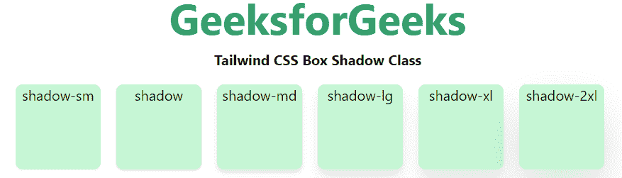

# 顺风 CSS 框影

> 原文:[https://www.geeksforgeeks.org/tailwind-css-box-shadow/](https://www.geeksforgeeks.org/tailwind-css-box-shadow/)

这个类在[顺风 CSS](https://www.geeksforgeeks.org/css-tailwind-introduction/) 中接受很多值，其中所有的属性都以类的形式被覆盖。通过使用这个类，我们可以控制元素的框阴影。在 CSS 中，我们通过使用盒子阴影的 [CSS 阴影效果](https://www.geeksforgeeks.org/css-shadow-effect/)属性来实现。

**盒子阴影类:**

*   **阴影-sm:** 这个职业是用来在方块上创建一个褪色或者小阴影的效果。
*   **阴影:**这个职业是用来在方块上创建正常的阴影效果。
*   **暗影-md:** 这个职业是用来在盒子上创造 *md* 效果的。
*   **阴影-lg:** 这个职业是用来在箱子上创建 *lg* 阴影效果的。
*   **阴影-xl:** 这个类用来在盒子上创建 *xl* 阴影效果。
*   **阴影-2xl:** 这个职业用来在盒子上创建 *2xl* 阴影效果。
*   **阴影-内部:**这个类是用来在盒子内部创建阴影效果的。
*   **暗影-无:**这个职业是用来稀释暗影效果的。

**语法:**

```
<element class="shadow-{shadow-depth}">...</element>
```

**示例:**

## 超文本标记语言

```
<!DOCTYPE html> 
<head> 
    <link href= 
"https://unpkg.com/tailwindcss@^1.0/dist/tailwind.min.css"
        rel="stylesheet"> 
</head> 

<body class="text-center mx-4 space-y-2"> 
    <h1 class="text-green-600 text-5xl font-bold"> 
        GeeksforGeeks 
    </h1> 
    <b>Tailwind CSS Box Shadow Class</b> 
    <div class="grid grid-flow-col text-center p-2"> 
        <div class="shadow-sm w-24 h-24 bg-green-200 
                    rounded-lg">shadow-sm
        </div>
        <div class="shadow w-24 h-24 bg-green-200 
                    rounded-lg">shadow
        </div>
        <div class="shadow-md w-24 h-24 bg-green-200 
                    rounded-lg">shadow-md
        </div>
        <div class="shadow-lg w-24 h-24 bg-green-200 
                    rounded-lg">shadow-lg
        </div>
        <div class="shadow-xl w-24 h-24 bg-green-200 
                    rounded-lg">shadow-xl
        </div>
        <div class="shadow-2xl w-24 h-24 bg-green-200 
                    rounded-lg">shadow-2xl
        </div>
    </div> 
</body> 

</html>
```

**输出:**



顺风 CSS 框阴影类