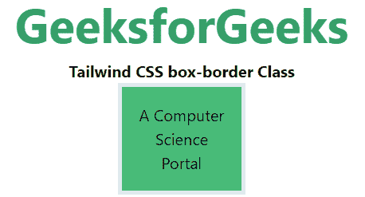
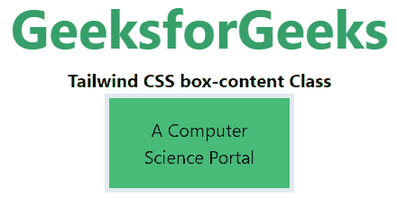

# 顺风 CSS 框尺寸

> 原文:[https://www.geeksforgeeks.org/tailwind-css-box-sizing/](https://www.geeksforgeeks.org/tailwind-css-box-sizing/)

这个类在 tailwind CSS 中接受多个值，所有的属性都以类的形式被覆盖。它是 [CSS 框大小属性](https://www.geeksforgeeks.org/css-box-sizing-property/)的替代。这个类用来定义用户应该如何计算一个元素的总宽度和总高度，即填充和边框是否包含在内。

**箱体尺寸:**

*   **框线**
*   **框-内容**

**框-边框:**在这种模式下，宽度和高度属性包括内容、填充和边框，即如果我们将元素的宽度设置为 200 像素，那 200 像素将包括我们添加的任何边框或填充，内容框将收缩以吸收额外的宽度。这通常会使元素的大小调整变得更加容易。

**语法:**

```css
<element class="box-border">..</element>
```

**示例:**

## 超文本标记语言

```css
<!DOCTYPE html> 
<head> 
    <title>Tailwind box-border Class</title> 
    <link href=
"https://unpkg.com/tailwindcss@^1.0/dist/tailwind.min.css" 
          rel="stylesheet"> 
</head> 

<body class="text-center"> 
<center>
    <h1 class="text-green-600 text-5xl font-bold">
        GeeksforGeeks
    </h1> 
    <b>Tailwind CSS box-border Class</b> 
    <div class="box-border h-28 w-32 p-4 
                border-4 bg-green-500 m4">
        A Computer Science Portal
    </div> 
</center>
</body> 

</html>
```

**输出:**



**框内容:**这是框大小类的默认值。在这种模式下，宽度和高度类只包含内容。边框和填充不包括在其中，也就是说，如果我们将元素的宽度设置为 200 像素，那么元素的内容框将为 200 像素宽，并且任何边框或填充的宽度都将被添加到最终渲染的宽度中。

**语法:**

```css
<element class="box-content">..</element>
```

**示例:**

## 超文本标记语言

```css
<!DOCTYPE html> 
<head> 
    <title>Tailwind box-content Class</title> 
    <link href=
"https://unpkg.com/tailwindcss@^1.0/dist/tailwind.min.css" 
          rel="stylesheet"> 
</head> 

<body class="text-center"> 
<center>
    <h1 class="text-green-600 text-5xl font-bold">
        GeeksforGeeks
    </h1> 
    <b>Tailwind CSS box-content Class</b> 
    <div class="box-content h-28 w-32 p-4 
                border-4 bg-green-500 m4">
        A Computer Science Portal
    </div> 
</center>
</body> 

</html>
```

**输出:**

