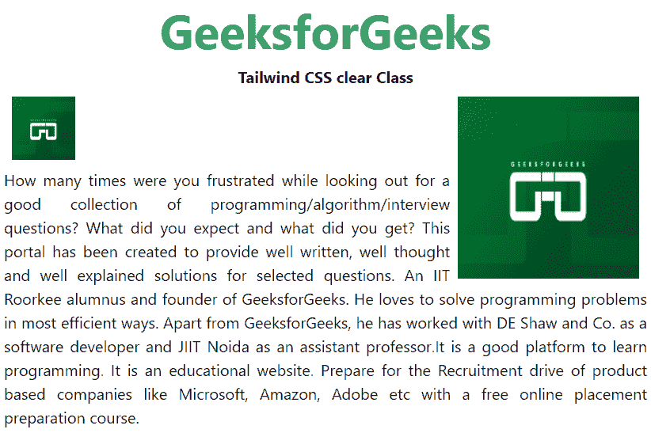
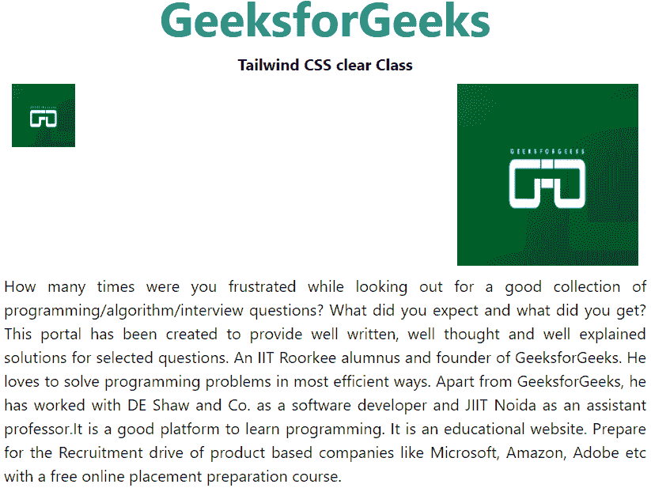
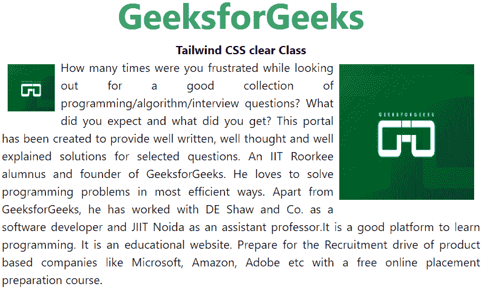

# 顺风 CSS 清除

> 原文:[https://www.geeksforgeeks.org/tailwind-css-clear/](https://www.geeksforgeeks.org/tailwind-css-clear/)

这个类在**顺风** CSS 中接受多个值。所有的属性都包含在类的形式中。它是 [CSS 透明属性](https://www.geeksforgeeks.org/css-clear-property/#:~:text=The%20clear%20property%20is%20used,which%20is%20floated%2C%20it%20will.)的替代物。此类用于指定浮动元素的哪一侧不允许浮动。它设置或返回元素相对于浮动对象的位置。如果该元素可以水平放置在另一个浮动元素旁边的空间中，它将会。基本上，它用于控制元素周围内容的包装。

**CSS 清除类:**

*   左转
*   清楚-对
*   清除-两者
*   清除-无

**clear-left:** 该类用于指定元素相对于另一个元素不允许在左侧浮动。

**语法:**

```
<element class="clear-left">...</element>
```

**示例:**

## 超文本标记语言

```
<!DOCTYPE html> 
<head>    
    <link href=
"https://unpkg.com/tailwindcss@^1.0/dist/tailwind.min.css" 
 rel="stylesheet"> 
</head> 

<body class="text-center"> 
<center>
    <h1 class="text-green-600 text-5xl font-bold">
        GeeksforGeeks
    </h1> 
    <b>Tailwind CSS clear Class</b> 
    <div class="mx-10">
    
    
    <p class="text-justify clear-left">
      How many times were you frustrated while looking out  
      for a good collection of programming/algorithm/interview 
      questions? What did you expect and what did you get?  
      This portal has been created to provide well written,  
      well thought and well explained solutions for selected  
      questions. An IIT Roorkee alumnus and founder of  
      GeeksforGeeks. He loves to solve programming problems 
      in most efficient ways. Apart from GeeksforGeeks, he  
      has worked with DE Shaw and Co. as a software developer  
      and JIIT Noida as an assistant professor.It is a good  
      platform to learn programming. It is an educational  
      website. Prepare for the Recruitment drive of product  
      based companies like Microsoft, Amazon, Adobe etc with 
      a free online placement preparation course.</p>

</center>
</body> 

</html>
```

**输出:**



**clear-right:** 该类用于指定元素相对于另一个元素不允许在右侧浮动。

**语法:**

```
<element class="clear-right">...</element>
```

**示例:**

## 超文本标记语言

```
<!DOCTYPE html> 
<head>     
    <link href=
"https://unpkg.com/tailwindcss@^1.0/dist/tailwind.min.css" 
     rel="stylesheet"> 
</head> 

<body class="text-center"> 
<center>
    <h1 class="text-green-600 text-5xl font-bold">
        GeeksforGeeks
    </h1> 
    <b>Tailwind CSS clear Class</b> 
    <div class="mx-10">
    
    
    <p class="text-justify clear-right">
      How many times were you frustrated while looking out  
      for a good collection of programming/algorithm/interview 
      questions? What did you expect and what did you get?  
      This portal has been created to provide well written,  
      well thought and well explained solutions for selected  
      questions. An IIT Roorkee alumnus and founder of  
      GeeksforGeeks. He loves to solve programming problems 
      in most efficient ways. Apart from GeeksforGeeks, he  
      has worked with DE Shaw and Co. as a software developer  
      and JIIT Noida as an assistant professor.It is a good  
      platform to learn programming. It is an educational  
      website. Prepare for the Recruitment drive of product  
      based companies like Microsoft, Amazon, Adobe etc with 
      a free online placement preparation course.</p>

</center>
</body> 

</html>
```

**输出:**



**clear-both:** 这个类用来指定浮动元素不允许两边浮动。

**语法:**

```
<element class="clear-both">...</element>
```

**示例:**

## 超文本标记语言

```
<!DOCTYPE html> 
<head>     
    <link href=
"https://unpkg.com/tailwindcss@^1.0/dist/tailwind.min.css" 
          rel="stylesheet"> 
</head> 

<body class="text-center"> 
<center>
    <h1 class="text-green-600 text-5xl font-bold">
        GeeksforGeeks
    </h1> 
    <b>Tailwind CSS clear Class</b> 
    <div class="mx-10">
    
    
    <p class="text-justify clear-both">
      How many times were you frustrated while looking out  
      for a good collection of programming/algorithm/interview 
      questions? What did you expect and what did you get?  
      This portal has been created to provide well written,  
      well thought and well explained solutions for selected  
      questions. An IIT Roorkee alumnus and founder of  
      GeeksforGeeks. He loves to solve programming problems 
      in most efficient ways. Apart from GeeksforGeeks, he  
      has worked with DE Shaw and Co. as a software developer  
      and JIIT Noida as an assistant professor.It is a good  
      platform to learn programming. It is an educational  
      website. Prepare for the Recruitment drive of product  
      based companies like Microsoft, Amazon, Adobe etc with 
      a free online placement preparation course.</p>

</center>
</body> 

</html>
```

**输出:**


**clear-none:** 此类用于指定默认值。它允许元素在两侧浮动。

**语法:**

```
<element class="clear-none">...</element>
```

**示例:**

## 超文本标记语言

```
<!DOCTYPE html> 
<head>    
    <link href=
"https://unpkg.com/tailwindcss@^1.0/dist/tailwind.min.css" 
    rel="stylesheet"> 
</head> 

<body class="text-center"> 
<center>
    <h1 class="text-green-600 text-5xl font-bold">
        GeeksforGeeks
    </h1> 
    <b>Tailwind CSS clear Class</b> 
    <div class="mx-10">
    
    
    <p class="text-justify clear-none">
      How many times were you frustrated while looking out  
      for a good collection of programming/algorithm/interview 
      questions? What did you expect and what did you get?  
      This portal has been created to provide well written,  
      well thought and well explained solutions for selected  
      questions. An IIT Roorkee alumnus and founder of  
      GeeksforGeeks. He loves to solve programming problems 
      in most efficient ways. Apart from GeeksforGeeks, he  
      has worked with DE Shaw and Co. as a software developer  
      and JIIT Noida as an assistant professor.It is a good  
      platform to learn programming. It is an educational  
      website. Prepare for the Recruitment drive of product  
      based companies like Microsoft, Amazon, Adobe etc with 
      a free online placement preparation course.</p>

</center>
</body> 

</html>
```

**输出:**

