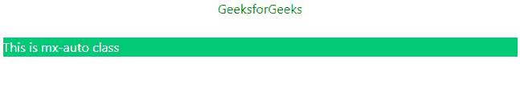
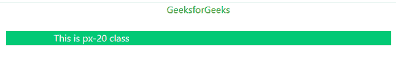

# 顺风 CSS 容器

> 原文:[https://www.geeksforgeeks.org/tailwind-css-container/](https://www.geeksforgeeks.org/tailwind-css-container/)

在 [**顺风 CSS**](https://www.geeksforgeeks.org/css-tailwind-introduction/) 中，一个容器用来固定一个元素的*最大宽度*来匹配断点的*最小宽度*。当内容必须以响应每个断点的方式显示时，它非常方便。

顺风 CSS 中的断点如下。

<figure class="table">T19T26】LGT32】XL

| **Breakpoint** | **最小宽度** |
| 钐 | 640 像素 |
| 医学博士 | 768 像素 |
| 1024 像素 |

</figure>

顺风 CSS 不会自动居中，也不包含任何预定义的填充。下面是一些使容器类脱颖而出的实用程序类。

**mx-auto:** 为了使容器居中，我们使用 *mx-auto* 实用程序类。它会自动调整容器的边距，使容器看起来居中。

**语法:**

```css
<element class="mx-auto">...</element>
```

**示例:**

## 超文本标记语言

```css
<!DOCTYPE html>
<html>

<head>
    <link href=
"https://unpkg.com/tailwindcss@^1.0/dist/tailwind.min.css"
        rel="stylesheet">

    <style>
        .container {
            background-color: rgb(2, 201, 118);
            color: white;
        }

        h2 {
            text-align: center;
        }
    </style>
</head>

<body>
    <h2 style="color:green">
        GeeksforGeeks
    </h2><br />

    <div class="container mx-auto">
        This is mx-auto class
    </div>
</body>

</html>
```

**输出:**



MX-自动分类

**px-{size}:** 要添加填充容器，我们使用 *px-{size}* 实用程序类。它向容器中添加了与所述大小相等的水平填充。

**语法:**

```css
<element class="px-20">...</element>
```

**示例:**

## 超文本标记语言

```css
<!DOCTYPE html>
<html>

<head>
    <link href=
"https://unpkg.com/tailwindcss@^1.0/dist/tailwind.min.css"
        rel="stylesheet">

    <style>
        .container {
            background-color: rgb(2, 201, 118);
            color: white;
        }

        h2 {
            text-align: center;
        }
    </style>
</head>

<body>
    <h2 style="color:green">
        GeeksforGeeks
    </h2>
    <br />

    <div class="container mx-auto px-20">
        This is px-20 class
    </div>
</body>

</html>
```

**输出:**



px 尺寸等级