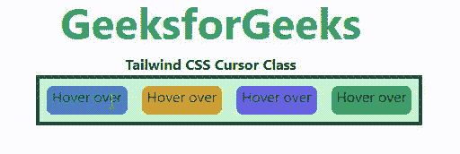

# 泰风 CSS 游标

> 原文:[https://www.geeksforgeeks.org/tailwind-css-cursor/](https://www.geeksforgeeks.org/tailwind-css-cursor/)

这个类在[顺风 CSS](https://www.geeksforgeeks.org/css-tailwind-introduction/) 中接受很多值，其中所有的属性都以类的形式被覆盖。这个类用来指定鼠标指针指向一个元素时要显示的内容。在 CSS 中，我们通过使用 [CSS 光标属性](https://www.geeksforgeeks.org/css-cursor-property/)做到了这一点。

**光标类别:**

*   **光标自动:**这是浏览器设置光标的默认类。
*   **光标-默认:**这是默认的光标类。
*   **光标指针:**在这个类中，光标是一个指针，表示一个链接
*   **光标-等待:**在这个类中，光标表示程序正忙。
*   **光标-文本:**在该类中，光标表示可以选择的文本。
*   **光标移动:**在这个类中，光标表示要移动的东西。
*   **光标-帮助:**
*   **光标-不允许:**在这个类中，光标表示请求的动作不会被执行。

**语法:**

```css
<element class="cursor-{behaviour}">...</element>
```

**示例:**

## 超文本标记语言

```css
<!DOCTYPE html>
<html>
<head> 
    <link href= 
"https://unpkg.com/tailwindcss@^1.0/dist/tailwind.min.css"
        rel="stylesheet"> 
</head> 

<body class="text-center"> 
    <h1 class="text-green-600 text-5xl font-bold"> 
        GeeksforGeeks 
    </h1> 
    <b>Tailwind CSS Cursor Class</b> 
    <div id="main" class="p-2 justify-around ml-32 h-26 w-2/3 flex 
                          items-stretch 
                          bg-green-200 border-solid border-4 
                          border-green-900 gap-4"> 
        <div class="cursor-auto bg-blue-600 
                    w-full h-8 rounded-lg">
            Hover over
        </div> 
        <div class="cursor-default bg-yellow-600 
                    w-full h-8 rounded-lg">
            Hover over
        </div> 
        <div class="cursor-pointer bg-purple-600 
                    w-full h-8 rounded-lg">
            Hover over
        </div> 
        <div class="cursor-wait bg-green-600 
                    w-full h-8 rounded-lg">
            Hover over
        </div> 
    </div> 
</body> 

</html>
```

**输出:**

