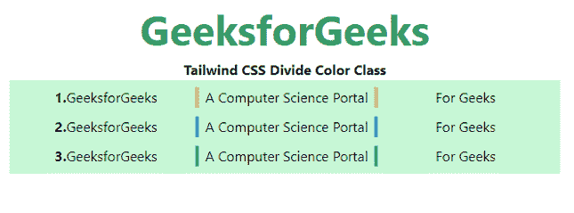

# 顺风 CSS 分色

> 原文:[https://www.geeksforgeeks.org/tailwind-css-divide-color/](https://www.geeksforgeeks.org/tailwind-css-divide-color/)

这个类在[顺风 CSS](https://www.geeksforgeeks.org/css-tailwind-introduction/) 中接受很多值，其中所有的属性都以类的形式被覆盖。通过使用这个类，我们可以给任何分割线着色。在 CSS 中，我们通过使用 [CSS 颜色属性](https://www.geeksforgeeks.org/css-color-property/)来实现。

**划分颜色等级:**

*   **分割透明:**分割颜色将是透明的。
*   **分流:**分流颜色将取决于父元素颜色。
*   **分割线-黑色:**分割线颜色将为黑色。
*   **分割线-白色:**分割线颜色将为白色。
*   **分割线-灰色-50:** 分割线颜色将为灰色。
*   **分割线-红色-50:** 分割线颜色为红色。
*   **分割线-蓝色-50:** 分割线颜色为蓝色。
*   **分裂-靛蓝-50:** 分裂的颜色将是靛蓝。
*   **分割线-紫色-50:** 分割线颜色将为紫色。
*   **分割线-绿色-50:** 分割线颜色将为绿色。
*   **分割线-黄色-50:** 分割线颜色将为黄色。
*   **分割线-粉色-50:** 分割线颜色为粉色。

**注意:**颜色的值可以根据你的需要在 50-900 之间变化，跨度应该是 100，在 100 之后。

**语法:**

```html
<element class="divide-{color}">...</element>
```

**示例:**这个示例涵盖了所有可能的类，可以更改颜色值使其更有对比度、更饱满，或者使其更褪色。

## 超文本标记语言

```html
<!DOCTYPE html> 
<html> 
<head> 
    <link
    href="https://unpkg.com/tailwindcss@^1.0/dist/tailwind.min.css"
    rel="stylesheet"> 
</head> 

<body class="text-center"> 
    <h2 class="text-green-600 text-5xl font-bold"> 
    GeeksforGeeks 
    </h2> 
    <b>Tailwind CSS Divide Color Class</b> 
    <div class="mx-4 bg-green-200 p-2">
        <div class="grid grid-cols-3 divide-x-4 
                    divide-pink-500">  

            <div><b>1.</b>GeeksforGeeks</div>
            <div>A Computer Science Portal</div>
            <div>For Geeks</div>
        </div>
        <div style="height:10px"> </div>
         <div class="grid grid-cols-3 divide-x-4 
                     divide-blue-500">  

            <div><b>2.</b>GeeksforGeeks</div>
            <div>A Computer Science Portal</div>
            <div>For Geeks</div>
        </div>
        <div style="height:10px"> </div>
         <div class="grid grid-cols-3 divide-x-4 
                     divide-green-500">  

            <div><b>3.</b>GeeksforGeeks</div>
            <div>A Computer Science Portal</div>
            <div>For Geeks</div>
        </div>
    </div>
</body> 
</html>
```

**输出:**



划分颜色类别