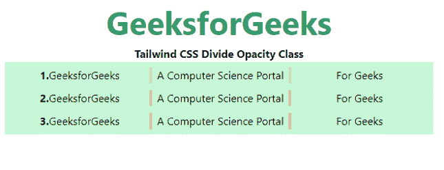

# 顺风 CSS 分割不透明度

> 原文:[https://www.geeksforgeeks.org/tailwind-css-divide-opacity/](https://www.geeksforgeeks.org/tailwind-css-divide-opacity/)

这个类在[顺风 CSS](https://www.geeksforgeeks.org/css-tailwind-introduction/) 中接受很多值，其中所有的属性都以类的形式被覆盖。通过使用这个类，我们可以设置任何分割的不透明度。在 CSS 中，我们通过使用 [CSS 不透明度属性](https://www.geeksforgeeks.org/css-opacity-transparency/)来做到这一点。

**划分不透明度等级:**

*   **分割-不透明度-0:** 使用分割-不透明度-{amount}实用程序控制元素占位符颜色的不透明度。

**注意:**不透明度的数量可以在 0 到 100 之间变化，跨度为 5。

**语法:**

```html
<element class="divide-{opacity}">...</element>
```

**示例:**

## 超文本标记语言

```html
<!DOCTYPE html> 
<html> 
<head> 
    <link
    href="https://unpkg.com/tailwindcss@^1.0/dist/tailwind.min.css"
    rel="stylesheet"> 
</head> 

<body class="text-center"> 
    <h2 class="text-green-600 text-5xl font-bold"> 
    GeeksforGeeks 
    </h2> 
    <b>Tailwind CSS Divide Opacity Class</b> 
    <div class="mx-4 bg-green-200 p-2">
        <div class="grid grid-cols-3 divide-x-4 
                    divide-pink-500 divide-opacity-25">
            <div><b>1.</b>GeeksforGeeks</div>
            <div>A Computer Science Portal</div>
            <div>For Geeks</div>
        </div>
        <div style="height:10px"> </div>
         <div class="grid grid-cols-3 divide-x-4 
                     divide-pink-500 divide-opacity-50">
            <div><b>2.</b>GeeksforGeeks</div>
            <div>A Computer Science Portal</div>
            <div>For Geeks</div>
        </div>
        <div style="height:10px"> </div>
         <div class="grid grid-cols-3 divide-x-4
                     divide-pink-500 divide-opacity-80">
            <div><b>3.</b>GeeksforGeeks</div>
            <div>A Computer Science Portal</div>
            <div>For Geeks</div>
        </div>
    </div>
</body> 
</html>
```

**输出:**



划分不透明度类别